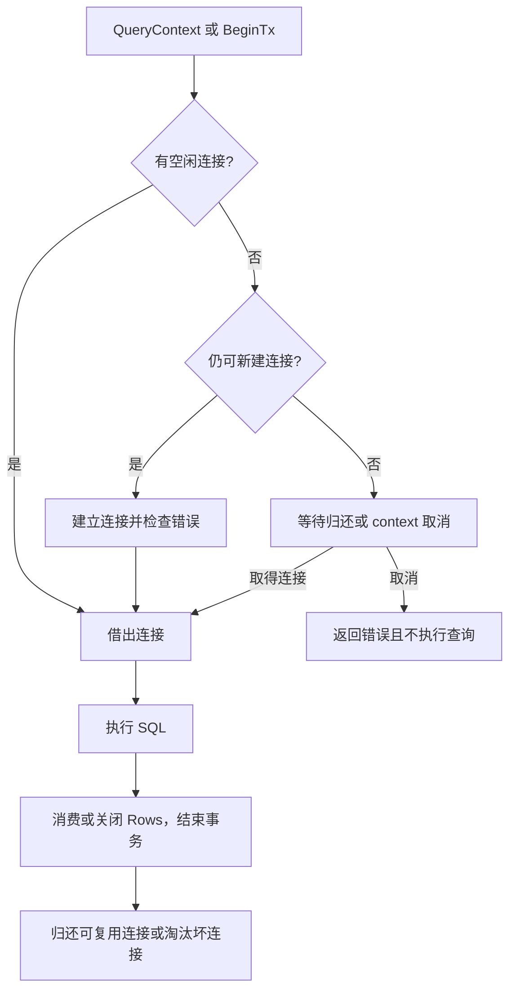

# 051 database/sql 的 DB 是连接还是连接池？

> 难度：基础 · 分类：数据库

## 简短回答

sql.DB 是可被多个 goroutine 使用的数据库访问句柄，内部管理连接池，不代表一条固定连接。通常按数据源长期复用，在应用结束时关闭；事务和显式 Conn 会在一定生命周期内占用具体连接。

## 详细解析

### 从一次查询看连接借还

调用 QueryContext 后，连接可能一直被 Rows 占用，直到结果读完或显式关闭。忘记 Close、只读第一行就返回、在遍历结果时做慢速网络调用，都可能延长连接占用。遍历结束还要检查 Rows.Err，不能只检查最初的查询错误。

```text
请求 → 等待可用连接 → 执行查询 → 消费 Rows → 归还连接
           ↑                            │
           └──── 不关闭结果会延长等待 ────┘
```

QueryRow 的错误通常在 Scan 时暴露，包括没有记录的情况。Open 也不应被当成已经成功连通数据库的证明；需要在启动策略允许的范围内用 PingContext 验证实际连接能力。

### 配额要看所有实例

假设数据库给该业务保留 300 条连接，应用有 10 个实例，每实例配置 50 条，就可能同时请求 500 条，超过预算。还要给迁移、运维、其他服务和故障恢复预留空间。池越大不一定越快，数据库 CPU、锁和 I/O 才决定真正处理能力。

SetMaxOpenConns 控制最大打开连接数，SetMaxIdleConns 控制空闲保留，连接寿命和空闲寿命用于替换老连接。它们与服务端超时、代理策略和凭据轮换需要协调；大量连接同时到期也可能造成重连波峰。

DBStats 中 InUse、Idle、WaitCount、WaitDuration 能揭示等待压力。WaitCount 和 WaitDuration 是累计量，应计算窗口增量或速率，而不是把历史大数字当作当前故障。等待增多时先看持有时间和查询形态，再决定是否增加连接。

### 池等待和 SQL 执行是两段不同的时间

业务观察到一次查询耗时 800 ms，并不能直接说 SQL 在数据库执行了 800 ms。它可能先等池中连接 700 ms，再执行和消费结果 100 ms。数据库慢查询日志只覆盖其中一部分，应用 tracing 若把全部时间记在一个数据库 span 中，也需要结合池指标解释。



图中借出到归还的时间才是连接占用时间。把 Rows 打开后逐行调用远程服务，即使数据库已经很快产生结果，连接也可能一直被占着。对于有限的小结果集，可以先完整扫描到受限集合并关闭 Rows，再做外部调用；对于大结果集，要改成分批读取或专门导出流程，不能用无限内存换连接释放。

假设每秒 400 次数据库操作，平均占连接 20 ms，平均占用约为 8；变成 200 ms 后，平均占用约为 80。这只是稳态均值估算，实际还要为波动保留余量。如果每实例最大连接数是 30，仅把请求超时由 1 秒改成 10 秒，更多请求会留下来排队，无法提高数据库的真实完成速度。

### 池参数与实例数量一起审核

| 参数或对象 | 主要影响 | 需要同时核对 |
| --- | --- | --- |
| MaxOpenConns | 一个 DB 句柄允许的连接上限 | 实例数、每进程句柄数、数据库总预算 |
| MaxIdleConns | 归还后保留多少空闲连接 | 低谷连接成本与突发建连压力 |
| ConnMaxLifetime | 连接最长可复用时间 | 代理或服务端寿命、集中重建风险 |
| ConnMaxIdleTime | 空闲连接保留时间 | 间歇流量与服务端空闲关闭策略 |

假设数据库留给应用 240 条连接，部署稳定态有 8 个实例，滚动发布时最多额外增加 2 个实例，那么按每实例 30 配置会在发布期达到 300。预算要按可能同时在线的 10 个实例计算，并留出必要余量；只用稳定副本数相除会让发布变成连接故障触发器。

DBStats 的快照要用一致时间窗口比较。例如一分钟内 WaitCount 增加 600，WaitDuration 增加 120 秒，二者之比约为每次发生等待的请求累计等待 200 ms；它不是所有查询的平均耗时，也不包含没有排队的查询。还要同时看 InUse 是否持续顶满、数据库活跃会话在执行还是等锁。

排查练习可以先问“连接被谁持有”，再问“为什么持有这么久”。如果所有连接都在同一条慢 SQL 上，优化或减少这条工作更合理；如果业务已经返回却仍有 Rows 未关闭，则是资源生命周期问题。本题没有启动真实数据库，图与数字用于建立诊断模型，不能替代驱动和服务端的实际观测。

## 常见误区 / 面试追问

- **每个请求 Open 一个 DB 更隔离吗？** 会分裂连接池、增加建立连接成本并难以控制总配额，应长期复用。
- **查询有 context 就不会耗尽池吗？** 超时限制单次等待，但大量并发、长事务或错误关闭仍会造成压力。
- **连接池满一定是泄漏吗？** 也可能是慢查询、锁等待、容量不足或流量突增，参见 [060](060-pool-exhaustion.md)。

## 参考资料

- [database/sql.DB](https://pkg.go.dev/database/sql#DB)
- [Go 官方：管理连接](https://go.dev/doc/database/manage-connections)

[返回目录](../README.md) · [下一题](052-transactions.md)
