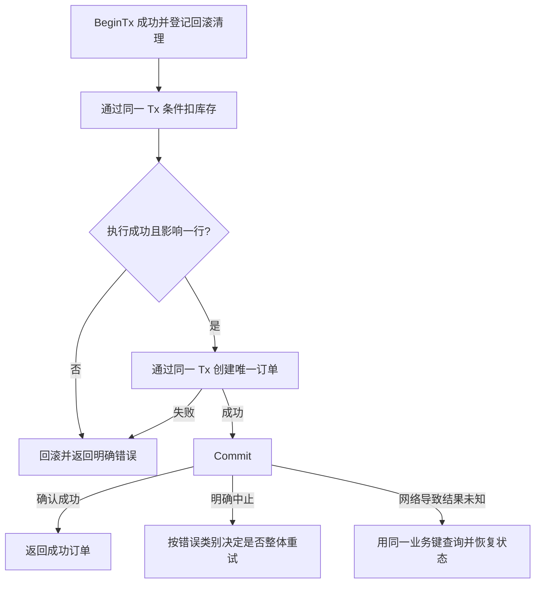

# 052 事务为什么必须使用同一个 Tx？如何处理提交失败？

> 难度：基础 · 分类：数据库

## 简短回答

sql.Tx 绑定事务及其连接，事务内操作必须通过同一个 Tx 执行。混用 DB 会让语句跑到事务之外。Commit 返回错误时不能对调用者承诺成功；部分网络故障还可能使提交结果不确定，需要依靠业务唯一键和状态查询判断。

## 详细解析

### 原子边界从哪里开始

订单创建和库存扣减若在同一数据库中要求一起成功，应通过 BeginTx 开始，再使用 tx.ExecContext、tx.QueryRowContext 等完成全部操作，最后检查 Commit。任一步失败则结束流程并回滚。获取事务后安排 Rollback 清理，是为了覆盖提前返回路径；成功提交后事务已结束。

```text
BeginTx
  → Tx 中校验或条件扣库存
  → Tx 中写入订单与唯一业务键
  → Commit

误用：事务里调用 DB.Exec → 可能借另一连接 → 不属于该事务
```

数据库连接池只有一条连接时，事务占着它却又调用 DB 查询，还可能让当前任务等待自己释放连接，形成业务层死锁。这个故障不是调大池就应被忽略，根本问题是事务句柄使用错误。

### 提交失败需要分类

约束冲突、序列化失败和网络中断代表不同情况。序列化失败通常需要按数据库要求重试整个事务，不能只重放最后一条语句。网络在提交请求发出后断开，则可能是提交成功但确认丢失；直接重做非幂等操作可能重复产生效果。

例如客户端订单号具有唯一约束，提交不确定时可以用该号查询。如果查到已提交订单，返回已有结果；若仍无法确认，返回可查询的处理中或不确定状态，而不是编造确定失败。对涉及外部支付的操作，还需要下游自己的幂等身份。

事务里避免等待用户、调用慢速远程服务或执行大批无关计算。越长的事务占用连接与锁越久，还可能影响数据库维护。缩短事务时必须保持原业务不变量，不能把操作随意移出后失去原子性。

### 从一个扣库存事务推演失败分支

设库存表和订单表在同一数据库，业务不变量是“成功订单必须对应一次成功扣减”。事务先执行带库存条件的 UPDATE，确认影响一行后插入带唯一业务键的订单，最后提交。若扣减影响零行，应返回库存不足或资源不存在等业务结果，不能继续创建订单。



这里的影响行数检查是业务判断，执行没有报错不代表扣减成功。唯一业务键还要贯穿重试，若每次进入事务都生成新的业务身份，就无法区分“上次成功但确认丢失”和“真正新的订单”。库存条件与请求幂等是两条不同约束，不能用其中一条代替另一条。

事务帮助函数若只接收全局 `*sql.DB`，会使调用者难以表达“请加入我已有的事务”。可让需要事务的仓储方法显式接收事务句柄，或者在用例边界提供事务内仓储；是否抽象接口取决于项目规模。重要的是能沿真实调用链确认所有语句使用同一 Tx，而不是仅看最外层函数调用了 BeginTx。

### 四种错误对应四种行动

| 观察结果 | 已知事实 | 可采取的行动 |
| --- | --- | --- |
| 库存条件不满足 | 本次扣减未产生预期变更 | 回滚，返回业务失败 |
| 唯一约束冲突 | 存在竞争或重复业务身份 | 结束失败事务后核对原记录 |
| 数据库报告序列化失败 | 此次事务不能按当前并发历史提交 | 使用新事务重新读取并有限重试 |
| 提交后连接中断 | 仅知道确认未收到 | 查询业务状态，保留未知状态 |

查不到订单也不一定立即证明先前事务永远不会成功，例如查询走了有延迟的副本，或原提交仍未确定。结果确认应使用满足可见性要求的数据源，并把查询与重试设计成同一套恢复协议。这里的未知状态是系统真实情况，不能为了简化接口强行映射成确定失败。

重试完整事务时，还要避免重复执行事务之外的副作用。若第一次尝试在提交前已经发了一封邮件，第二次事务会再发一次，数据库回滚不能撤销邮件。可以在事务里写出待发送事件，再由可靠投递流程执行，相关双写问题见 [068 Outbox](../07-cache-messaging/068-outbox.md)。

验证时至少区分“语句失败”“提交被明确拒绝”“提交确认丢失”。Mock 可以检查调用了 Rollback、没有混用 DB，但不能证明真实服务器在网络断开时的提交行为。后者需要数据库和代理故障注入。本题未执行这类实验，提供的是可检查的事务边界和恢复步骤。

## 常见误区 / 面试追问

- **defer Rollback 会撤销成功 Commit 吗？** 事务成功提交后已结束，后续回滚不能撤销它；仍需处理 Commit 的实际返回值。
- **数据库事务能包住发消息吗？** 普通本地事务不能原子提交外部消息，参见 [068](../07-cache-messaging/068-outbox.md)。
- **重试一次语句为什么不够？** 新尝试必须基于一致的新事务视图，旧事务可能已进入失败状态。

## 参考资料

- [Go 官方：执行事务](https://go.dev/doc/database/execute-transactions)
- [database/sql.Tx](https://pkg.go.dev/database/sql#Tx)

[返回目录](../README.md) · [上一题](051-connection-pool.md) · [下一题](053-isolation.md)
