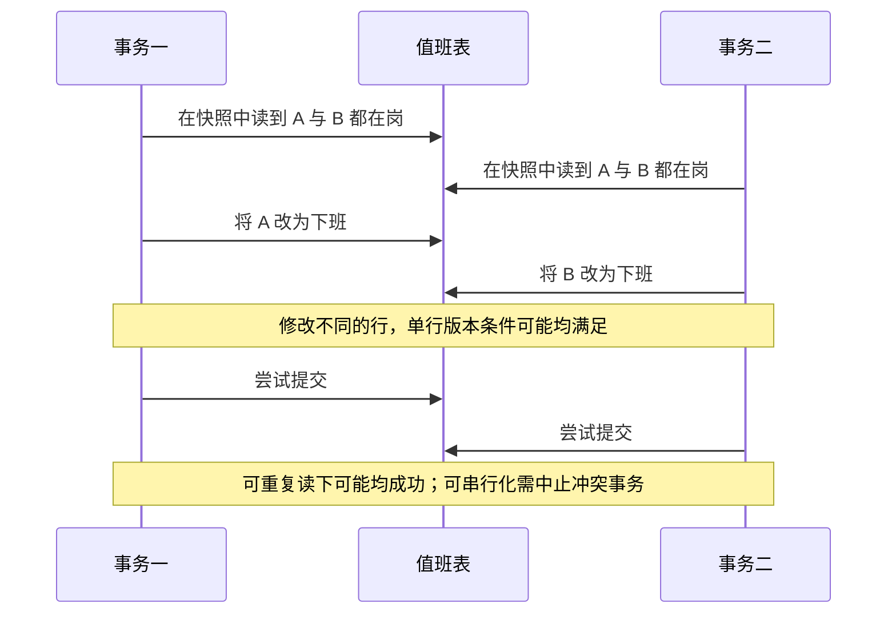

# 053 隔离级别、MVCC 与锁分别保证什么？

> 难度：中级 · 分类：数据库

## 简短回答

隔离级别定义并发事务允许观察到什么，MVCC 通过多版本实现读取视图，锁协调冲突访问。MVCC 不等于没有锁，可重复读也不自动等于可串行化。具体语义必须指明数据库和版本，本题以 PostgreSQL 16 为例。

## 详细解析

### 同名隔离级别不能跨数据库照搬

PostgreSQL 的 Read Committed 中，不同语句可以看到不同已提交快照；Repeatable Read 提供事务内更稳定的快照，但仍可能出现序列化异常。不能把其他数据库的间隙锁或当前读规则直接套到它上面。

### 写偏斜说明“读得稳定”仍不够

假设值班表中 A、B 都在岗，规则要求至少一人在岗。两个事务都读到两人在岗，随后事务一让 A 下班，事务二让 B 下班。它们更新不同行，仍可能共同破坏约束。

```text
T1：读取 A=true、B=true → 写 A=false
T2：读取 A=true、B=true → 写 B=false
结果：两个局部决定都看似合理，全局约束却不成立。
```

解决方向包括使用可串行化并处理重试，或让所有相关修改锁定同一个明确的协调记录，在锁内重新检查。具体方案要覆盖所有修改入口，不能只修一个接口。把数据库约束能表达的不变量交给约束，也比应用先查后写更可靠。

### 锁的范围与事务长度

普通快照读取不代表修改也不需要等待。UPDATE、显式行锁和结构变更可能互相阻塞。锁定行越多、事务越长，竞争与死锁概率越高。多行更新采用一致顺序能降低某些死锁，但仍需按数据库错误分类处理被中止的事务。

这些时序属于基于文档的推演。本仓库没有启动 PostgreSQL 验证隔离实验；在项目中应使用两个真实连接按步骤暂停与提交，观察实际结果和错误码。用一个内存 mock 无法证明数据库隔离语义。

### 写偏斜为什么不等于丢失更新

丢失更新常表现为两个事务依据同一旧值覆盖同一行；本题值班例子里，T1 改 A，T2 改 B，没有简单的同一行覆盖关系。问题来自各自读取了对方仍在岗的事实，再据此修改不同对象。只给每个人的记录加版本号，可能两个版本检查都通过，跨行规则仍然被破坏。



如果采用协调记录方案，每次改值班状态都先锁住“班次”这一共同记录，再重新读取在岗人数。T2 在 T1 提交后取得锁，应基于适当隔离语义看到 A 已下班，因而拒绝 B 下班。在 PostgreSQL 的 Read Committed 下，锁定后的下一条查询取得新的语句快照；如果改用固定事务快照，必须重新审查读到的数据，不能只写一句“加锁即可”就跨隔离级别照搬。

协调记录让相关修改串行进入临界区，代价是这个班次成为热点。可串行化允许更丰富的并发执行，但应用要处理事务被中止和完整重试。业务约束、竞争强度、重试成本决定选择，不是隔离级别越高就一定在所有负载下越划算。

### MVCC 和锁在一次更新中如何共同出现

快照读取通过版本可见性找到当前事务允许看的数据版本；更新还要协调与其他更新者的冲突。长事务可能保留旧版本的可见性需求，导致清理无法及时回收某些版本，所以“读查询不阻塞普通写”不等于长时间读取没有系统成本。

| 要回答的问题 | 应检查的机制 |
| --- | --- |
| 我能否读到别人的未提交内容 | 隔离级别与版本可见性 |
| 两次查询为什么结果不同 | 快照建立和更新的时机 |
| UPDATE 为什么一直等待 | 持锁者、锁范围与事务状态 |
| 不同行更新为何破坏总规则 | 跨行依赖与序列化异常 |

PostgreSQL 16 的 Repeatable Read 不出现该实现定义下的幻读，但仍可能发生序列化异常。这里不能简单套用“可重复读一定有幻读”的通用表格，更不能把 PostgreSQL 的结论直接移植到另一数据库。回答时先报数据库和版本，是为了让后续判断具有可检验的语义。

### 如何把推演变成真实实验

准备只有 A、B 两行的独立实验表，使用两个会话；两边都开始指定隔离级别的事务并完成第一次读取，再分别更新自己的行，最后依次提交并检查最终人数。换成 Serializable 后重做，记录哪一步收到序列化错误，而不是预设错误必定发生在 Commit。

再增加协调记录，分别测试 Read Committed 与固定快照的处理策略，核对锁等待和重新读取结果。实验应以明确的手工步骤或信号控制交错，避免依赖两个线程“差不多同时执行”。本仓库仍未执行 PostgreSQL 双会话实验，不能把图中的可能时序标为实测结果。

## 常见误区 / 面试追问

- **串行化就是所有事务串行执行吗？** 不一定，实现可以并发执行并检测无法串行解释的冲突，再中止部分事务。
- **快照一致就满足业务一致吗？** 不一定，跨行规则可能需要更强隔离或显式协调。
- **死锁一定是数据库 bug 吗？** 常由应用锁顺序形成环，数据库中止一个事务是恢复机制。

## 参考资料

- [PostgreSQL 16 事务隔离](https://www.postgresql.org/docs/16/transaction-iso.html)
- [PostgreSQL 16 显式锁](https://www.postgresql.org/docs/16/explicit-locking.html)

[返回目录](../README.md) · [上一题](052-transactions.md) · [下一题](054-indexes.md)
