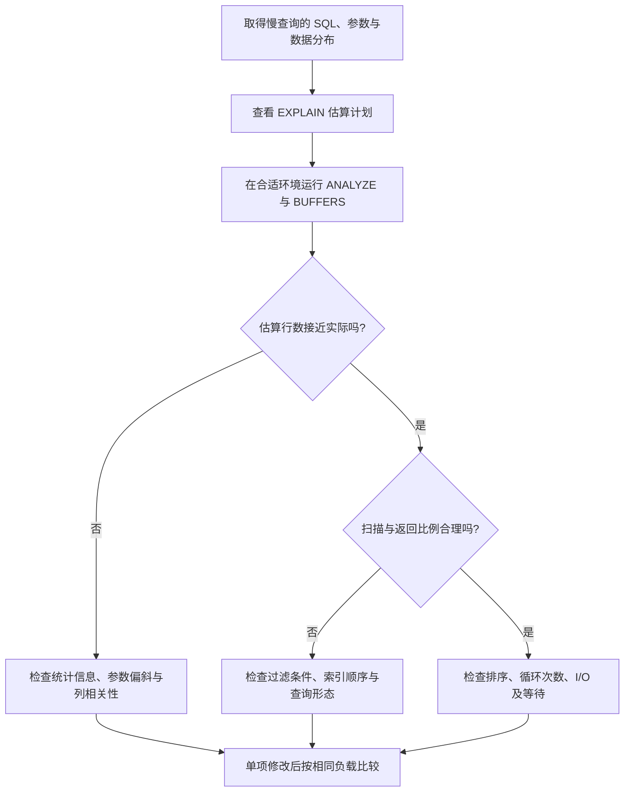

# 054 索引为什么没有生效？如何阅读执行计划？

> 难度：中级 · 分类：数据库

## 简短回答

优化器选择估算成本较低的访问路径，存在索引不代表一定使用。选择性、统计信息、表达式、排序要求和回表成本都会影响决策。读执行计划要沿数据流比较估算行数、实际行数、循环次数与 I/O，而不是只找有没有 Index Scan。

## 详细解析

### 从查询形态反推索引

本例使用 PostgreSQL 16 语法，表示一个按租户查看订单的独立实验表。在临时数据库执行建表与插入后，再用与真实规模接近的数据查看计划；空表计划没有生产代表性。

```sql
CREATE TABLE plan_orders (
    id bigint PRIMARY KEY,
    tenant_id bigint NOT NULL,
    created_at timestamptz NOT NULL
);
CREATE INDEX plan_orders_tenant_time
    ON plan_orders (tenant_id, created_at DESC, id DESC);
EXPLAIN SELECT id, created_at
FROM plan_orders
WHERE tenant_id = 7
ORDER BY created_at DESC, id DESC
LIMIT 20;
```

索引设计服务于等值过滤后的顺序读取。若只按 created_at 查询所有租户，访问模式已经不同，不能因为同一索引包含时间字段就保证仍高效。表达式和类型转换也可能影响能否使用某种索引条件，要检查实际计划。

### 区分估算与实测

EXPLAIN 展示计划与估算成本，成本单位不应被直接当作毫秒。EXPLAIN ANALYZE 会实际执行语句，提供实际耗时与行数；对写入或可能有副作用的语句尤其要谨慎选择隔离实验环境。加入 BUFFERS 可以进一步观察缓冲与读取情况。

若估算只返回 10 行，实际返回 100 万行，可能是统计信息或数据分布判断不准，导致连接顺序不佳。若返回大比例数据，全表扫描反而可能合理；强制索引不一定改善性能。

每增加一个索引，也增加写入维护、存储和缓存占用。优化应以目标查询的实际收益与整体写入代价共同评估，避免给所有字段单独建索引。

### 从最早的估算偏差开始读计划

执行计划是一棵数据流树，上层消费下层产生的行。先定位哪一层开始把实际行数估小或估大，再分析这种偏差怎样改变连接算法、排序和内存需求，比直接改最顶层节点更有效。父节点的耗时通常包含子节点工作，不能把整棵树所有耗时直接相加当成总耗时。



假设某个嵌套循环内层显示每次返回 3 行、loops 为 10,000，内层总产出量约为 30,000 行，而不是 3 行。若外层预计只有 10 行，实际却是 10,000 行，优化器原本认为便宜的反复索引查找就可能放大成大量访问。这里是模拟计划数字，用于说明 loops 与每次执行均值的关系，没有对应实测计划。

对比 BUFFERS 时，shared hit 表示页在 PostgreSQL 共享缓冲中命中，不等于整个查询没有 CPU 或内存访问成本；shared read 也不能简单等同于每次都从物理磁盘读取，因为还可能经过操作系统缓存。判断存储瓶颈需要结合耗时、I/O 指标与环境，而不是仅看一个计数。

### 复合索引如何匹配这条查询

`(tenant_id, created_at DESC, id DESC)` 先按租户聚集可检索范围，再在该范围内按时间和 ID 排序。因此查某个租户最新 20 条记录可能尽早停止；如果按全部租户的最新时间查询，第一列不再被等值约束，访问方式与成本就发生变化。

| 查询变化 | 需要重新检查的点 |
| --- | --- |
| 增加状态过滤 | 状态是在索引条件中筛选，还是扫描后过滤 |
| 返回大量宽字段 | 索引读取后访问表的成本是否占主导 |
| 改成按金额排序 | 原索引顺序能否避免额外排序 |
| 租户规模差异很大 | 同一查询参数是否需要不同计划 |

表达式也要具体看：对时间列套日期转换后过滤某天，可能不再直接对应原始列的范围访问。可以把条件改成明确时区的半开时间区间，或者按需求设计表达式索引；不能盲目改写而改变“某天”所属时区的业务含义。

索引覆盖所需列不保证一定完全不访问表。PostgreSQL 的 Index Only Scan 还受页面可见性信息等条件影响，应检查实际 Heap Fetches。对频繁更新的表，增加覆盖列带来的写放大也要计算。最终验收需要同一查询的尾延迟、扫描量和业务整体写入成本，而不是一张出现 Index Scan 字样的截图。

## 常见误区 / 面试追问

- **用了索引就一定快吗？** 大量随机访问或低选择性仍可能很慢，要看扫描与返回比例。
- **本地小表快能说明线上快吗？** 不能，数据量、分布、缓存和并发都会改变计划与成本。
- **参数化查询会影响计划吗？** 可能涉及通用或定制计划，应结合驱动和数据库实际行为诊断。

## 参考资料

- [PostgreSQL 16：使用 EXPLAIN](https://www.postgresql.org/docs/16/using-explain.html)
- [PostgreSQL 16：多列索引](https://www.postgresql.org/docs/16/indexes-multicolumn.html)

[返回目录](../README.md) · [上一题](053-isolation.md) · [下一题](055-query-shapes.md)
