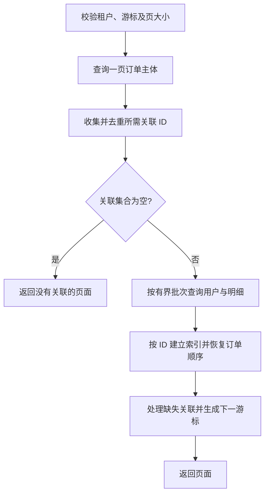

# 055 如何避免 N+1 查询和深分页？

> 难度：中级 · 分类：数据库

## 简短回答

N+1 是先查一批主体，再为每个主体独立查询关联数据，导致数据库往返随结果数增长。深 offset 分页则可能扫描并丢弃大量前置行。应按结果形态设计有界批量查询、合适连接或基于稳定排序键的游标分页。

## 详细解析

### 查询数量本身就是成本

订单列表取 100 条，再逐条查用户，共 101 次查询。即使单次只有 2 ms，串行往返也可能占到约 202 ms，还没算业务处理。把循环改成 100 个 goroutine 虽能重叠等待，却增加连接竞争；优先减少查询次数才是结构性改进。

可先提取去重后的用户 ID，在受控大小内批量查询，再在内存中按 ID 关联。若使用 JOIN，需要警惕一对多关系导致订单行重复，影响 LIMIT 的含义；“一次查完”也可能返回巨大笛卡尔扩张结果。

### 用位置继续，而不是反复跳过

假设订单按 created_at、id 降序，下一页从上一页末尾继续。以下是针对已有订单表的 PostgreSQL 参数化查询；参数由驱动绑定，不能拼接用户字符串。

```sql
SELECT id, created_at
FROM plan_orders
WHERE tenant_id = $1
  AND (created_at, id) < ($2, $3)
ORDER BY created_at DESC, id DESC
LIMIT $4;
```

这里复用 [054](054-indexes.md) 的表结构与复合索引。page size 必须有上限，游标要保留精确时间与 ID。只用时间条件会在相同时间的记录间产生遗漏，使用不稳定可变排序字段也会使分页跳动。

游标分页不天然支持跳到任意第几页，也不天然提供完整快照。后台导出可以选择固定快照或按不可变键分批，交互列表则可接受明确说明的一致性范围。设计需要与产品需求匹配。

验证时记录每请求查询次数、数据库返回行数、网络字节量与连接占用时间；减少查询数量若换来巨量重复数据，也未必达到优化目标。

### 先确定一页的主体，再加载它的关联

假设要展示 20 个订单，每单平均 5 个明细。直接把订单和明细 JOIN 后 `LIMIT 20`，限制的可能是连接结果的 20 行，只包含约 4 个订单，而不是产品要求的 20 个订单。正确做法可以先确定一页订单 ID，再查询这些订单的明细并组装；也可以用子查询先完成主体分页，再进行连接。



批量查询不保证返回顺序与 IN 参数顺序相同，所以需要以 ID 建立 map，再沿订单原排序组装。缺失用户可能是删除、权限过滤或读取不同快照造成的，必须定义显示策略或错误行为；不能让零值用户对象悄悄冒充有效关联。如果要求主体和关联在同一快照下自洽，还要选择合适事务隔离，并避免把事务保持到外部网络响应全部完成。

### 用三个维度评估“减少 SQL”的收益

下面数字是教学计算：100 个订单关联到 20 个去重用户，原方案做 101 次查询，每次网络与服务固定开销 2 ms，则串行固定成本约 202 ms。改成订单一次、用户一次后，这部分降到约 4 ms；但总耗时还包含 SQL 执行、返回字节和组装，不能把 4 ms 宣传成整个接口的实测延迟。

| 指标 | N+1 方案 | 需要避免的新问题 |
| --- | --- | --- |
| 往返次数 | 随订单数线性增加 | 大 IN 被拆成无界并行查询 |
| 返回行数 | 每次少，但次数很多 | 一次大 JOIN 造成行数乘法扩张 |
| 结果字节数 | 重复加载同一用户 | SELECT * 拉回无需展示的大字段 |

若一个订单有 5 个明细和 3 条标签记录，同时连接这两个一对多关系，可能产生 15 行组合，而不是 8 行独立关联。单看查询数从三次变一次就宣布优化成功，会忽略重复传输和错误聚合风险。

### 深分页的改动还要经过产品验收

游标分页适合“继续向后看”，不便于直接跳到第 5,000 页。若产品确实需要任意页跳转，可以评估有限页深、预计算索引或独立搜索系统，而不是对外保留 page 参数、内部偷偷换成无法等价的语义。导出要求逐条覆盖某个时点的数据时，则要明确快照或不可变边界。

验证改动时固定数据分布，至少覆盖零订单、重复用户、缺失关联、同时间不同 ID 和大页大小被拒绝或收缩的场景。记录每请求查询数以及数据库返回行数，才能发现 ORM 的隐式懒加载。SQL 示例没有在本仓库真实数据库中运行，这些验证条件是落地实验的输入，不是已有跑分。

## 常见误区 / 面试追问

- **ORM 一定导致 N+1 吗？** 不是工具必然问题，应检查加载策略与实际发出的 SQL。
- **IN 列表越大越好吗？** 过大可能增加解析、参数和结果压力，应分成有界批次。
- **count 总数会不会成为新瓶颈？** 会，分页数据快不代表精确总数便宜，应按需求选择是否执行。

## 参考资料

- [PostgreSQL 16：LIMIT 与 OFFSET](https://www.postgresql.org/docs/16/queries-limit.html)
- [Go 官方：使用参数避免 SQL 注入](https://go.dev/doc/database/sql-injection)

[返回目录](../README.md) · [上一题](054-indexes.md) · [下一题](056-stock-locking.md)
