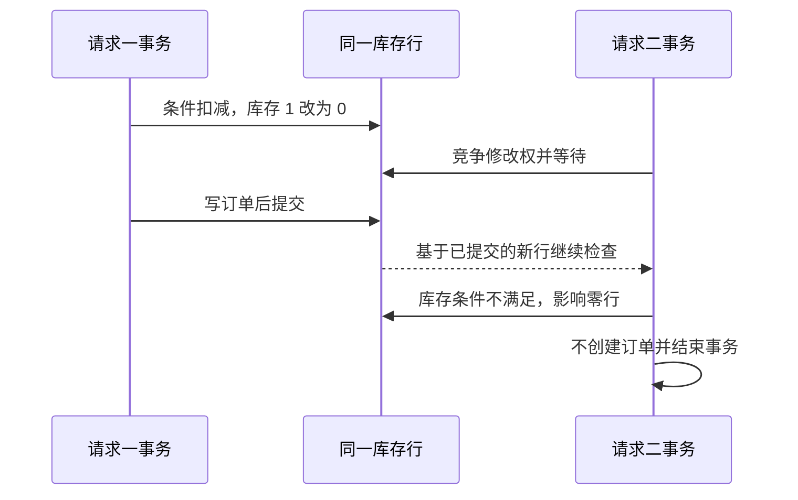

# 056 乐观锁和悲观锁如何防止超卖？

> 难度：中级 · 分类：数据库

## 简短回答

防超卖的核心是让“库存足够”和“扣减库存”在数据库中形成受协调的原子操作。简单扣减优先考虑带条件的 UPDATE；需要多步读取和决策时可用行锁；基于版本号的乐观并发控制则通过条件更新检测冲突。都要检查实际修改结果。

## 详细解析

### 先查后写为什么不可靠

库存为一，两个请求都先读到一，然后分别写入零并创建订单，最终可能生成两笔订单却只扣了一份库存。应用里的 if 判断不保护两个并发请求间的时间窗口。

以下 PostgreSQL 16 示例在一个全新实验表上演示条件扣减。第一次返回零，第二次不返回行；这是依据语句语义的预期，不是本仓库的数据库执行记录。

```sql
CREATE TABLE stock_demo (
    sku text PRIMARY KEY,
    available integer NOT NULL CHECK (available >= 0)
);
INSERT INTO stock_demo VALUES ('book', 1);
UPDATE stock_demo SET available = available - 1
WHERE sku = 'book' AND available >= 1 RETURNING available;
UPDATE stock_demo SET available = available - 1
WHERE sku = 'book' AND available >= 1 RETURNING available;
```

购买数量必须为正并有上限，否则负数扣减会变成增加库存。订单写入与扣减需要同一事务，并以业务请求键防止重试再次扣减。库存不为负只保护一项不变量，不等于订单、支付和库存已经全部一致。

### 锁策略的取舍

悲观方案使用 SELECT FOR UPDATE 锁定目标行，在同一事务内检查并更新，适合确实需要多步决策的场景。代价是等待与长事务竞争，应固定多行锁定顺序并尽快提交。

乐观方案把读取到的 version 放进 UPDATE 条件，成功后 version 加一。影响行数为零说明状态已变化，应重新读取或返回冲突，不可忽略。竞争极高时频繁重试会放大压力，可能不如顺序化或库存分片。

SQL UPDATE 本身也会涉及数据库锁，因此“乐观锁完全无锁”是不准确的。这里的乐观指应用冲突检测策略，不是底层完全不协调写入。

### 两个请求抢最后一件时发生什么

以 PostgreSQL 16 的 Read Committed 和单行条件 UPDATE 为前提，T1、T2 同时购买一件库存。T1 先获得该行的修改权，把库存从 1 改为 0；T2 可能等待。T1 提交后，T2 对更新后的行重新检查 `available >= 1`，条件不成立，因此没有成功扣减。如果 T1 回滚，T2 则还有机会基于恢复后的库存完成扣减。



这条时序依赖明确的数据库语义；更高隔离级别下还可能得到并发更新或序列化错误，应用需要分类处理。图不是“所有数据库都必然这样执行”的证明，也不是本仓库的实测记录。

### 乐观版本检查保护的是什么

版本号方案可以表达“我只接受基于刚才读到的版本做这次修改”。例如读取库存 10、version=7 后，更新要求同时满足 version=7 和库存足够，并把版本增为 8。另一个请求已经改过记录时，旧版本更新影响零行；调用者重新读取后才有资格决定是否重试。

对于纯粹的库存减法，直接在数据库中做 `available = available - quantity` 并加下界条件，通常已经能表达核心不变量；额外版本号未必必要。对于根据多个字段计算价格、库存状态或业务审批结果的更新，版本号可以避免用过期决策覆盖新状态。选择策略要从“不允许发生什么”推导，不能为了展示乐观锁而机械地给每张表加 version。

| 不变量 | 负责的机制 | 单独缺少时的后果 |
| --- | --- | --- |
| 库存不能为负 | 条件扣减与数据库约束 | 并发下出现负库存 |
| 成功订单必须有对应扣减 | 同一事务提交 | 库存与订单分裂 |
| 同一请求最多产生一次订单效果 | 业务幂等唯一性 | 超时重试重复购买 |
| 取消最多归还一次库存 | 状态条件更新或唯一补偿记录 | 重复回调把库存加多 |

### 多商品订单怎样控制锁顺序

订单甲先扣 SKU A 再扣 B，订单乙先扣 B 再扣 A，可能形成循环等待。把所有参与库存操作按稳定 SKU 顺序排序，可以减少这种相反加锁顺序引发的死锁；所有入口都要遵守，数据库检测到死锁后仍需有限重试完整事务。事务中不要等待用户付款，否则热商品的锁会被长期占住。

验收不能只看最后库存等于零。假设初始库存 10，应核对成功订单数量、每单数量、取消归还记录和剩余库存的守恒关系，并重复发送相同业务键。一个系统完全可能“库存不为负”但多生成订单，或者因重复归还而凭空增加库存。能列出这些核对项，才说明理解了超卖问题的完整业务边界。

## 常见误区 / 面试追问

- **加 Go Mutex 就能防超卖吗？** 只保护当前进程，多个实例仍会并发写同一数据库。
- **Redis 扣减成功就能立刻发货吗？** 需要定义库存权威来源和可靠落单协议，不能忽略缓存故障与持久化。
- **失败就无限重试吗？** 应限次、退避并受整体期限约束，业务冲突也可能应直接返回。

## 参考资料

- [PostgreSQL 16：UPDATE](https://www.postgresql.org/docs/16/sql-update.html)
- [PostgreSQL 16：行锁](https://www.postgresql.org/docs/16/explicit-locking.html#LOCKING-ROWS)

[返回目录](../README.md) · [下一题](057-migrations.md)
