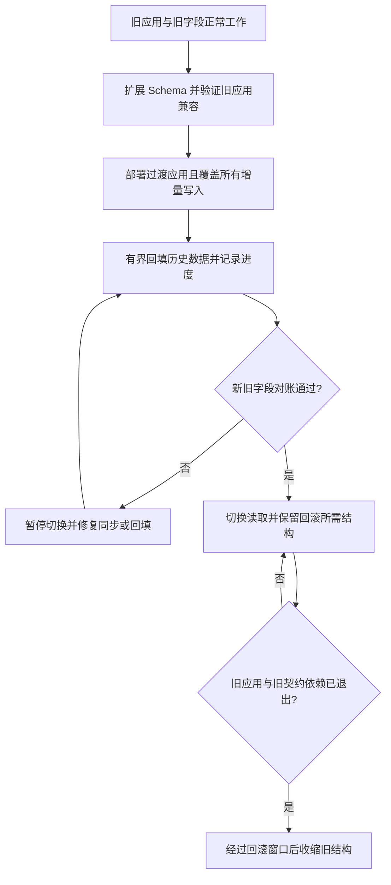

# 057 Schema 迁移怎样兼容滚动发布？

> 难度：中级 · 分类：数据库

## 简短回答

滚动发布期间新旧应用同时访问数据库，Schema 变化必须允许它们共存。常用扩展—迁移—收缩：先添加兼容结构，再切换和回填，确认所有读写迁移完成后才删除旧结构。回滚应用不自动回滚数据含义。

## 详细解析

### 把一次改名拆成可验证步骤

将 users.name 拆为 display_name，直接重命名会让旧版本查询失败。可先加新字段并保持旧字段可用，再发布能处理过渡状态的应用；之后有界回填历史数据，切换读取，确认旧版本完全退出，最后收缩旧字段。

| 阶段 | 数据库 | 应用行为 | 退出条件 |
| --- | --- | --- | --- |
| 扩展 | 增加新字段 | 旧版本仍工作 | 结构兼容验证通过 |
| 迁移 | 新旧结构共存 | 明确双写或转换规则 | 回填与新写均完整 |
| 切换 | 保留旧结构 | 新读取路径启用 | 对账与错误率稳定 |
| 收缩 | 删除废弃结构 | 全部使用新契约 | 回滚窗口与依赖已确认 |

双写不是随手给两个字段赋值，必须定义谁是权威以及并发旧写如何同步。若旧版本仍只写旧字段，新字段不能被一次回填后就永久认为完整；需要覆盖过渡期间的所有写入。

### 迁移本身也消耗生产资源

大表回填应分批、限速、记录检查点，避免长事务、大量锁和复制延迟。批次需要幂等，失败可继续；不能靠一个没有进度记录的全表 UPDATE 支撑长时间变更。

建立索引、加约束、改类型的锁与重写行为依数据库版本和具体操作而异。PostgreSQL 的并发建索引也有自己的限制和失败清理要求，并非“零成本在线”。上线前在代表性数据量和相同版本环境中验证持续时间、锁等待及回滚操作。

迁移脚本应版本化，有明确执行者与日志。多个应用实例启动时同时运行迁移，可能引起竞争和不确定顺序；应使用受控迁移任务，而不是把所有变更藏进普通启动路径。

### 用新旧版本共存矩阵检查每一步

把 name 迁到 display_name 时，可以先规定旧字段仍是权威来源，新字段只是过渡投影。在全部写入者都升级前，必须让旧写入也能同步到新字段，例如使用经过验证的数据库同步机制；或者在旧写入者退出前始终从旧字段读取，不提前宣称新字段可用。选择哪种方式取决于回滚和上线窗口，不能省略这个决定。

图中循环表示停留在兼容阶段等待条件满足，不是让发布任务不停地切换开关。收缩前还要检查定时任务、报表和运维脚本，不能只看在线服务版本已经全新。

| 应用版本与结构组合 | 必须验证的行为 |
| --- | --- |
| 旧应用 + 扩展后 Schema | 原有读写仍正确，不被新约束拒绝 |
| 过渡应用 + 未回填数据 | 缺少新字段时有明确且一致的读取规则 |
| 新应用 + 回填完成数据 | 增量写入与历史数据使用同一语义 |
| 回滚应用 + 切换后数据 | 旧程序仍能正确解释新产生的数据 |

### 回填最怕覆盖同时发生的新写入

假设回填读取旧 name=甲，用户随后把名称改成乙，回填再把先前读取的甲写到 display_name，就可能覆盖较新的乙。可使用版本条件、只填尚未填充的记录并配合可靠增量同步，或采用同一条受约束 SQL；具体条件要覆盖所有写入路径。只有“每批 1,000 行”并不能防止这种时序错误。

检查点也必须和实际完成边界一致。若先把检查点推进到 ID 10,000，再提交该批回填，进程中断后可能跳过未完成数据。应使批次更新与进度提交可靠关联，或让重跑范围具备幂等性并通过最终对账发现遗漏。按主键范围分批通常比不断增长的 offset 更容易解释进度。

建索引同样有状态：PostgreSQL 的 `CREATE INDEX CONCURRENTLY` 不能简单放进普通事务块，失败后还可能留下无效索引。迁移执行器需要理解该命令的事务要求并检查最终索引有效性，而不是仅记录“脚本运行过”。避免把所有 DDL 都包装成统一的事务模板。

练习可模拟“回填中断、用户同时更新、回滚旧应用”三条路径，要求每一步说明哪个字段权威、哪些版本可读写、如何恢复进度。这里提供的是发布设计和故障窗口分析，未在真实大表上测量锁时间与回填速度，相关参数必须通过同版本实验确认。

## 常见误区 / 面试追问

- **加了新字段就一定兼容吗？** 严格序列化、SELECT *、字段顺序或 ORM 行为可能受影响，应验证实际客户端。
- **删除列后回滚应用为什么失败？** 旧程序依赖已消失的结构，应用回滚与 Schema 回滚必须共同设计。
- **回填完成怎么证明？** 用可解释的计数、抽样和业务一致性对账，不能只看任务进程退出。

## 参考资料

- [PostgreSQL 16：ALTER TABLE](https://www.postgresql.org/docs/16/sql-altertable.html)
- [PostgreSQL 16：CREATE INDEX](https://www.postgresql.org/docs/16/sql-createindex.html)

[返回目录](../README.md) · [上一题](056-stock-locking.md) · [下一题](058-replication.md)
