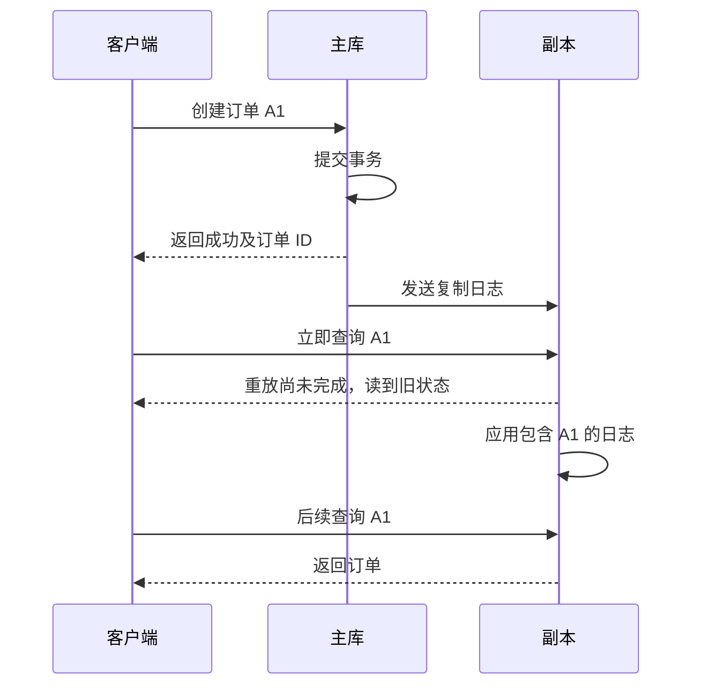

# 058 读写分离为何导致刚写完却读不到？

> 难度：中级 · 分类：数据库

## 简短回答

主库提交与副本应用更新之间可能有延迟。写主库后立刻读副本，副本可能仍处于旧状态；这不一定是写失败。读写分离需要按业务定义一致性要求，而不是把所有 SELECT 自动路由到副本。

## 详细解析

### 一次创建订单的时序

```text
t0 主库提交订单 A1
t1 客户端收到创建成功
t2 查询被路由到副本，副本尚未应用 A1 → 返回不存在
t3 副本应用日志，之后查询才能看到 A1
```

若前端把 t2 的不存在解释为创建失败并重新下单，就会引入重复业务风险。写接口应返回资源身份，客户端重复操作仍使用同一幂等键；读取策略则需要与用户刚完成的操作协调。

### 根据业务选择保证

短时间内把该用户相关读路由到主库可以改善读己之写，但固定时间窗口不能严格覆盖任意复制延迟。更强方案可以传递可验证的复制位置并等待副本追上，或把需要强一致的查询始终放主库，代价是额外等待或主库负载。

订单确认、余额和权限撤销通常比商品展示更难容忍旧值，但具体选择仍由业务约束决定。不能因为副本“通常只延迟几毫秒”就忽略故障时延迟可能显著增长。

同步复制也要核对提交等待的是日志接收、刷盘还是应用；不同配置提供的保证不同。等待一个同步副本，不代表任意其他副本都已经可见。故障切换还涉及已确认数据是否保留、客户端连接重建和提交不确定性。

监控应包含复制延迟、日志积压、读路由与回主库比例。发现副本落后时，可以停止向它分配敏感读，但要核对主库容量，防止所有流量突然集中造成新的故障。

### 提交确认与副本可读之间还有哪些阶段

一条写入日志可以处于发送、接收、持久化、重放等不同位置。副本已经收到了字节，不意味着查询执行器已经能读到对应行。同步复制的等待目标需要落到具体配置：等待远端落盘主要回答数据持久性问题，等待指定同步副本应用才更接近该副本上的读取可见性。



图展示异步复制的一种合法时序，不表示每次查询都会失败。问题恰恰是它可能只在负载高、网络抖动或副本恢复时出现；日常低延迟观测无法把这种可能性消除。

### 三种读策略各自承诺什么

| 策略 | 能表达的保证 | 代价或限制 |
| --- | --- | --- |
| 写后相关查询读主库 | 在主库正常且读取语义合适时避免复制旧值 | 主库读压力增加，缓存仍需另行处理 |
| 固定时间内粘主 | 在常见延迟范围内改善体验 | 时间窗口不是严格追赶证明 |
| 携带复制位置并检查重放 | 副本达到所需位置后再读 | 需要位置来源、路由和等待超时设计 |

复制位置必须来自实际写入确认相关的协议，不能随便取一个本地时间戳就当成数据库进度。查询若在等待追赶前已经开启固定快照事务，即使副本随后追上，原快照也不一定包含新写入；应在满足可见性条件后建立相应读取视图，并核对驱动和事务边界。

故障切换后，还要处理位置所属时间线或集群身份，不能比较两个没有共同语义的数字就断言“已追上”。这也是为什么业务应明确哪些接口确实需要读己之写，再决定是否引入复杂的复制位置协议。

### 副本不可用会把负载转移到哪里

假设主库正常承担 2,000 次写入及敏感读取每秒，多个副本承担 8,000 次展示查询每秒。副本全部落后时把全部查询转回主库，会把入口需求推到原来的五倍；这是教学负载模型，不是实测容量。回主必须受预算控制，可降低非关键读取频率、允许明确标注的旧数据或拒绝部分请求，保证写路径和关键查询。

验证时分别观察“返回成功后立即查询”“切换到另一副本”“副本追赶超时”“主库已经过载”四条路径。只有第一条成功不能证明任意读路由都一致；只有复制延迟指标恢复也不能证明缓存已更新。把缓存、数据库和业务状态的权威来源画清楚，才能定位看似相同的“刚写完读不到”。

## 常见误区 / 面试追问

- **副本查不到就再查主库是不是万能解法？** 会增加负载且混淆错误，需要明确适用范围、预算与原因指标。
- **强制读主库就解决所有一致性问题吗？** 还要考虑事务隔离、缓存和跨服务状态，并非只有复制延迟一个来源。
- **如何验证？** 在真实复制环境注入延迟，确认读己之写契约和降级负载；本题仅给出设计推演。

## 参考资料

- [PostgreSQL 16：流复制](https://www.postgresql.org/docs/16/warm-standby.html#STREAMING-REPLICATION)
- [PostgreSQL 16：同步复制](https://www.postgresql.org/docs/16/warm-standby.html#SYNCHRONOUS-REPLICATION)

[返回目录](../README.md) · [上一题](057-migrations.md) · [下一题](059-sharding.md)
