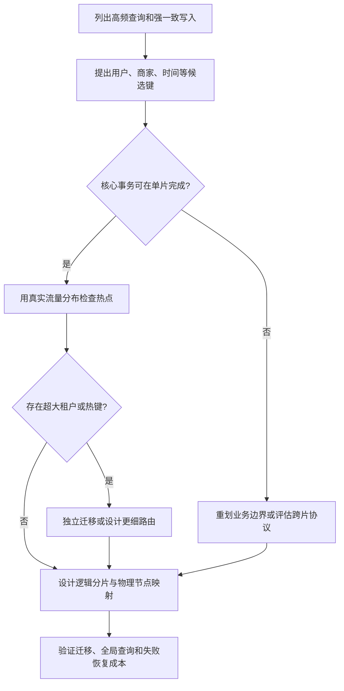

# 059 分库分表应该如何选择分片键？

> 难度：高级 · 分类：数据库

## 简短回答

分片键决定数据路由、热点分布、事务局部性和扩容难度。优先让高频查询与强一致写落在同一分片，同时保持负载可分散。分片不是大表的默认答案，应先证明单库索引、归档、容量或连接治理已无法满足目标。

## 详细解析

### 用业务访问矩阵选择

订单按用户查询与退款，可考虑 user_id 分片；商家经营报表却可能跨很多用户，这种选择会使报表查询扇出。按 merchant_id 分片能改善商家查询，但超级商家可能形成热点。没有一个键能同时让所有维度都本地化。

| 分片键 | 有利操作 | 主要风险 |
| --- | --- | --- |
| 用户 ID 哈希 | 用户订单聚合、分散一般负载 | 商家或时间统计跨片 |
| 商家 ID | 商家事务与查询 | 大商家热点与数据倾斜 |
| 时间范围 | 归档和时间扫描 | 当前时间段写入集中 |

关键是用实际请求分布和数据增长推演，而不是只看键的取值数量。一个百万租户系统也可能由少数租户贡献大部分流量，需要给大租户独立资源或更细的路由策略。

### 迁移比取模公式更重要

简单 `hash(key) % N` 在 N 改变时会迁移大量数据。可以引入逻辑分片和路由表，把逻辑槽映射到物理节点，扩容时搬迁指定范围。代价是路由元数据、迁移状态、版本传播与失败恢复需要可靠设计。

迁移期间要定义写入权威、双读或切换规则、数据校验和旧节点退役条件。只复制历史数据再改路由，会漏掉复制期间的增量写；同时向两边写也有双写不一致窗口。

跨片事务和全局唯一性无法继续假设由单库自然提供。业务 ID、幂等键、分页排序和汇总查询都需要重新检查。可以把分析查询移到专用管道，避免每次在线请求扇出全部分片。

### 从访问比例推导分片键

假设订单业务有 80% 请求按用户查询，15% 按商家查询，5% 是全局运营统计；这是一组教学假设。按用户分片可让大部分在线请求单片完成，但不能只凭 80% 就定案：如果商家退款必须在一个事务中修改大量用户订单，低比例路径也可能具有很高的一致性成本。访问频率、数据量和事务边界要一起比较。

逻辑分片可先定义为固定数量的槽，物理机器只承载这些槽的子集。增加机器时移动部分槽，而不是让所有用户按照新的机器总数重新取模。槽数、路由元数据和迁移协议都属于持久契约，不能在进程重启时随意重新生成。

### 一次迁移需要明确唯一写入者

可以把迁移分为“旧片权威、复制历史、追赶增量、切换写权威、校验、退役旧片”。历史复制期间新写仍会进入旧片，因此必须有可靠增量来源；切换时要阻止使用旧路由版本的请求继续向旧片提交。仅更新控制面的路由表，不能保证所有缓存路由的应用立即生效。

| 迁移阶段 | 写入权威 | 恢复时最重要的事实 |
| --- | --- | --- |
| 历史复制与追赶 | 旧片 | 已复制范围和增量位置 |
| 权威切换 | 受控切换协议指定的一侧 | 路由版本及旧写是否已被排斥 |
| 新片稳定服务 | 新片 | 校验结果与回退所需增量 |

如果切换后新片已经接受写入，再简单把路由指回旧片会丢掉新变化。回退也需要数据同步和权威切换，不能把它当成无状态开关。若架构暂时无法承担这些机制，应先考虑垂直扩容、归档或业务拆分，避免把尚未解决的容量问题升级成数据正确性问题。

### 全局能力会在哪些地方失效

单片的唯一约束只保护该片。若同一个幂等键可能被不同路由送到两个分片，就可能分别插入成功；应让操作身份稳定地路由到同一权威位置，或使用专门全局协调机制。全局订单 ID 的生成、重复校验和查询路由也是不同问题，ID 看起来唯一不等于能够高效定位分片。

跨片排序若要取全局前 20 条，通常需要从相关分片取得候选并合并；分片越多，扇出请求和尾延迟风险越大。一个片不可用时是整页失败还是返回不完整结果，必须在接口契约中说明。异步汇总可降低在线扇出，但会带来数据延迟，需要业务接受。

最后区分表分区和跨节点分片：PostgreSQL 单实例分区可以改善某些扫描与维护操作，却仍共享实例资源，不能自动获得多数据库节点的写入能力。本题给出的是架构推演，没有运行分片集群或迁移实验。

## 常见误区 / 面试追问

- **一致性哈希会自动解决热点吗？** 它主要减少节点变化时的映射迁移，不消除单个热键或超大租户。
- **分表就是水平扩容吗？** 同实例内分表可能仍共享 CPU、I/O 和连接限制，必须区分物理资源边界。
- **什么时候不该分片？** 若主要瓶颈是坏查询或长事务，先修这些问题，避免提前承担路由与迁移复杂度。

## 参考资料

- [Vitess 官方：分片与扩展](https://vitess.io/docs/23.0/overview/whatisvitess/)
- [PostgreSQL 16：表分区](https://www.postgresql.org/docs/16/ddl-partitioning.html)

[返回目录](../README.md) · [上一题](058-replication.md) · [下一题](060-pool-exhaustion.md)
