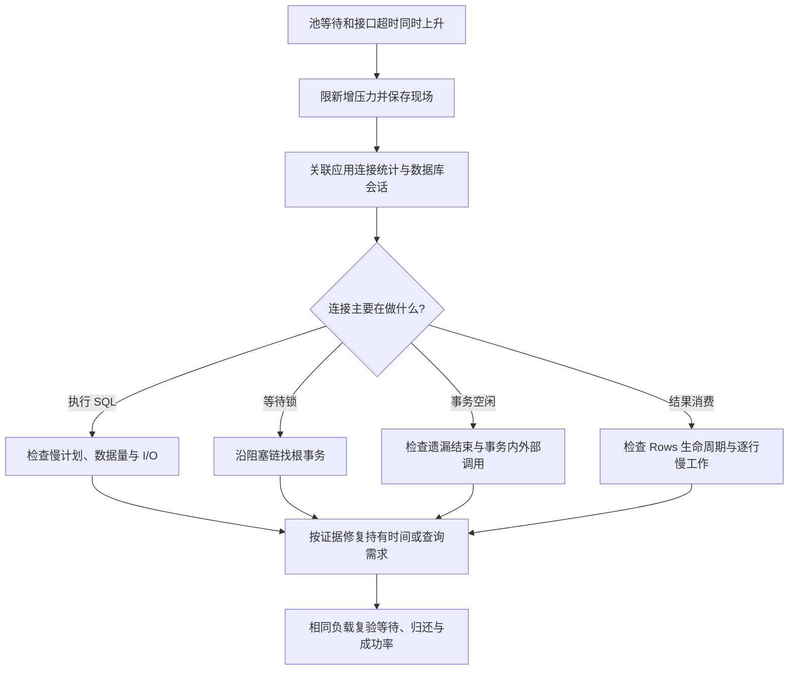

# 060 场景题：数据库连接池耗尽，如何止血与定位？

> 难度：高级 · 分类：数据库

## 简短回答

先降低新增压力并保存现场，再区分连接泄漏、长事务、慢查询、锁等待和真实容量不足。结合 DBStats、数据库活跃会话与应用堆栈还原连接被谁占住；调大连接池只能在数据库仍有余量且证据支持时进行。

## 详细解析

### 场景与分叉判断

假设最大连接数 40，InUse 长期为 40，WaitCount 与 WaitDuration 持续增长，接口不断超时。第一步看数据库里的 40 条连接在做什么，而不是仅凭池满就宣布连接泄漏。

| 数据库或应用证据 | 可能原因 | 优先行动 |
| --- | --- | --- |
| 长时间运行同一 SQL | 查询计划或数据量变化 | 看计划、索引与参数 |
| 多个会话等待同一锁 | 长事务或锁顺序问题 | 找阻塞链源头 |
| idle in transaction | 事务未结束或中途慢调用 | 回到事务生命周期 |
| 应用堆栈卡在 Rows 处理 | 结果未关闭或消费太慢 | 核对所有退出路径 |

### 一次可解释的根因链

发布增加了导出接口，查询后在 Rows.Next 循环里逐条调用外部 HTTP，再继续读取下一行。外部依赖变慢，使导出连接占用几十秒；正常请求因此等不到连接。此时数据库本身可能 CPU 很低，却依旧拖慢全站。

止血可以暂时限制导出并发、关闭入口或回滚变更，并减少超时后的自动重试。长期修复可以将导出与在线业务隔离、按有界批次读取并及时关闭结果、把慢外部动作移出持有连接的范围。批次边界还需定义数据一致性，避免导出期间重复或遗漏。

若发现事务内误用 DB 查询而事务占据了全部连接，应改为使用 Tx 或重构流程；增大池可能短期掩盖自我等待，但保留了错误模式。

### 验证与防复发

复现慢依赖和提前返回路径，观察连接能否按预期归还。修复后应同时看到等待增量下降、在途请求回落和错误率恢复，而不是只是把 MaxOpenConns 从 40 改成 400 后等待消失。新增池等待和事务时长告警，帮助在用户超时前发现趋势。

### 把现场证据放到同一个时间窗口

下面是一组模拟故障数据，目的是练习推断而非提供生产事故记录。发布前一分钟，连接占用中位数为 8，导出并发为 0；发布后导出并发升到 40，InUse 达到上限 40，在线请求池等待 P99 达到 2 秒，数据库 CPU 仍为 25%。这些事实支持“连接被长时间占用”的方向，但还不能区分慢 SQL、锁等待和慢结果消费。

采集时保存请求类型、版本、SQL 指纹、事务开始时间、数据库等待事件及应用堆栈，尽量让它们能按时间和连接关联。注意避免把带敏感参数的完整 SQL 大量写入日志。堆栈显示停在 Rows.Next 也不是“忘记 Close”的直接证据，它可能正在等待数据库或网络，需要与服务端会话状态一起解释。

### 用证据排除两种看似合理的猜测

如果怀疑数据库计算饱和，应检查活跃执行、I/O 与相关 SQL 的资源消耗；CPU 低并不能排除锁或存储瓶颈。若数据库会话大多在等待客户端继续消费，而应用堆栈在导出的 HTTP 调用中，则更支持“持有结果期间做慢外部工作”。同一时间发布出现的新调用形态，比单纯的池满现象更接近根因。

如果怀疑泄漏，应观察请求结束后连接是否仍长期不归还，核对提前返回和扫描错误分支。若暂停新增导出后，现有导出逐个完成，InUse 也下降，说明长期占用可以解释现象，但尚不能据此排除其他路径的泄漏。诊断结论应与证据覆盖范围一致。

### 止血动作要写出收益与副作用

| 动作 | 预期收益 | 必须监控的副作用 |
| --- | --- | --- |
| 限制或暂停导出入口 | 减少新的长连接占用 | 已接受任务的状态和恢复 |
| 降低客户端重试 | 避免超时流量继续放大 | 关键用户请求的明确失败反馈 |
| 取消明确异常的长任务 | 尽快释放持有资源 | 回滚耗时与外部副作用不确定性 |
| 有证据地调整池上限 | 利用数据库剩余处理能力 | 全集群连接数、锁竞争与 I/O |

增加应用副本会同时增加连接池总预算，可能让数据库从“应用池排队”变成“服务端连接耗尽”。重启也会造成同时建连和缓存冷启动；若需要重启，应该有节奏并先保存必要现场，不能将它当作根因修复。

修复验收应在同等在线流量和慢导出依赖条件下重复：在线请求错误率恢复，池等待增量下降，导出提前取消后连接及时归还，批次读取没有重复或漏行。最后增加有针对性的保护，例如导出并发预算和事务持有时长观测。这里只定义实验与验收方法，未运行真实数据库负载测试。

## 常见误区 / 面试追问

- **重启应用能证明泄漏吗？** 不能，重启会清空很多状态，只能说明资源重置暂时有帮助。
- **超时后连接一定马上可复用吗？** 取决于驱动、取消协议和事务状态，需要检查真实行为。
- **扩容实例为什么可能更糟？** 总连接需求会增加，可能进一步压垮共享数据库。

## 参考资料

- [database/sql.DBStats](https://pkg.go.dev/database/sql#DBStats)
- [PostgreSQL 16：统计活动视图](https://www.postgresql.org/docs/16/monitoring-stats.html#MONITORING-PG-STAT-ACTIVITY-VIEW)

[返回目录](../README.md) · [上一题](059-sharding.md) · [下一模块](../07-cache-messaging/061-cache-aside.md)
