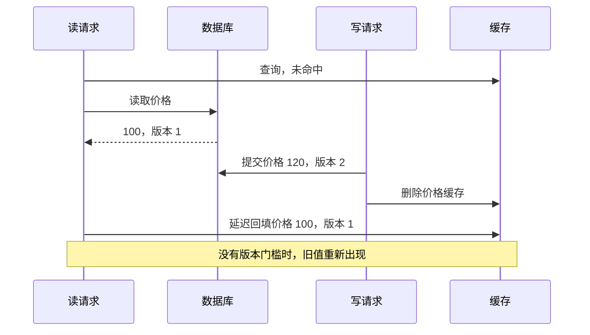

# 061 Cache Aside 如何处理命中、失效和一致性？

> 难度：基础 · 分类：缓存与消息

## 简短回答

Cache Aside 由应用先读缓存，未命中时读数据库并回填；写入通常先提交数据库，再使相关缓存失效。它优化读取成本，但不能仅靠这个顺序获得强一致，仍需分析并发回填、失效失败和旧数据保留窗口。

## 详细解析

### 一个旧值重新出现的时序

```text
读请求 R：缓存未命中 → 从数据库读到旧值 v1 ─────→ 回填 v1
写请求 W：                 提交新值 v2 → 删除缓存

若 R 的回填发生在删除之后，缓存又可能出现 v1。
```

因此“先写库再删缓存”是常见工程选择，不是无条件一致性证明。数据库提交后删除缓存失败，也会留下旧值。业务必须明确允许多长陈旧窗口，以及失败如何被观测和修复。

### 按一致性需求选择措施

商品展示可以接受短暂旧值时，可采用合理 TTL、可靠失效通知和监控；权限撤销或关键状态确认可能应该绕过缓存，直接访问权威存储。版本号可帮助拒绝旧回填，但需要持久或足够可靠地保存当前版本，并让比较与写入原子执行；仅把版本放进即将被删除的值并不自动解决问题。

延迟双删能降低某些竞态概率，却依赖延迟时间覆盖旧读取的生命周期；网络抖动和暂停没有固定上界，所以不应把它写成严格一致方案。需要可靠异步失效时，可结合事务日志或 Outbox 传递变更，并让处理可重试。

缓存 key 应包括影响结果的租户、权限范围和查询参数，避免把一个用户的结果复用给另一个用户。负缓存也要有边界：不存在结果可以短时缓存，但随后创建资源时需要失效策略，否则用户刚创建就读不到。

缓存故障时是否回源，要受数据库容量约束。全部请求无条件绕过缓存可能把缓存故障升级成数据库故障，应结合限流、并发限制与可接受的旧值返回。

### 把读取与写入画在同一条时间线上

设商品价格初始为 100，缓存当前为空。读请求已经从数据库拿到 100，但由于暂停没有回填；与此同时写请求把价格改成 120，提交后删除缓存；随后旧读恢复，把 100 写回。删除动作本身没有失败，缓存仍然变旧，因此只统计删除错误率不能发现所有一致性问题。



版本比较能否解决，要继续追问“和谁比较”。若删除时把版本 2 一起删掉，缓存中已经没有可比较的最新版本，旧回填可能再次被接受。设计可保留可靠的版本水位或使用能原子比较更新的存储，但还要处理水位淘汰、恢复和旧请求最长生命周期；只在缓存 value 中增加一个 version 字段不是完整协议。

### 根据读接口的业务含义决定是否容忍旧值

商品列表显示旧价格，最终下单时重新按权威价格确认，可能是可接受的体验；支付执行时沿用过期金额，则可能违反业务契约。相同字段在不同操作中的一致性要求不同，不能因为“这个是商品缓存”就一概允许旧值。

| 失败窗口 | 可见问题 | 可采用的补救方向 |
| --- | --- | --- |
| 数据库提交成功但失效请求失败 | 旧缓存持续存在 | 可靠失效事件、有限 TTL、可观测重试 |
| 旧读取在失效后回填 | 旧值重新进入缓存 | 版本约束或更强读取协议 |
| 不存在结果被负缓存后创建 | 新对象暂时不可见 | 创建时失效、短负缓存、关键确认直读 |
| 缓存整体不可达 | 回源数量陡增 | 数据库准入和明确降级 |

TTL 限制的是某次写入缓存之后的有效时间，不一定严格等于“数据库变更后最多陈旧多久”：一个很晚才完成的旧回填可能重新开始 TTL。因此要求精确陈旧上限时，需要把数据版本、源读取时间、加载期限和失效协议一起纳入分析。

### 如何验证不是只在正常路径有效

实验可以控制读请求在“读库成功、尚未回填”处暂停，然后执行一次写入与失效，再恢复旧读，检查缓存最终版本。第二个实验让数据库提交成功后失效服务不可达，确认事件是否被可靠记录并最终重试。第三个实验关闭缓存，观察回源是否受到并发预算保护。

验收指标应包括回源速率、加载时间、失效延迟、版本落后比例和数据库等待，而不仅是命中率。高命中率也可能意味着大量请求持续命中错误旧值。本题时序为教学推演，未执行 Redis 与数据库联合故障实验；其价值在于明确应控制的故障点和应观察的业务事实。

## 常见误区 / 面试追问

- **缓存不是权威库就可以随便丢吗？** 数据可以重建不代表重建成本可忽略，要验证冷启动和故障回源压力。
- **TTL 越短越一致吗？** 可以缩短部分旧值窗口，但增加回源与竞争，且不替代正确失效协议。
- **写缓存再写数据库行不行？** 数据库失败会让缓存包含未提交事实，应明确权威来源和失败处理。

## 参考资料

- [Microsoft 官方：Cache-Aside 模式](https://learn.microsoft.com/en-us/azure/architecture/patterns/cache-aside)
- [Redis 客户端缓存与失效](https://redis.io/docs/latest/develop/use/client-side-caching/)

[返回目录](../README.md) · [下一题](062-cache-failures.md)
