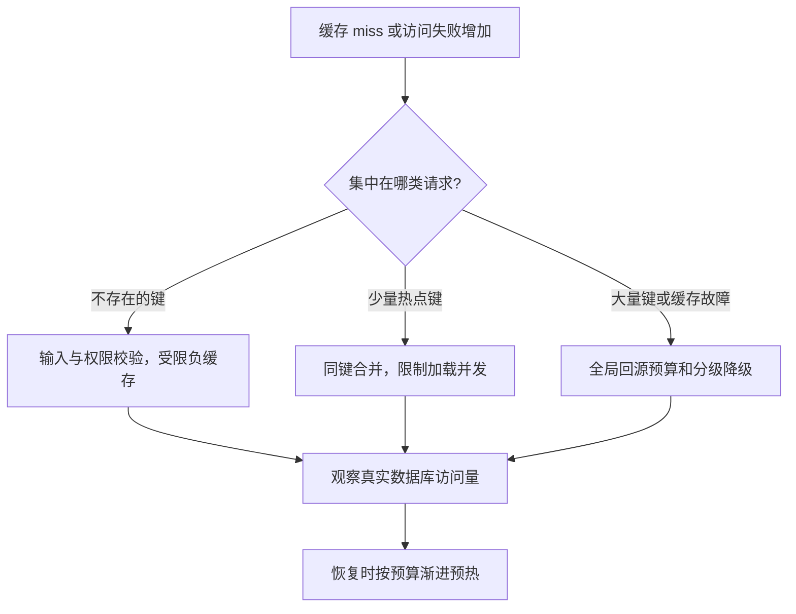

# 062 缓存穿透、击穿、雪崩应该分别怎样治理？

> 难度：中级 · 分类：缓存与消息

## 简短回答

穿透是大量查询本就不存在的数据，击穿是热点键失效后并发回源，雪崩是大量键或缓存服务同时失效。三者的触发机制不同，应分别治理输入与负缓存、热点重建并发以及整体回源容量。

## 详细解析

### 不要只背三个名词

| 场景 | 触发条件 | 主要控制 |
| --- | --- | --- |
| 不存在的订单 ID 被反复查询 | 缓存没有保存缺失结果 | 输入校验、短负缓存、访问控制 |
| 热点商品过期 | 大量请求同时 miss | 合并同键请求、限制重建并发 |
| 缓存节点失效或批量同刻过期 | 大范围 miss | 过期抖动、隔离、回源准入 |

布隆过滤器可以快速排除某些确定不存在的键，但有误判且需要正确维护新增与删除语义；过滤器不是授权系统，也不能把可能存在误认为确定存在后跳过数据库校验。

### 同键合并有作用范围

singleflight 可让同一进程里同键并发调用共享一次计算结果。若有 100 个实例，仍可能同时发生 100 次回源。等待者取消、首个请求的 context 与共享加载生命周期也要设计：一个用户离开，不应无意取消所有仍在等待的用户所需重建。

热点重建可采用短租约，但租约失败与过期仍需有界等待，不能让所有请求都卡在分布式锁上。允许陈旧数据的场景可以先返回旧值，再由受控任务更新；关键业务则不能为了可用性返回过期授权或余额。

### 雪崩需要容量预算

给 TTL 加抖动可以分散定时过期，却不能防止整个集群不可达。应对数据库回源设置总并发上限，限制非关键接口，并对重建流量单独观测。恢复后不要让所有实例同时全量预热，避免第二次冲击。

测试不只看正常命中率，应模拟热点失效、全量冷缓存、缓存超时和恢复过程。观察数据库请求倍数、队列时长与拒绝率，才能证明保护路径有效。

### 从绝对流量判断风险大小

假设入口每秒 100,000 次查询，命中率 99%，仍有每秒 1,000 次回源；若数据库只能给该接口每秒 500 次查询预算，正常运行就已经超出预算。命中率从 99% 降到 95%，回源变为每秒 5,000 次，是原来的五倍，而不是“只下降四个百分点那么轻微”。这些是假设数字，用来说明容量应按 miss 的绝对数量计算。

图按触发机制分支，同一次故障可能同时出现多种分支。例如缓存节点失效后热点键率先大量 miss，既需要同键合并，也需要全局回源上限。只给 TTL 加随机数无法解决缓存网络不可达。

### singleflight 合并了工作，没合并所有风险

在同一 Group 中，同键并发调用共享一次执行结果。键必须包含真正影响结果的参数和访问范围，否则会把本来不同的查询合并。共享函数的错误也会交给等待者，所以短时间内一次失败可能影响一批请求；加载恢复策略和错误缓存需要明确。

如果把第一个用户的 context 直接传给共享加载，第一个用户断开可能取消其他用户仍然需要的数据。可让加载使用服务管理、独立且有期限的 context，等待者分别监听自己的取消；代价是所有用户都离开后，共享加载可能仍运行到结束，因此总加载并发与期限必须有界。`DoChan` 提供结果 channel，不会自动替应用设计这些生命周期。

跨 50 个实例时，本地合并仍可能有 50 次同时回源。若每次查询便宜且数据库能承受，这可能比维护分布式互斥更简单；若单次重建非常昂贵，再评估带失败协议的跨实例协调。不要为了追求“绝对只查一次”引入一个比回源本身更脆弱的依赖。

### 负缓存和过滤器也有容量与更新边界

攻击者每次查询一个新的随机 ID，短负缓存只会不断新增不同键，未必降低多少回源，反而消耗内存。因此还要限制键空间、入口速率和负缓存容量。布隆过滤器判断“可能存在”后仍需查库；如果新增资源没有正确写入过滤器，则工程上可能出现误拒绝，不能把理论性质当成更新流程正确的证明。

验收可分别制造：同一缺失 ID、随机缺失 ID、一个热点键过期、所有缓存为空。记录合并前后加载次数、数据库完成率和拒绝率。恢复预热应优先覆盖实际热点，不要同时把全部历史键重新载入。高风险权限和余额不能采用未经契约允许的旧值降级，故障时的“可用”也必须是业务上正确的结果。

## 常见误区 / 面试追问

- **缓存空值会不会出错？** 可能遮住随后创建的数据，要使用短期限或可靠失效并明确语义。
- **所有 miss 都应该加分布式锁吗？** 成本可能高于重复回源，应先识别真正热点与下游容量。
- **命中率 99% 就没有问题吗？** 剩下 1% 的绝对流量仍可能压垮数据库，需看规模。

## 参考资料

- [singleflight 官方文档](https://pkg.go.dev/golang.org/x/sync/singleflight)
- [Redis Bloom 官方资料](https://redis.io/docs/latest/develop/data-types/probabilistic/bloom-filter/)

[返回目录](../README.md) · [上一题](061-cache-aside.md) · [下一题](063-distributed-locks.md)
