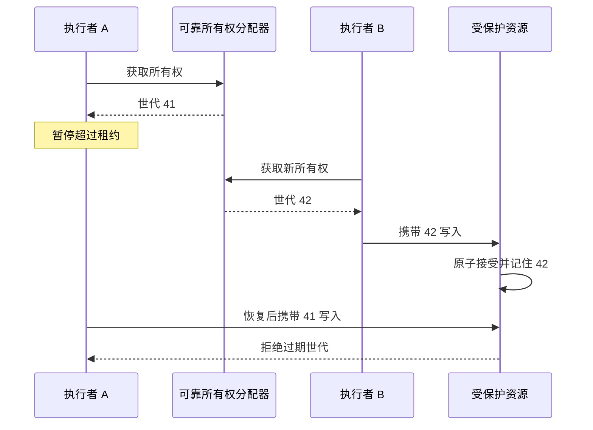

# 063 Redis 分布式锁为何需要所有权与 fencing token？

> 难度：中级 · 分类：缓存与消息

## 简短回答

锁需要唯一持有者标识和有限租期，释放时原子确认所有权，避免删除别人的锁。但租约过期不会强行停止旧持有者；严格保护外部资源还需要由资源端拒绝过期执行者，例如校验单调递增的 fencing token。

## 详细解析

### 所有权只能防止误删

单 Redis 实例的常见获取方式是 SET key token NX PX ttl，其中 token 为每次获取的唯一随机值。释放必须原子比较值再删除，不能 GET 后另发 DEL，因为两个命令之间可能已经换了持有者。

下面 Lua 表达比较后删除协议，KEYS[1] 是锁键，ARGV[1] 是调用者令牌。它是 Redis 脚本示例，本仓库未连接 Redis 执行。

```lua
if redis.call('GET', KEYS[1]) == ARGV[1] then
    return redis.call('DEL', KEYS[1])
end
return 0
```

### 过期后的旧执行者才是难点

```text
A 获锁 → 长时间暂停 → 租约到期
B 获锁 → 写入新状态
A 恢复 → 仍以为自己有锁 → 写入旧状态
```

释放脚本不会阻止最后一步。即使 A 定期续租，也可能因暂停或网络故障失去租约却未及时知道。取消本地任务同样不能撤销已发出的远端写请求。

fencing token 是每次成功取得所有权时分配的递增序号。资源服务保存已接受的最高序号，只接受满足协议的新请求，从而拒绝旧持有者。关键在于序号生成与资源校验本身要可靠、持久且原子；一个会在故障恢复后倒退的计数器无法提供这项保证。

如果数据库已经能用条件 UPDATE、唯一约束或事务表达业务规则，优先利用权威存储的能力。分布式锁更适合协作和减少重复工作，不能自动使跨多个系统的副作用形成原子事务。还应分析 Redis 复制与故障切换下锁状态丢失的影响。

### 用具体世代说明资源端为何必须参与

设 A 获得 fencing token=41，随后长时间暂停；租约过期后 B 获得 42，并向存储提交新状态。存储在同一原子操作中保存状态与已接受的世代 42。A 恢复后携带 41 发来写请求，存储检查出它落后，拒绝写入。真正排斥旧写的是资源端判断，而不是 A 对自己租约的主观判断。



图中的分配器是抽象前提，不表示一个可能回滚计数的 Redis INCR 自动具备这种可靠性。若故障切换后 token 从 42 倒退到 40，或者资源端丢失已接受的最大世代，原来的论证就失去条件。还要保证 token 的分配与所有权取得有可靠关联，不能先拿旧序号、很久后再凭它取得新租约。

### 比较规则还要区分同一世代内的多次写入

资源可以拒绝小于已接受世代的请求，同时允许同一有效世代进行多步操作；但这些操作仍需要各自的幂等键或顺序约束。fencing 解决“旧持有者覆盖新持有者”的问题，不会自动防止有效持有者因网络重试重复扣款。若规定每个 token 只能执行一次，也必须把该规定写进资源协议。

| 机制 | 解决的问题 | 无法单独解决的问题 |
| --- | --- | --- |
| 随机所有者值 | 释放时识别是不是自己的锁 | 判断哪个持有者更新 |
| 有限租期 | 持有者死亡后最终让别人接管 | 强制停止旧进程 |
| 原子比较后删除 | 避免误删新持有者的锁 | 阻止已经发出的外部写入 |
| fencing 校验 | 排斥落后世代的资源访问 | 同世代重复业务副作用 |

### 什么情况下根本不该把锁当主约束

如果目标是“不重复创建订单”，数据库唯一业务键直接约束事实更清晰；如果目标是“库存不低于零”，条件 UPDATE 更贴近不变量。分布式锁可以降低重复计算或减少争抢，但一旦锁状态丢失，核心业务仍应由权威约束保护。

对于无法检查 token 的外部系统，例如某个只接受普通写请求的旧接口，应用侧加 fencing 字段不会产生效果。需要改造资源端、借助其原生条件更新或幂等协议，或者承认方案只能降低重复概率。不要在图上画一个 token 就宣称已经具备严格互斥。

故障演练应控制 A 暂停、租约过期、B 成功写入、A 恢复这四个时刻，并观察最终资源，而不只是 Redis 键是否删除正确。本题未运行 Redis 或资源端实验，Lua 只展示原子释放逻辑，不能充当完整分布式锁实现的验证。

## 常见误区 / 面试追问

- **随机 token 和 fencing token 是一回事吗？** 前者识别持有者，后者表达可比较的世代顺序，作用不同。
- **租期设得足够长就安全吗？** 无法覆盖任意暂停，且会延迟故障后恢复。
- **续租失败怎么办？** 停止新的工作并按协议处理已有请求，核心资源仍需防止旧写入。

## 参考资料

- [Redis 官方分布式锁说明](https://redis.io/docs/latest/develop/clients/patterns/distributed-locks/)
- [Redis SET 命令](https://redis.io/docs/latest/commands/set/)
- [etcd 并发与锁 API](https://etcd.io/docs/v3.5/dev-guide/api_concurrency_reference_v3/)

[返回目录](../README.md) · [上一题](062-cache-failures.md) · [下一题](064-cache-levels.md)
