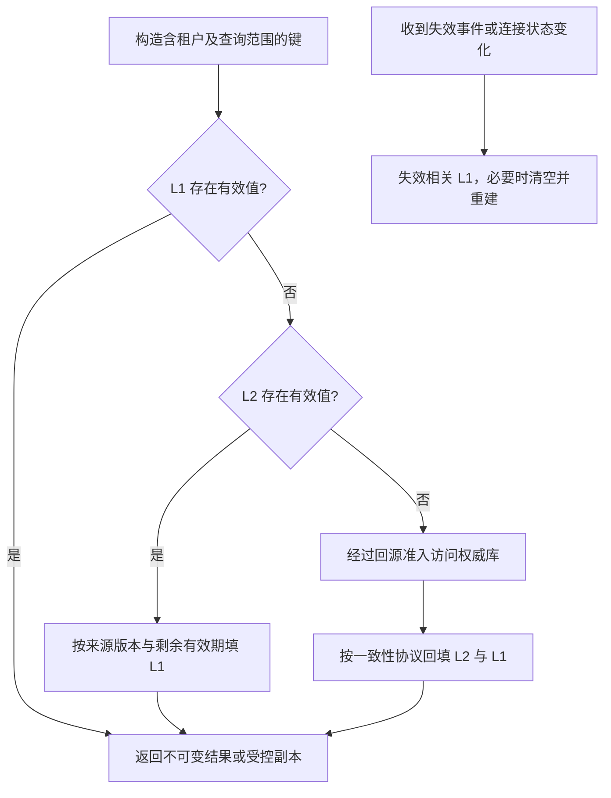

# 064 本地缓存和分布式缓存怎样组合？

> 难度：中级 · 分类：缓存与消息

## 简短回答

本地缓存降低网络访问与热点压力，分布式缓存在实例间共享数据，但两级缓存增加失效传播与版本管理复杂度。每一级都应有容量、过期、键空间和一致性边界，不能无限叠加 TTL 后仍声称读取足够新。

## 详细解析

### 读取路径与成本

```text
请求 → L1 进程缓存 → L2 Redis → 权威数据库
          命中返回     命中回填 L1    回填适用缓存
```

假设服务每秒读取同一个小字典十万次，L1 可以减少到 Redis 的重复网络请求。若缓存的是每用户一次性数据，本地命中率可能很低，却占用大量堆并增加 GC，应该先测访问局部性。

### TTL 不能简单叠加

L2 中一个即将过期的旧值被读出，再给 L1 一个全新的长 TTL，可能延长陈旧数据的实际生命周期。可以携带版本和绝对有效时间，让 L1 不超过来源剩余有效期；需要失效事件时，也要考虑断线期间漏事件的问题。

Redis 客户端缓存失效机制可以减少部分手工维护，但具体客户端、连接模式和重连语义必须核对。若使用普通 Pub/Sub 广播失效，订阅者离线期间的消息可能丢失，因此重连后需要清理或重新建立一致视图，不能假设消息总能送达。

每个实例存一份数据，内存成本会随实例数放大。容量规划要看对象实际大小和引用图，不只是 key 数量。淘汰策略也应符合热点分布，超大单值要有限制，以免少量对象挤掉整个缓存。

权限和租户范围必须进入键或隔离边界，尤其不能把针对某用户过滤后的结果放进跨用户公共 key。缓存对象发布后最好不可变，避免调用者修改共享对象导致其他请求读到污染数据。

### 两级命中率应按条件概率计算

假设每秒有 10,000 次读取，L1 命中率 80%；到达 L2 的 2,000 次中，L2 命中率为 90%，最终回源为每秒 200 次，总体命中率 98%。不能把 80% 和 90% 相加，也不能把只到达 L2 的统计当成全流量统计。这组数字用于计算路径，不代表仓库实测性能。



图里的有效值不只是“map 中有这个 key”：还要检查过期时间、版本和失效状态。本地共享对象如果含 slice 或 map，直接返回可能把修改权交给调用者；可以约定不可变使用，或在边界复制必要数据，代价需要计入收益评估。

### 为什么 L1 的过期时间不能随意刷新

设 L2 值在 12:00:30 到期，某实例在 12:00:29 读到它。如果给 L1 从此刻再缓存 60 秒，就把旧值延续到 12:01:29。可以携带来源的绝对有效时间，将 L1 到期限制在来源界限内；跨节点时钟误差和读取耗时也需要在严格时间保证中考虑，不能靠客户端猜测一个 TTL。

失效通知与回填还可能竞态：实例发起 L2 读取，随后收到失效并删除 L1，最后先前读取的旧结果才返回并重新写入 L1。需要在客户端缓存协议中处理这种在途读取，例如记录失效世代并在回填时核对。只注册一个“收到消息就 delete”的回调不能自动消除窗口。

### 断线后应恢复什么

| 状态变化 | 风险 | 需要的动作 |
| --- | --- | --- |
| 普通 Pub/Sub 订阅断开 | 离线期间失效消息丢失 | 重连后不能继续信任旧 L1 |
| 进程滚动重启 | 大量实例同时冷启动 | 限制预热和回源并发 |
| L2 淘汰热点键 | L1 暂时掩盖问题，之后集中 miss | 观察分层命中与加载流量 |
| 数据格式升级 | 旧进程无法理解新缓存值 | 键版本或兼容解码协议 |

Redis 客户端跟踪能力可帮助维护失效，但需要核对所用 Go 客户端对连接重建、在途读取和清空通知的具体实现。本题没有选择并验证一个具体客户端，因此不提供看似可用但未核对的接入代码。

内存预算按所有实例计算：每实例缓存 200 MiB、50 个实例就是约 10,000 MiB 的应用数据副本，还不包括索引和 GC 开销。局部热点带来的延迟收益是否值得这份成本，应通过命中局部性、对象大小和实际请求分布验证。对于每个用户只读一次的巨大对象，两级缓存可能只是增加两次 miss 和两次存储。

## 常见误区 / 面试追问

- **两级缓存一定更快吗？** 命中率低时会多一次查询与回填，收益需要测量。
- **TTL 足够短就不用失效通知吗？** 取决于可接受陈旧窗口，高风险权限变更可能不接受等待 TTL。
- **重启是否可以直接预热全部数据？** 应有节奏和预算，避免多实例同时预热冲击 Redis 与数据库。

## 参考资料

- [Redis 客户端缓存](https://redis.io/docs/latest/develop/use/client-side-caching/)
- [Redis Pub/Sub 交付语义](https://redis.io/docs/latest/develop/pubsub/)

[返回目录](../README.md) · [上一题](063-distributed-locks.md) · [下一题](065-redis-durability.md)
