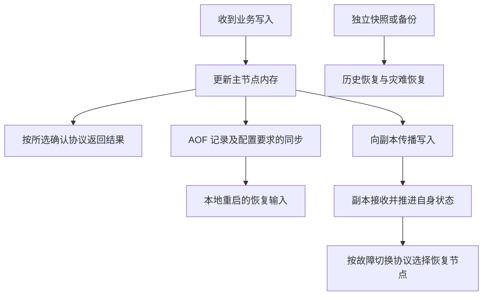

# 065 Redis 持久化与复制如何影响数据可靠性？

> 难度：中级 · 分类：缓存与消息

## 简短回答

RDB 保存时间点快照，AOF 记录写操作并按策略同步到存储，复制把数据传播到其他节点。三者分别影响恢复数据、写入丢失窗口与故障切换，但不能仅凭“开了 AOF、有副本”就承诺所有已确认写入都不会丢。

## 详细解析

### 明确确认发生在哪一步

```text
客户端写入 → 主节点内存更新 → 返回确认
                    ├→ AOF 写入与刷盘
                    └→ 复制到副本 → 副本应用或持久化
```

实际顺序与等待条件由配置、命令和产品形态决定。节点在确认之后、持久化或复制达到要求之前失败，可能丢失部分写入。数据是否落盘、是否被副本接收、是否能在故障切换后保留，是不同问题。

### 持久化策略的成本

RDB 适合快照恢复与备份，但快照间的新写入可能不在其中。AOF 的同步频率在吞吐、延迟和潜在丢失窗口之间取舍；每秒同步是常见策略，但不能脱离磁盘、操作系统和故障条件给出绝对保证。

重写和快照还需要 CPU、I/O 与额外内存预算，写入密集时复制写页面可能增大峰值内存。只按正常数据集大小配置容器上限，可能在维护操作时出问题。恢复时间也要实际测量，大文件恢复慢会扩大业务不可用窗口。

复制通常涉及异步传播。WAIT 等机制可以提高特定写入达到副本的确认程度，但不会把所有部署自动变成强一致系统；需要核对故障切换、持久化与读路径的整体保证。

若 Redis 只保存可重建缓存，丢数据主要带来回源压力；若保存唯一订单事实、锁或消费进度，数据丢失可能改变业务正确性。应先给数据分类，再确定可靠性要求，并用恢复演练检验备份是否真的可用。

### 把可恢复数据与业务损失对应起来

可靠性讨论先声明故障模型：只丢进程、丢一台机器、丢整个可用区，还是误删除后需要回到历史时点？内存、磁盘、副本和离线备份在这些故障下的作用不同。复制可以缩短节点故障后的恢复时间，却也可能很快传播错误删除，因此不能替代独立历史备份。



图把可能的路径分开表达，没有承诺 C 一定在 D 或 G 之前或之后；真实顺序要根据持久化、等待命令和部署产品核对。评审时应把选定配置代入，明确“返回成功时至少完成了哪些动作”，而不是只列出开启了哪些功能。

### WAIT 的返回值也需要业务处理

WAIT 针对当前连接此前的写入，等待一定数量副本确认达到相应复制进度，返回实际确认数量。连接池场景需要确保等待与目标写入属于正确连接和顺序，不能在另一个随机连接上执行 WAIT 就认为等到了这次写入。超时返回不足数量时，原写入不会因此自动回滚；调用者仍可能面对结果已经生效但复制保证未达到的状态。

即使收到所需数量的复制确认，故障切换算法、被提升副本和持久化状态仍影响最终保留结果。因此“WAIT 成功”不能单独等价于整个系统线性一致或永久不丢写。它提高特定边界的确认程度，需要放进完整故障模型中理解。

| 保存的数据 | 丢失后的主要代价 | 应重点验证 |
| --- | --- | --- |
| 可从数据库重建的商品缓存 | 冷启动及回源压力 | 有界重建和关键接口保护 |
| 会话或临时令牌 | 用户重新认证或会话状态变化 | 撤销与失效契约 |
| 去重记录或锁状态 | 可能重复执行业务 | 权威唯一性与资源端保护 |
| 唯一保存的业务事实 | 无法由其他来源重建 | 持久化、复制、备份及恢复承诺 |

### 恢复时间也是可靠性的组成部分

假设持久化文件能恢复全部目标数据，但加载要 20 分钟，业务只允许中断 2 分钟，这个方案仍然没有达到目标。应分别定义可接受的数据丢失量和恢复耗时，再实际演练下载备份、校验、加载、追赶增量和切换流量。

快照与重写期间，fork 后写入可能导致额外写时复制内存，磁盘也需要维护操作的峰值空间。评估时保留主数据、旧文件、新文件和正常写入的空间余量；具体峰值随版本、数据与写入率变化，不能套一个固定百分比宣称安全。本题未进行 Redis 持久化和故障切换实验，列出的是需要记录的确认边界和恢复证据。

## 常见误区 / 面试追问

- **副本等于备份吗？** 误删除也可能复制到副本，需要独立历史恢复能力。
- **成功返回就等于永久保存吗？** 取决于确认协议和部署保证，不能只看客户端返回值。
- **缓存重建为什么也要演练？** 重建流量可能压垮权威库，数据可重建不等于服务可平稳恢复。

## 参考资料

- [Redis 持久化](https://redis.io/docs/latest/operate/oss_and_stack/management/persistence/)
- [Redis 复制](https://redis.io/docs/latest/operate/oss_and_stack/management/replication/)
- [Redis WAIT](https://redis.io/docs/latest/commands/wait/)

[返回目录](../README.md) · [上一题](064-cache-levels.md) · [下一题](066-delivery.md)
