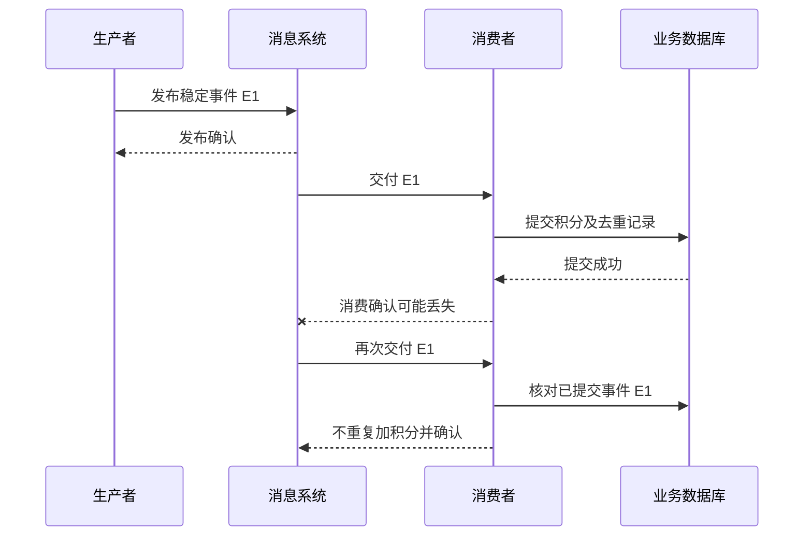

# 066 消息队列中的至少一次与至多一次是什么意思？

> 难度：基础 · 分类：缓存与消息

## 简短回答

至多一次允许丢失但避免重复交付，至少一次通过重试降低丢失风险但允许重复。恰好一次必须说明作用边界：消息系统内部的事务保证不自动覆盖外部数据库、邮件或支付副作用。业务通常需要可靠交付加幂等处理。

## 详细解析

### 确认位置决定故障窗口

消费者处理一条“增加积分”消息。如果先确认再改数据库，确认后崩溃可能永久丢掉积分变更；如果先提交数据库再确认，提交后崩溃会导致消息再次交付。没有共同事务时，调整顺序只能选择不同窗口，不能让窗口消失。

```text
先 ACK → 崩溃 → 业务未执行：可能丢处理
先提交业务 → 崩溃 → ACK 未到：可能重复处理

正确设计关注“副作用是否重复”，不只关注“消息是否重复”。
```

### 生产确认与消费确认不同

生产者收到 broker 确认，通常说明消息达到了相应存储或复制条件，不表示消费者已经完成业务。消费者确认则表示它愿意让系统按协议推进交付状态。两端都需要核对持久化、复制、重试与超时配置。

网络断开时，生产者可能不知道消息是否已经进入 broker，重试可能产生重复。稳定的事件 ID 或业务操作 ID 应随重试保持一致，让消费者能识别同一逻辑事件，而不是每次尝试重新生成身份。

Kafka 的幂等生产与事务可以在特定配置和消费隔离下提供其范围内的保证，但不能自动把任意外部数据库写入纳入同一原子提交。RabbitMQ 的确认与重新交付也需要消费者正确处理重复，不能只在正常链路上测试。

系统验收应注入几个关键故障点：发布后未收到确认、业务提交后未确认消费、消费者处理到一半退出。检查最终业务结果，而不是只看 broker 中消息条数。

### 一条事件有三个不同的完成状态

生产者发送完成、broker 接收确认、消费者业务提交，是三个不同事实。订单服务收到发布确认后，可以知道发布达到约定条件，却不能立即告诉用户“积分已到账”，除非它还取得了积分服务的业务结果。把技术确认映射成业务完成，是异步系统中常见的错误承诺。



图选择至少一次交付配合幂等业务的路径。重复交付本身没有被消除；消费者第二次执行检查仍是一次程序运行，但不再产生重复积分。这就是为什么面试回答必须说明“恰好一次”讨论的是投递、处理尝试，还是最终业务效果。

### 确认丢失时为什么不能靠猜

| 故障点 | 发送方知道什么 | 可靠处理方向 |
| --- | --- | --- |
| 发布连接断开且无确认 | 不知道 broker 是否已接收 | 按协议重试同一事件身份 |
| 消费者业务提交前退出 | 业务尚未完成或需核对 | 不提前推进消费确认 |
| 业务提交后、ACK 前退出 | 业务已完成，交付可能重来 | 去重事实与业务原子保存 |
| 消息超过保留期未处理 | 队列可能已不再提供事件 | 预警、保存或从权威事实补建 |

队列没有收到确认，不能推断消费者没有执行；生产者没有收到发布确认，也不能推断消息没有进入队列。这两个“不知道”是网络故障的正常可能状态，需要幂等和可查询事实处理，不能简单映射成确定失败。

Kafka 事务可以把某些 Kafka 内部的生产记录与消费位点提交关联起来，消费者隔离配置也参与保证；外部数据库写入若不在这个提交边界内，就仍有协调窗口。RabbitMQ 发布确认与消费 ACK 分别作用在两端，也不能相互替代。组件名称相同不代表所有队列类型和配置拥有同样持久性，应以所选版本与部署文档为准。

### 怎样验证至少一次方案的业务效果

可以准备一个固定事件 E1，业务含义是给账户增加 10 积分；在业务事务提交后、ACK 前让消费者退出，重新启动后重放 E1。最终积分应只增加 10，同时能够观察到处理尝试次数大于一次。若只检查队列最终清空，就可能漏掉积分加了 20 的错误。

再单独测试发布确认丢失，生产者重发时必须保留 E1，而不是生成 E2。需要额外核对消息持久性、保留期限与故障切换，否则“至少一次”只是局部重试逻辑。本题没有运行消息集群故障注入，图与实验输入用于说明验收边界。

## 常见误区 / 面试追问

- **至少一次就是绝不丢消息吗？** 还依赖持久化、复制、保留期、配置和操作，必须在明确故障模型内讨论。
- **消息重复就是队列有 bug 吗？** 对至少一次交付通常是设计内行为，消费者必须准备好。
- **怎样让业务只生效一次？** 把去重记录与业务写入放在同一事务或使用业务唯一性约束，参见 [067](067-consumers.md)。

## 参考资料

- [RabbitMQ 消费确认与发布确认](https://www.rabbitmq.com/docs/confirms)
- [Apache Kafka 设计与交付语义](https://kafka.apache.org/41/design/design/)

[返回目录](../README.md) · [下一题](067-consumers.md)
