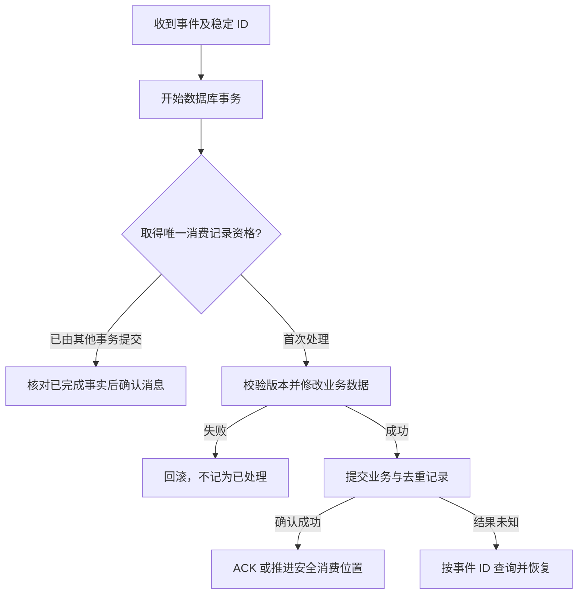

# 067 消费者如何做到业务幂等与有序处理？

> 难度：中级 · 分类：缓存与消息

## 简短回答

幂等消费需要稳定事件身份，并让去重标记与业务副作用共享可靠提交边界。有序处理需要明确顺序范围，例如同一订单，而不是盲目追求全局顺序。队列分区有序也不代表消费者并发执行后的完成顺序仍然有序。

## 详细解析

### 原子地处理事件与业务事实

在同一数据库事务中，先尝试插入 `(消费者逻辑身份, 事件 ID)` 唯一记录；只有首次成功者执行业务写入。事务提交后再确认消息。重复事件可以确认并结束，但如果前次业务事务失败，去重记录也必须随之回滚。

```text
BEGIN → 插入去重记录 → 更新订单投影 → COMMIT → ACK
                 │
           已存在且已提交 → 不重复更新 → ACK
```

去重表要包括消费者逻辑身份，否则两个不同业务处理器可能互相误认为已处理。清理周期应覆盖可能的重新交付与重放范围；历史事件仍允许回放时，不能只靠短 TTL 的缓存去重。

### 保序要一直保持到提交

同一订单按 order_id 路由到同一分区，可以得到该分区内的日志顺序。但消费后把每条消息交给任意 worker 并发执行，后来的取消事件仍可能先于创建事件完成。应按键串行、采用有序提交，或利用单调版本拒绝过期事件。

版本号不能随意丢掉缺口。若事件是完整状态快照，可以根据协议保留较新版本；若事件是“余额增加十元”的增量，跳过某个版本就会丢失效果。遇到乱序需要等待、补读权威状态或进入待修复队列。

多个订单之间通常不需要全局顺序。把全系统压到一个队列顺序执行会限制吞吐，也让一条失败消息阻塞所有业务。设计时先找真正需要共同排序的实体边界。

### 去重事务怎样覆盖崩溃和并发

以“订单支付后增加积分”为例，消费者身份是积分投影处理器，事件 ID 是支付事件 E1。事务内先争取唯一去重记录，再增加积分；如果积分更新失败，去重记录一起回滚。另一消费者并发处理 E1 时，由数据库唯一性决定谁获得执行资格，不能依赖两个进程各自的 map。



图中“已由其他事务提交”的判断必须发生在数据库允许的正常事务路径上；若唯一约束异常使事务失败，应先回滚或使用正确的冲突处理语句。不能吞掉异常后继续在失败事务里查询并宣称已处理。ACK 丢失后的重复交付会再次走检查，但不会重复积分变更。

去重标记不是永远越多越好，需要容量与清理策略；但删除后再重放 E1 就会失去这项保护。若支持一年前事件的历史重放，应保留足够事实，或为投影重建提供独立目标和消费身份，而不是让短期在线去重表承担无限历史。

### 顺序分为读取顺序、执行顺序和提交顺序

设同一订单事件为创建 v1、支付 v2、取消 v3。日志按 1、2、3 读取，worker 可能按 3、1、2 完成。分区键正确只能保证入口排列，不能保证并发业务完成次序。可按订单键串行执行，让不同订单并行；也可利用版本条件识别冲突，再补读或重排，但要承担相应状态管理。

| 事件形式 | 收到 v3 而本地只有 v1 | 是否可直接跳过 v2 |
| --- | --- | --- |
| 自包含的最新状态快照 | 可以按明确协议用 v3 替换旧投影 | 若不依赖中间副作用，可以 |
| 增加积分等增量 | 缺少 v2 的效果 | 不可以直接丢弃 |
| 业务命令 | 还要核对当前状态是否允许执行 | 不能仅按版本大小判断 |

消费位点的提交又是一条边界。Kafka 分区中 offset 10 尚未完成，11 已完成，若直接提交表示下一条为 12 的位点，进程崩溃后可能跳过 10。并发处理需要维护连续完成前缀，不能简单提交“最大的已完成 offset”。即使不同事件的业务执行互不依赖，恢复位点也必须正确。

验收可把同一事件投递两次、交换相邻事件到达顺序，并让低 offset 处理阻塞而高 offset 先完成。分别检查业务余额、版本和重启后消费位置。本文描述的是可检验协议，未实现消息客户端或数据库消费事务；单元 mock 只能证明分支逻辑，真正恢复行为需要集成实验。

## 常见误区 / 面试追问

- **先查去重表再插入安全吗？** 并发消费者可能同时查不到，必须有数据库唯一约束和正确事务处理。
- **处理失败就确认消息吗？** 只有失败已被可靠记录并转入约定处理路径时才考虑，否则可能丢失工作。
- **重复消息能直接比较内容哈希吗？** 相同内容可能是两次合法操作，业务事件身份比内容相等更可靠。

## 参考资料

- [Apache Kafka 设计](https://kafka.apache.org/41/design/design/)
- [PostgreSQL 唯一约束](https://www.postgresql.org/docs/16/ddl-constraints.html#DDL-CONSTRAINTS-UNIQUE-CONSTRAINTS)

[返回目录](../README.md) · [上一题](066-delivery.md) · [下一题](068-outbox.md)
