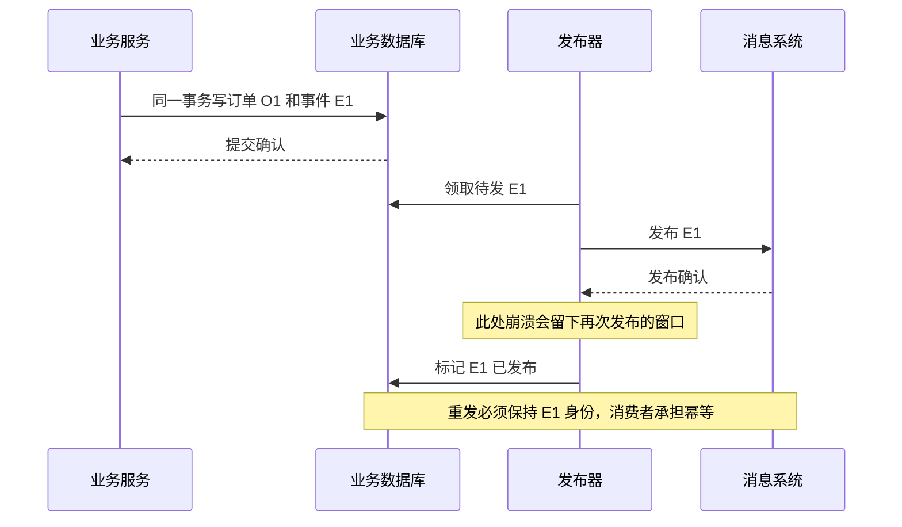

# 068 Outbox 如何解决写数据库与发消息的双写问题？

> 难度：高级 · 分类：缓存与消息

## 简短回答

Outbox 把业务数据和待发布事件写入同一数据库事务，保证“业务成功就有可恢复的发布意图”。独立发布器或 CDC 再把事件送到消息系统。它避免丢失发布意图，但发布确认与标记之间仍可能重复，因此消费者仍需幂等。

## 详细解析

### 先消除最危险的窗口

直接先提交订单再发消息，进程可能在两步之间崩溃，订单永久没有通知。先发消息再提交订单，消费者可能观察到最终回滚的订单。Outbox 把订单与事件记录原子写入，提交后无论应用何时退出，都能重新找到未发布事件。

```text
业务事务：写订单 + 写 Outbox → 一起提交
发布器：读取待发事件 → 发布并等待确认 → 标记已发布
                                      ↑
                         崩溃后可能重发同一事件 ID
```

事件至少包含稳定 ID、聚合对象 ID、事件类型、版本和载荷。不要让发布器每次重试都重新生成 ID，也不要只存一条指向会继续变化的业务记录的模糊通知，除非消费者契约明确是“重新读取最新状态”。

### 发布器也是一个需要设计的系统

轮询发布需要索引、批量大小和租约或并发领取机制。长时间持有数据库事务再等 broker 确认，会占连接与锁；若先领取再在事务外发布，则需要可靠租约与失败重新领取。无论哪种方式，都要分析旧发布者恢复与重复发布。

CDC 可以从数据库日志捕获提交事件，但需要管理日志保留、连接器位点、Schema 演进和故障恢复。采用工具并不意味着可以忽略发布延迟和位点丢失风险。

同一订单的事件顺序还要明确：多个发布器并发读取可能改变发布次序，应使用聚合键与序号配合分区及消费者协议。不要仅按创建时间猜测全局顺序。

监控应包含最老未发布事件年龄、待发数量、失败原因与重试次数。清理已发布记录前确认审计和重放需求，备份恢复后还要准备重复事件，而不是假定已发布标志永远正确。

### Outbox 保存的是事实之后的发布义务

订单 O1 与事件 E1 同时提交，意味着即使 API 进程马上退出，另一个发布器仍能发现 E1。若事务回滚，两者都不应可见。这里最重要的收益是把“以后必须发布”变成可恢复的数据，而不是把发布操作藏在某个 defer 或后台 goroutine 中。



如果先标记“已发布”再发消息，崩溃时可能再也没人补发；如果先发再标记，就可能重复。因此选择后者并处理重复，而不是虚构一个不会崩溃的两步过程。只有数据库与消息系统真的共享合适的原子协议，才可以讨论不同保证，普通 HTTP 调用不具备这一点。

### 领取协议要防止任务永久失踪

可以用状态、领取者和租约表示发布中的记录。领取事务保持短小，提交后在事务外访问 broker；发布成功后再以领取条件更新结果。执行者崩溃后，租约过期的事件重新可领取。旧执行者晚到的标记不能覆盖新领取者的状态，因此标记操作也应核对领取世代或身份。

| 状态 | 允许的转移 | 需要保存的证据 |
| --- | --- | --- |
| 待发布 | 被一个发布器领取 | 事件 ID、顺序、载荷 |
| 已领取 | 发布成功或租约到期 | 领取身份、期限、尝试次数 |
| 已发布 | 按保留规则归档 | broker 确认信息与完成时间 |
| 待修复 | 人工或受控重放 | 永久失败原因与原事件身份 |

租约只帮助恢复调度，不保证 broker 中没有重复。两个发布器在租约交接处都可能成功发送 E1，消费者仍要识别 E1。若要求同一订单的 E1、E2 有序，还应防止 E2 在 E1 未确认时被另一个发布器抢先送出，或者让消费协议能够处理乱序。

### 事件载荷与表结构不必同生共死

事件是跨时间的契约。保存订单创建时的金额与币种，可以让消费者解释当时的事实；只保存订单 ID 再读取当前表，读到的可能已是修改后的状态。两种设计都可以，但事件类型要清楚区分“发生过的事实”和“请刷新当前状态”，否则重放会产生不同结果。

敏感字段不应为了方便全部复制到长期消息日志中；保留能完成消费职责的内容，并定义载荷版本。CDC 连接器的位点、日志保留和 Schema 变化也要纳入运维，不能以“不写轮询代码”推断没有恢复成本。

验证可在业务提交前、提交后未领取、发布确认后未标记三个点停止进程，再检查最终是否有遗漏或重复业务效果。重点指标是最老待发事件年龄和发布失败原因，而不仅是总条数。本题未运行发布器或 CDC 集群，图说明的是恢复协议与需要验证的窗口。

## 常见误区 / 面试追问

- **Outbox 是否实现恰好一次？** 它保证本地事实与意图原子提交，外部交付仍需处理重复。
- **事务提交后 goroutine 发消息不就够了？** 进程崩溃会丢失内存任务，必须持久化意图。
- **所有事件都应放完整对象吗？** 取决于事件契约、敏感性和版本演进，避免把内部数据库行直接当长期外部协议。

## 参考资料

- [Debezium Outbox Event Router](https://debezium.io/documentation/reference/stable/transformations/outbox-event-router.html)
- [AWS 官方：Transactional Outbox](https://docs.aws.amazon.com/prescriptive-guidance/latest/cloud-design-patterns/transactional-outbox.html)

[返回目录](../README.md) · [上一题](067-consumers.md) · [下一题](069-message-retries.md)
