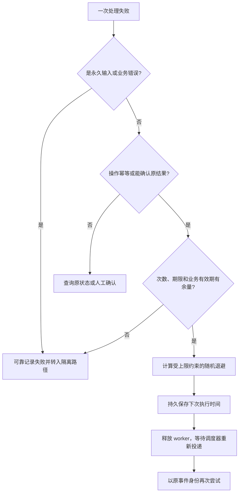

# 069 重试、退避与死信队列如何避免故障放大？

> 难度：中级 · 分类：缓存与消息

## 简短回答

先区分暂时性错误和永久性错误，再对可重试失败使用有上限的指数退避与随机抖动。超过尝试次数或处理期限的消息进入可观测的隔离路径。死信队列需要负责人和重放规则，否则只是把失败藏到另一个地方。

## 详细解析

### 重试会制造额外流量

原始消息每秒 1000 条，每条最多尝试五次，依赖持续故障时可能接近每秒 5000 次处理尝试，还不包含生产端和下游自己的重试。立即重新入队会让同一批失败消息持续占满 worker，使新消息也无法推进。

```text
失败 → 分类
  ├─ 参数/格式永久错误 → 记录原因 → 隔离并告警
  └─ 临时故障 → 计算退避 → 到期重试 → 超预算后隔离
```

退避可按 `min(上限, 基础间隔 × 2^尝试次数)` 计算，再加入随机抖动，避免所有消费者在同一时刻冲击恢复中的依赖。次数和时间都要有界，且要考虑消息业务有效期；过期支付通知不能无限重试后突然执行旧动作。

### 延迟不应占住工作者

消费者睡眠几十分钟等待下一次重试，会占用处理槽并影响关停。可使用消息系统支持的延迟机制或持久调度队列，在适当时间重新投递。具体组件对延迟、顺序和确认的保证不同，需要核对版本配置。

死信记录应保留事件 ID、来源、失败原因、尝试次数和必要诊断信息，避免保存不必要的敏感载荷。修复后重放要限速、可审计，并保留原逻辑身份以维持幂等；如果业务意图确实变化，应该创建新的明确操作，而不是偷偷更改旧事件。

顺序业务要考虑毒消息：跳过它可能让后续状态失去前提，不跳过则可能阻塞整个键。可以隔离该实体并让其他实体继续，或者通过权威状态修复，不能只给全局队列加更多 worker。

### 重试资格由错误、操作与预算共同决定

同样的网络超时，查询商品通常可以再次读取，付款则需要先确认幂等身份和原操作状态。消息处理返回“字段不符合 Schema”时，重复执行一百次不会让输入自行变合法；依赖限流或短暂不可达才可能在等待后恢复。分类应该保留结构化原因，而不是用字符串是否包含 timeout 来决定所有行为。



以基础间隔 1 秒、上限 30 秒、full jitter 为例，第 k 次重试从 `0` 到 `min(30, 2^k)` 秒的范围采样，k 从 0 开始。它让不同消息分散，而不是保证每次重试一定比上次晚一倍。实际还应服从下游明确的等待要求，并把重试时间计入消息总期限。

### 一层五次，三层可能是多少

假设生产任务、消费处理、HTTP 客户端三层各允许最多 5 次尝试，最坏路径可能触发 `5 × 5 × 5 = 125` 次下游尝试，而不是 15 次。这是上界推演，不代表每次故障都达到该数值。应尽量指定主要重试责任层，并限制全链路总尝试和恢复流量。

所有失败消息立即回到队首，会让毒消息不断抢占成功消息的处理机会。持久延迟调度把等待状态移出 worker；进程重启后还要保留已尝试次数和原始创建时间，不能每次启动都重置预算。对于严格按实体有序的流程，隔离毒消息可能也要暂停该实体后续事件，其他实体则可继续。

| 死信处置步骤 | 应确认的结果 |
| --- | --- |
| 分类与告警 | 有明确负责人、原因和影响实体 |
| 修复代码或数据 | 确认原失败原因已消除 |
| 小批量重放 | 仍使用原逻辑身份，限制速率 |
| 业务对账 | 缺失效果补齐，没有重复副作用 |
| 清理归档 | 保留必要审计与恢复信息 |

把消息转入死信也需要可靠交付。应用自己“发布到隔离队列，然后 ACK 原消息”仍有双写窗口；需要使用组件提供的适当机制并核对它的可靠性，或用持久状态协议处理。RabbitMQ 不同队列类型和死信配置的保证有差异，不能因配置了 DLX 就假设任意故障下绝无丢失。

恢复时应逐步放大重放量，观察依赖成功率和在线业务延迟。队列清空并不是唯一目标：若通过提前 ACK 把失败丢掉，图表同样漂亮，业务却仍未完成。本题没有实际运行消息调度与死信重放，退避数字和多层尝试数用于设计检查。

## 常见误区 / 面试追问

- **所有 5xx 都可重试吗？** 还要看操作幂等性、错误语义和预算，不能只根据一个状态类别决定。
- **死信清空就表示故障解决吗？** 必须确认业务效果已补齐且没有重复，队列长度只是中间指标。
- **重试状态放内存够吗？** 需要跨重启保持预算时必须持久化，否则每次重启都可能重新获得全部尝试次数。

## 参考资料

- [RabbitMQ 死信机制](https://www.rabbitmq.com/docs/dlx)
- [AWS Builders Library：超时、重试与抖动](https://aws.amazon.com/builders-library/timeouts-retries-and-backoff-with-jitter/)

[返回目录](../README.md) · [上一题](068-outbox.md) · [下一题](070-backlog.md)
