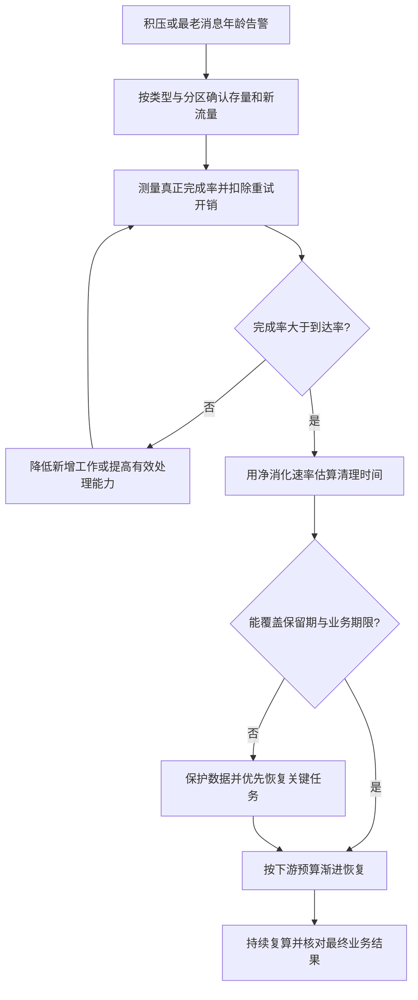

# 070 场景题：消息积压持续增长，如何算清恢复时间？

> 难度：高级 · 分类：缓存与消息

## 简短回答

积压恢复取决于净消化速率，而不是消费者总吞吐。若存量为 B、持续到达率为 λ、实际完成率为 μ，只有 μ 大于 λ 时，近似恢复时间才是 B / (μ − λ)。还要核对分区、热点、失败重试和下游容量。

## 详细解析

### 一道容量计算题

积压 120 万条，每秒新来 3000 条，消费者每秒真正完成 5000 条，净消化为 2000 条每秒，理想清空时间约 600 秒。若只按 120 万除以 5000，得到 240 秒，就漏掉了恢复期间持续进入的新消息。

如果处理失败率高，5000 次尝试不等于 5000 次成功，计算必须使用符合业务定义的完成率。批量、消息大小和热点差异也会改变每条消息的平均成本，最好分类型估计。

### 为什么加消费者仍不变快

| 证据 | 可能瓶颈 | 调整方向 |
| --- | --- | --- |
| 活跃消费者少于实例数 | 分区并行度限制 | 核对分区和分配策略 |
| 一个分区积压特别高 | 热键或数据倾斜 | 调整业务分片与处理模型 |
| DB 池等待持续增加 | 下游已饱和 | 降低单位消息成本或扩下游 |
| 重试占大多数处理量 | 依赖故障或毒消息 | 分类隔离与控制重试 |

Kafka 同一消费组内，一个分区在某时刻通常由一个消费者负责；简单增加超过可分配分区数量的消费者，不会线性提升该组吞吐。应用内部再并行处理也要保持必要的提交顺序和实体顺序。

### 恢复计划不只追求清零

优先处理有时效性的消息，限制恢复流量对在线业务的影响。需要提高批量时，验证单批内存、提交延迟和失败重放成本；批次太大会让少数错误拖住更多消息。

同时观察最老消息年龄。积压数量下降，但最老关键任务一直没完成，业务仍可能严重受损。保留期也构成硬边界：预计恢复时间超过剩余保留时间，需要先保护数据或调整处理策略。

### 先统一计数口径，再计算恢复时间

如果监控上的每秒 5,000 是处理尝试数，其中 20% 失败，而成功里又有重复事件，那么唯一业务完成率可能低于 4,000。计算 B、λ、μ 时必须使用可比较单位：要么都是待完成任务，要么都是某个分区内需要推进的记录；不能拿字节积压除以每秒消息数。

继续使用 120 万存量、每秒新来 3,000 的假设。如果每秒 5,000 次尝试只有 80% 形成有效完成，μ 是 4,000，净消化只有 1,000，预计需要 1,200 秒。如果有效完成比例下降到 60%，μ 等于 λ，存量不会下降；低于这个比例则越处理积压越多。

### 恢复预算可以反推所需吞吐

若业务要求 10 分钟内完成历史积压，所需有效完成率至少为 `3,000 + 1,200,000 / 600 = 5,000` 条每秒。若预计只有 80% 的尝试转化为有效完成，则需要约 6,250 次尝试每秒，还要确认下游能承受这份工作量。不能只把消费者副本数调到一个看起来更大的数字。

| 变化 | 对恢复时间的影响 | 要验证的限制 |
| --- | --- | --- |
| 限制非关键新增消息 | 降低 λ，增加净消化能力 | 被延后的业务及恢复方式 |
| 提高批量大小 | 可能降低每条固定成本 | 内存、锁持有和失败重放规模 |
| 增加消费者 | 可能提高 μ | 分区数、热键和下游容量 |
| 隔离永久失败消息 | 减少无效尝试占用 | 隔离后顺序与业务修复 |

平均值还会掩盖分区倾斜：十个分区中的九个已经清空，一个热键所在分区仍每秒新增 500、完成 300，全局积压可能暂时下降，但这个分区永远追不上。恢复计划需要按瓶颈分区或消息类型计算，不能只用全局平均完成率解释最老任务的命运。

### 保留期与业务期限形成两条边界

消息还保留两小时，不代表业务能再等两小时；短信验证码可能早已无效，结算事件却不能随意丢弃。应区分过期后可取消的任务、必须补偿的任务和可以从权威事实重建的投影。任何跳过位点或删除积压都应有明确业务依据，不能用清理数量替代恢复完成。

实际恢复中 λ 和 μ 会变化，需要每个观测窗口重新估算，给出范围而非假装精确到某秒。验收要同时看到关键任务年龄下降、失败重试受控、在线业务未被恢复流量拖垮，以及业务对账完整。本题全部数量为容量推演，没有执行 Kafka 或 RabbitMQ 的吞吐实验。

## 常见误区 / 面试追问

- **μ 等于 λ 能清掉历史积压吗？** 不能，最多保持积压规模稳定。
- **直接跳过旧消息可以恢复吗？** 只有业务明确允许且有补偿或重建方案时，不能用丢弃掩盖处理失败。
- **什么时候宣布恢复？** 关键消息年龄、失败率与下游负载都回到目标范围，并确认存量业务结果完整。

## 参考资料

- [Apache Kafka 设计：消费与分区](https://kafka.apache.org/41/design/design/)
- [RabbitMQ 消费预取](https://www.rabbitmq.com/docs/consumer-prefetch)

[返回目录](../README.md) · [上一题](069-message-retries.md) · [下一模块](../08-microservices/071-boundaries.md)
