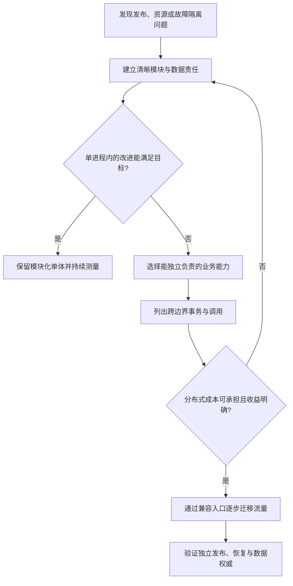

# 071 什么时候应该拆微服务？边界如何确定？

> 难度：基础 · 分类：微服务

## 简短回答

拆分应由独立发布、资源扩展、故障隔离或团队责任驱动，边界尽量围绕稳定业务能力和数据所有权。单体中的混乱不会因为加上网络调用就消失；先建立模块边界，再评估分布式收益是否覆盖一致性与运维成本。

## 详细解析

### 从订单与库存讨论边界

订单负责购买意图与状态流转，库存负责可售数量与预留规则。若两者由不同团队维护、负载形态显著不同，拆分可能有价值；但下单原本的本地事务会变为跨服务协议，需要设计幂等、预留、确认与释放。

```text
模块化单体：HTTP → 订单用例 → 库存模块 → 同库事务
拆分之后：订单服务 → RPC/事件 → 库存服务
新增责任：超时、重复、部分成功、补偿、追踪和发布兼容。
```

如果每次业务改动都必须同时发布五个服务，且它们共享表、相互直接改数据，系统可能只是把一个紧耦合应用分散到多个进程，获得了网络故障却没有独立性。

### 用访问与变更证据判断

观察哪些数据必须原子变化、哪些操作总是一起发布、谁对错误和可用性负责。强事务和密集同步调用提示边界可能切得太细；独立热点、独立合规范围或清晰能力归属则支持拆分。不能只按数据库表名一表一服务。

服务之间通过明确 API 或事件协作，数据由所属服务控制。跨服务报表可以通过只读投影或分析管道构建，避免重新引入跨库直接写。公共库适合协议工具和稳定基础能力，不宜放大量领域规则让所有服务同时升级。

迁移可以先把一项明确能力从单体中抽出，通过兼容适配逐步切流。必须定义旧新写路径和回滚规则，不能同时让两个服务都自认是同一份数据的权威。

### 用一个具体拆分提案检验收益

假设电商团队考虑把“订单展示”与“订单写入”拆成两个服务，理由是展示流量大。先检查读写是否真的需要独立扩容：只读副本、查询投影或同进程内独立并发预算，也可能解决当前瓶颈。如果展示与写入必须每周一起改字段、共享大量内部状态，拆进程未必带来足够独立性。



另一个提案是把图片处理独立出来。它 CPU 和内存峰值明显、可以异步完成、输入输出契约稳定，也不要求与订单提交共享事务，这些事实更支持独立资源与失败隔离。图中的判断没有规定某种架构必然优越，而是要求每一次拆分回答“解决了哪个已知问题”。

### 边界不是文件夹，而是一组责任

| 检查项 | 边界较清晰的表现 | 边界可疑的表现 |
| --- | --- | --- |
| 数据所有权 | 一个服务决定其状态与写规则 | 多个服务直接更新同一张表 |
| 发布独立性 | 兼容窗口内可单独发布 | 每次小改都必须同时上线 |
| 故障隔离 | 非关键依赖失败有明确降级 | 任意服务挂掉都阻塞全站 |
| 运维责任 | 有负责人、指标和恢复方式 | 出错后没人能解释调用链 |

订单与库存拆开后，需要明确库存预留的生命周期：下单拿到预留不等于永久扣减，支付成功如何确认，订单取消如何释放，重复确认或释放如何处理。服务拆分把原本隐含在同库事务中的不变量暴露成协议，若提案中没有这些状态，只画两个方框还不能进入实施。

### 迁移时先保住一个写入权威

可以先让旧入口调用抽出的新能力，保持外部 API 稳定；读取按比例切换，写入则经过清晰的路由与迁移协议。若旧新两边都直接接受同一对象写入，需要解决冲突、增量同步和重复请求，复杂度显著增加。回滚前还要判断新服务产生的数据是否能被旧实现理解。

拆分后的评价也应具体：部署等待是否缩短，资源是否能独立扩展，故障影响是否收敛，业务修改是否仍需要多团队协调。多了几个仓库、用了 gRPC 或上了 Kubernetes，都不等于已经获得这些收益。

面试练习可以给定“一个团队、两种负载、每周联合发布、下单要求原子库存”的背景，要求提出保留单体与拆分的两种方案并比较。能够主动保留事务边界，同时识别可独立抽出的计算任务，比见到高并发就回答微服务更有判断力。

## 常见误区 / 面试追问

- **微服务一定提高可靠性吗？** 隔离良好可能减少影响范围，依赖链变长也会引入更多失败点。
- **一个团队只能拥有一个服务吗？** 不是技术规则，关键是责任明确且团队能承担其运维复杂度。
- **早期项目该怎么开始？** 用清晰模块和接口保留演进空间，等独立性需求有证据后再拆。

## 参考资料

- [Microsoft：微服务边界设计](https://learn.microsoft.com/en-us/azure/architecture/microservices/model/microservice-boundaries)
- [Go 包命名与职责](https://go.dev/blog/package-names)

[返回目录](../README.md) · [下一题](072-grpc.md)
