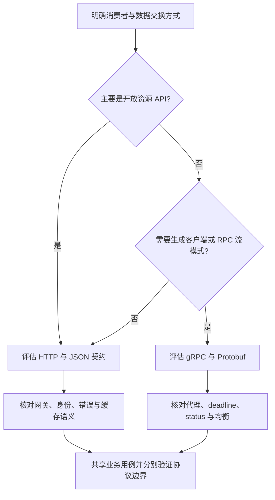

# 072 HTTP 与 gRPC 应该如何选择？

> 难度：基础 · 分类：微服务

## 简短回答

更准确的比较是常见 HTTP/JSON API 与 gRPC：gRPC 本身通常也使用 HTTP/2。前者便于浏览器、开放接口和通用工具接入，后者提供明确 RPC 契约、代码生成及流式调用能力。选择取决于消费者、协议治理和基础设施，而不是简单认为二进制一定更快。

## 详细解析

### 同一业务可以有两种入口

订单查询可以同时服务移动端和内部风控。外部 HTTP 接口关注资源表示、缓存和网关兼容；内部 gRPC 接口关注类型契约、调用期限与流式需求。两种入口可以复用业务用例，但身份来源、错误映射和配额不应被假设完全相同。

| 维度 | HTTP/JSON | gRPC |
| --- | --- | --- |
| 消费者 | 浏览器和通用 HTTP 客户端方便 | 通常使用生成客户端 |
| 协议契约 | 需另行维护 Schema/文档 | 常用 Protobuf 定义 |
| 流式能力 | SSE、分块等协议设计 | 支持多种 RPC 流模式 |
| 调试治理 | 文本工具广泛 | 需要理解 metadata、status、deadline |

表格描述常见使用形态，不是互斥技术清单。HTTP 同样可以严格定义契约，gRPC 也需要网关、负载均衡和可观测性配置。

### 不要把 RPC 当本地函数

一次 RPC 可能已经在远端执行，但客户端只收到超时；取消不会回滚远端副作用。客户端连接应按库约定复用，避免每次请求创建新通道。方法需要合理 deadline，并根据幂等性决定是否重试。

长连接和 HTTP/2 多路复用影响负载分布。若负载均衡只在连接建立时选择后端，少量长期连接可能导致实例分配不均；客户端均衡与代理策略要实际核对。浏览器调用 gRPC 也通常需要适配方案，不能假设与普通 fetch 完全相同。

性能评估应包括序列化、连接复用、压缩、消息大小和服务端处理。对于主要时间都在数据库的接口，更换编码格式未必改变用户延迟。

### 按消费者和调用形态选择协议

假设同一个商品查询要给浏览器、合作伙伴和内部批量计算服务使用。浏览器需要现成 HTTP 工具和缓存语义，合作伙伴重视文档与跨语言接入，内部服务可能需要生成客户端和双向流。可以让传输适配层映射到同一业务用例，但不能因为“同一个方法”就省略各入口的认证、配额和消息大小限制。

这是选择路径而不是排他规则。严格 Schema 的 HTTP API 同样可以代码生成，gRPC 也可能通过网关向外开放。真正需要验证的是客户端、代理和服务端是否共同支持选定语义，尤其是流式消息、取消和错误传递。

### 一次 RPC 失败包含多个不同位置

| 失败位置 | 业务是否执行 | 调用方应该知道的边界 |
| --- | --- | --- |
| 请求无法到达任何实例 | 这次传输未触达处理器 | 仍应核对库的尝试与重试行为 |
| 服务端校验拒绝 | 未开始目标副作用 | 返回可识别的业务或参数错误 |
| 服务端提交后响应丢失 | 可能已经成功 | 使用原操作身份确认结果 |
| 长流中途断开 | 可能只完成部分消息 | 用业务序号或检查点恢复 |

gRPC 的 status 与 HTTP 传输状态属于不同层。代理日志看到 HTTP 200，并不足以判断 RPC 成功；调用端应读取库返回的 RPC 状态，观测系统也需要按 RPC 结果统计错误。对流式调用，建立流成功不代表后续所有消息都成功，读取结束状态才是协议结果的一部分。

### 长连接如何影响容量和治理

一个 ClientConn 是客户端通信抽象，不应简单等同于一条固定 TCP 连接。连接解析、均衡和子连接管理由库及配置共同决定。复用客户端可以减少建连成本，但如果前方只做连接级均衡，少量长期 HTTP/2 连接可能使新增实例迟迟得不到流量；需要核对均衡实际发生在哪一层。

性能实验应固定业务逻辑、消息内容、连接复用和压缩策略，再比较吞吐、CPU、分配与尾延迟。若请求 100 ms 中有 95 ms 用在数据库，即使把其余部分降到 2 ms，总耗时也只是约 97 ms；这是分解计算，不是 gRPC 的实际跑分。二进制编码收益必须在完整链路中衡量。

本仓库的 [Kratos 示例](../examples/catalog/README.md) 提供两种真实传输入口，用于观察协议如何复用用例；它没有进行 HTTP/JSON 与 gRPC 的性能对比，因此不能把示例测试通过解释为协议性能优劣的证据。

## 常见误区 / 面试追问

- **gRPC 默认就有超时吗？** 应显式设置合理 deadline，不依赖无限等待的默认行为。
- **HTTP 状态 200 代表 gRPC 成功吗？** gRPC 有自己的状态表达，需要按协议和客户端返回值判断。
- **同时支持两套入口会复制业务吗？** 传输层负责适配，业务用例共享，参见 [083](../09-kratos/083-transports.md)。

## 参考资料

- [gRPC 核心概念](https://grpc.io/docs/what-is-grpc/core-concepts/)
- [gRPC 截止时间](https://grpc.io/docs/guides/deadlines/)

[返回目录](../README.md) · [上一题](071-boundaries.md) · [下一题](073-protobuf.md)
