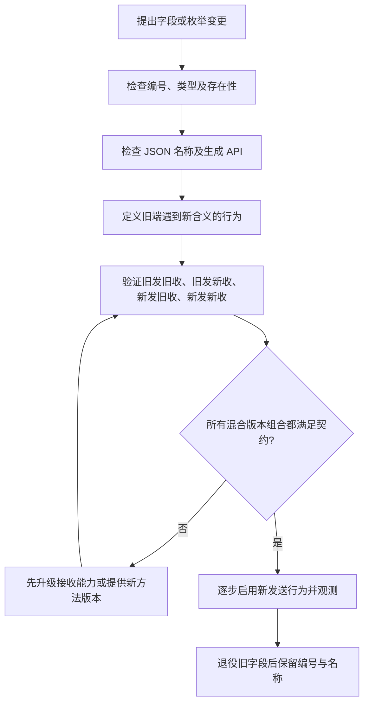

# 073 Protobuf 如何演进而不破坏兼容性？

> 难度：中级 · 分类：微服务

## 简短回答

Protobuf 二进制编码主要通过字段编号识别字段，已发布编号不能随意改变或复用。新增字段也需要定义缺省语义，删除字段后保留编号和名称。二进制兼容不等于 JSON、生成代码和业务语义都兼容，应分层验证。

## 详细解析

### 一个明确的消息契约

```proto
syntax = "proto3";
package interview.order.v1;
option go_package = "example.com/interview/api/order/v1;orderv1";

message Order {
  string id = 1;
  optional int64 discount_cents = 2;
  reserved 3;
  reserved "legacy_state";
}
```

discount_cents 使用 optional 表达是否提供，避免把“没有传”与“明确传零折扣”混为一谈。reserved 表明历史编号和名称不能重新用于别的含义。该片段是完整消息定义，可由固定版本生成器处理；不是某个已部署服务的协议。

### 兼容性包含四层

二进制 wire 层关注字段编号和类型编码；JSON 层关注字段名与表示；生成代码层关注调用 API 是否变化；业务层关注旧客户端如何解释新状态。改一个 enum 即使二进制能传输，也可能让旧业务分支落入未知状态处理。

新增字段时先让接收方理解它，再逐步让发送方使用；旧接收方忽略未知字段不代表它会正确执行依赖该字段的新业务约束。关键变更可能需要新方法或新协议版本，并保留迁移窗口。

不要改变字段单位而保留同一名字与编号，例如金额从元改成分；这种变更甚至可能完全不触发编译错误，却产生严重业务错误。时间精度、默认枚举和空值也应在注释与契约测试中说明。

生成器与运行库版本需固定，生成结果应可重建。协议变更评审应检查删除、重编号、类型变更、JSON 名称和旧客户端行为，而不只是看生成代码能否编译。

### 用四种版本组合验证发布顺序

假设新请求增加 optional discount_cents，缺失表示保持原有折扣计算，而显式零表示不使用折扣。新服务必须能正确解释旧客户端未传字段；旧服务即使能跳过新字段，也不代表能按新客户端期待执行“禁用折扣”。这是一种语义兼容问题，编解码成功发现不了。



| 组合 | 必须回答的问题 |
| --- | --- |
| 旧客户端 → 新服务 | 缺失新字段时是否保持旧行为 |
| 新客户端 → 旧服务 | 忽略新字段是否会执行错误业务 |
| 旧服务 → 新客户端 | 新客户端是否能接受缺少新响应字段 |
| 新服务 → 旧客户端 | 未知枚举或新增字段会不会破坏分支 |

如果新约束是“只能购买经过新风控批准的商品”，旧接收方忽略字段就继续下单，显然不兼容。应先确保所有可能接收者具备新校验能力，再启用新语义，必要时使用新方法和路由隔离；不要把未知字段机制当成业务协商协议。

### 存在性与零值如何影响补丁更新

隐式存在性的标量字段在一些合并操作中无法表达“把当前非零值清成零”，因为默认值可能不被当作需要合并的字段。显式存在性保留“是否设置”的信息，另一种常见协议是使用 FieldMask 指定更新字段。具体选择取决于更新契约，不能只根据 Go 生成字段是否为指针决定业务含义。

删除字段应同时考虑编号和名称：编号复用会让旧二进制消息被解释为新含义，名称复用还可能影响文本或 JSON 路径。字段从 int32 换成 int64 等变化即使在某些 wire 层规则下可处理，也需要考虑旧接收方范围与数据截断，不能只记一张“兼容类型转换表”就直接上线。

金额单位、时区、枚举含义和列表顺序通常不体现在 wire 类型中。把 `amount=100` 从元改为分，消息字节可以完全合法，业务价值却改变百倍。需要另一个字段或明确的新协议，并在过渡期验证换算，而不是沿用原编号偷偷改变注释。

### 生成结果要能追溯到同一份契约

评审时同时看 proto 差异、生成器版本和混合版本测试；生成代码很长，但关键变化往往只有一个字段号或 presence。可重建生成结果能发现有人手改生成文件，契约测试则验证旧消息样本和新代码的解释。本文的 Order 消息用于说明 Schema，没有对应已部署消费者；兼容矩阵是变更验证方法，不是已运行的跨版本结果。

## 常见误区 / 面试追问

- **字段名可以随便改吗？** 对二进制编号影响有限，但 JSON 和源代码 API 可能受影响，不能只看 wire 兼容。
- **默认零值就是用户没有设置吗？** 不一定，需要存在性语义时使用适合的字段定义。
- **unknown fields 能解决所有升级吗？** 不能，保留字节不等于理解新业务语义，转成其他表示还可能丢失信息。

## 参考资料

- [Protobuf proto3 语言指南](https://protobuf.dev/programming-guides/proto3/)
- [Protobuf 字段存在性](https://protobuf.dev/programming-guides/field_presence/)

[返回目录](../README.md) · [上一题](072-grpc.md) · [下一题](074-discovery.md)
