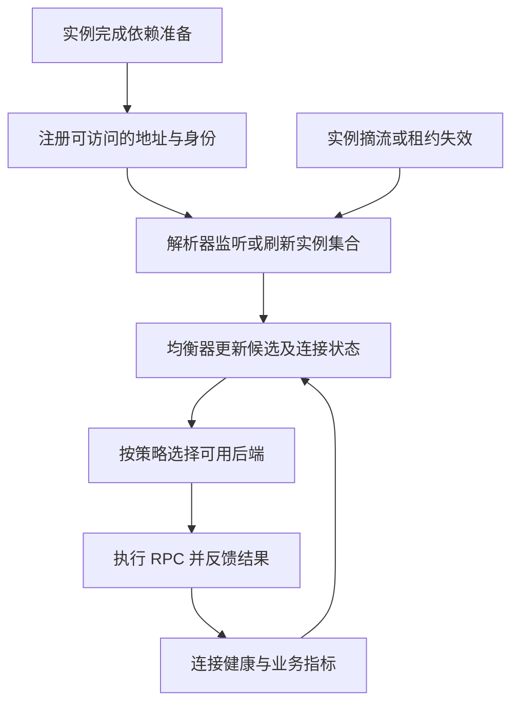

# 074 服务发现和负载均衡各解决什么问题？

> 难度：中级 · 分类：微服务

## 简短回答

服务发现把逻辑服务名解析为当前可用实例集合，负载均衡从候选实例中选择请求目标。注册存在不代表实例健康，列表更新也不代表连接立即迁移；必须协调健康状态、缓存、连接复用和摘流过程。

## 详细解析

### 拆开控制与数据路径

```text
实例注册/续约 → 注册中心 → resolver 更新候选地址
                                      ↓
请求进入 → balancer 选择后端 → 已有或新建连接 → RPC
```

注册中心是控制信息来源，不应要求每次业务请求都同步查询一次。客户端通常缓存并监听更新，因此注册中心短暂故障时能否继续调用，取决于缓存与失效策略；不能简单认为注册中心不可达就必须立即丢弃所有健康连接。

### 健康与权重需要真实反馈

一个实例可能存活但依赖未准备好，应该在 readiness 层停止分配新请求；也可能健康检查成功但核心业务已严重超时，需要业务指标辅助判断。把所有下游依赖都放进 liveness 并触发重启，可能制造整个集群重启风暴。

轮询实现简单，但请求成本差异大时不一定均匀；基于延迟或活跃请求的策略可以更好地反映负载，也可能受样本不足、抖动和异常反馈影响。策略应记录选择结果与实例指标，避免无法解释的自动切换。

长连接使“连接均匀”与“请求均匀”不相同。HTTP/2 或 gRPC 可能把大量请求复用到少数连接，扩容后旧连接未必立即重新分配。需要核对客户端、代理与服务网格实际均衡层级。

摘流要先停止新的选择，再等待在途请求和必要传播窗口，最后退出。注册注销、健康状态、连接终止和应用关停应放在同一时间线中验证。

### 新实例从注册到真正接到请求还差几步

假设服务从两台扩容到四台。新实例先完成初始化，发布可用地址；客户端 resolver 获得更新，均衡器把新地址纳入候选；必要的连接准备完成后，请求才可能落到新实例。任何一步滞后，都可能出现“注册中心明明有四台，流量还是集中在两台”的现象。



图中的反馈不能无差别处理所有错误。一个实例返回合法的库存不足，不能仅因为 RPC error 非空就被剔除；持续连接失败和容量拒绝也可能需要不同策略。若所有实例因为共享依赖故障一起变成“不健康”，路由层还应定义无候选时的行为，不能在无界重试中不断刷新注册中心。

### 长连接下先问均衡的单位是什么

四台后端各有一条连接，不代表各承担四分之一工作。一条连接可能承载大量流，一次 RPC 也可能处理数千条数据。按连接数、请求数、活跃请求数或估算工作量做均衡，解决的是不同问题。

| 观测现象 | 需要核对的层次 |
| --- | --- |
| 新节点注册成功但零流量 | 解析缓存、策略更新和连接建立 |
| 请求数均匀但 CPU 不均 | 请求成本、数据热点及硬件差异 |
| 客户端仍访问已下线地址 | 传播时间、缓存和在途连接 |
| 注册中心不可达但调用仍成功 | 客户端缓存和已有数据路径 |

DNS TTL 也不等于所有客户端都在该时刻刷新，实际解析器、缓存和连接复用行为需要验证。gRPC 的不同策略选择和解析目标格式会影响候选集合的使用，不能只根据客户端创建了一个连接对象就推断实际路由。

### 注册中心故障时怎样保留可解释的行为

已知地址短期内继续使用，可以降低控制面故障对业务的立即影响；但长期使用陈旧列表又可能继续访问已退役节点。设计要同时给出陈旧信息的容忍窗口、健康反馈和恢复刷新机制，并记录列表版本与更新时间。安全相关地址变更还可能不允许无限使用旧信息。

退出路径反向经过这些环节：先表达不再接收新流量，再等待传播和在途请求，最后关闭监听与依赖。测试要记录每个时刻新请求落在哪些实例、已有流是否正常结束。只验证注销 API 返回成功，不能证明所有客户端已经停止选择该节点。本题没有部署注册中心或代理，图解用于指导端到端路由实验。

## 常见误区 / 面试追问

- **DNS 就不能做服务发现吗？** 可以，能力与更新时效取决于记录、TTL 和客户端缓存行为。
- **有注册中心就无需健康检查吗？** 不对，注册与业务可服务状态不是同一事实。
- **负载均衡能保证不访问故障实例吗？** 故障检测有延迟，调用方仍需超时、错误处理和受控重试。

## 参考资料

- [gRPC 自定义名称解析](https://grpc.io/docs/guides/custom-name-resolution/)
- [gRPC 负载均衡](https://grpc.io/docs/guides/custom-load-balancing/)
- [Kubernetes 服务与网络](https://kubernetes.io/docs/concepts/services-networking/service/)

[返回目录](../README.md) · [上一题](073-protobuf.md) · [下一题](075-budgets.md)
