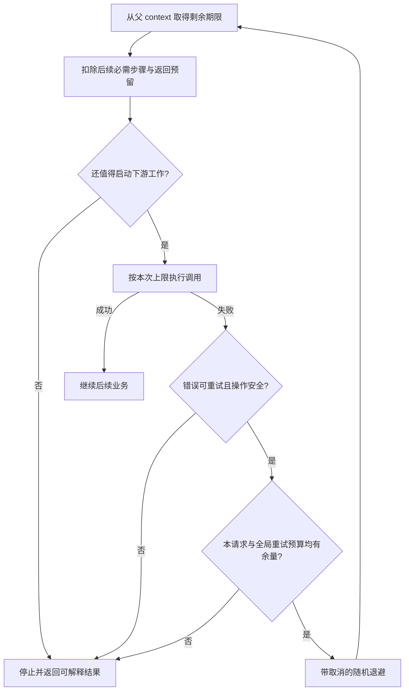

# 075 调用链怎样分配超时预算与重试预算？

> 难度：中级 · 分类：微服务

## 简短回答

整体请求期限是上限，每个下游只能使用剩余时间中的合理部分；重试还要受尝试次数、并发和总额外流量预算限制。只有可重试错误与安全的业务语义同时成立，重试才有价值，不能用无限等待换取表面成功率。

## 详细解析

### 先算一次请求剩多少时间

用户预算 600 ms，入口和返回预留 100 ms，业务可用 500 ms。如果先查账户用掉 150 ms，再查库存，库存及其重试必须落在剩余约 350 ms 内。每次重试重新创建一个 500 ms 的 Background context，会破坏全链路预算。

```text
总预算 600ms
├─ 入口与返回 100ms
└─ 业务 500ms
   ├─ 账户 150ms
   └─ 库存及可能重试 ≤ 350ms
```

并行调用的总墙钟时间主要由慢分支决定，但它们同时占用不同依赖资源，不能只算时间不算扇出。失败后 hedging 也会增加重复工作，需要更严格的幂等与取消设计。

### 多层重试会相乘

三层服务若每层最多尝试三次，最坏情况下底层可能面对 3 × 3 × 3 = 27 次尝试，而原始用户只发了一次请求。通常应选择了解业务语义的一层负责主要重试，并检查框架、代理与 SDK 是否也在透明重试。

指数退避与抖动帮助分散恢复流量，但不能让没有容量的下游凭空恢复。设置每秒或比例型重试预算，超过预算时停止追加流量，比只给每个请求一个大尝试次数更能限制集群级放大。

超时写请求可能已完成副作用；需要稳定幂等键和状态查询，不能把 DEADLINE_EXCEEDED 自动解释为未执行。取消后还要确保本地等待与下游资源能退出，否则仅仅缩短用户等待并没有降低资源压力。

### 用剩余时间决定要不要开始第二次尝试

设库存阶段剩余 350 ms，第一次最多使用 180 ms，已经失败并耗尽这部分；剩余 170 ms 中还要包含退避、下一次传输和结果处理。若退避选了 80 ms，而一次有意义的尝试至少需要 120 ms，就不应再启动。这些是教学预算，需要用实际分布校准，不能把 P50 当作下一次调用必定完成的时间。



等待退避也应该监听取消；不能用户已经离开，后台仍睡完再发出新请求。子 context 从父 context 派生后，要及时调用 cancel 释放相关资源。重新用 Background 开始尝试，会丢掉调用链取消与剩余期限，除非这是一个已经明确转成持久异步任务的不同生命周期。

### 时间预算之外还要有流量预算

假设入口每秒 1,000 个原始请求，规定额外重试不超过原始流量的 10%，那么系统每秒至多增加约 100 次重试，而不是每个失败请求都再试两遍。比例窗口和突发额度需要明确；低流量场景还要避免预算定义导致完全不能恢复探测，具体策略由系统目标决定。

| 预算维度 | 控制的问题 | 单独使用的不足 |
| --- | --- | --- |
| 单次超时 | 一次等待不无限延长 | 多次尝试仍可能累计很久 |
| 总 deadline | 一次用户操作的总墙钟时间 | 并行扇出仍可制造很多工作 |
| 最大尝试次数 | 单请求的重复工作上限 | 全部请求失败时仍放大全局流量 |
| 全局重试比例与并发 | 故障期间的额外资源占用 | 仍需业务幂等与结果确认 |

并行请求 A、B 各用 200 ms，墙钟可能约为 200 ms，但资源消耗仍是两个下游调用。若每个请求再发两个 hedge，瞬时工作量可能翻倍。取消落后分支只能减少尚未完成的工作，不能撤销已提交副作用，因此 hedging 更适合满足明确安全条件的调用。

### 看重试是否有效，不能只看最后成功率

应区分原始请求、尝试和成功挽救的请求，记录重试增加多少下游负载、改善多少用户结果、把 P99 拉长多少。一个方案让少量请求最终成功，却让更多正常请求因资源竞争超时，整体可能更差。

故障演练应包含快速拒绝、慢响应、提交后响应丢失和取消不被下游响应。观察实际尝试数与连接占用，不只观察调用者多久返回。本文未运行跨服务重试实验，数字属于预算演算；框架和代理的默认重试必须按锁定版本核对。

## 常见误区 / 面试追问

- **所有下游超时设一样最简单吗？** 会忽略串行依赖和不同成本，预算应按关键路径分配。
- **重试成功率提高就值得吗？** 要同时看额外负载和尾延迟，可能以其他用户失败为代价。
- **deadline 需要机器时钟完全一致吗？** 具体协议通常传递剩余超时来减轻时钟差异，仍要遵守库的传播方式。

## 参考资料

- [gRPC deadlines](https://grpc.io/docs/guides/deadlines/)
- [gRPC retry](https://grpc.io/docs/guides/retry/)
- [AWS：超时、重试与抖动](https://aws.amazon.com/builders-library/timeouts-retries-and-backoff-with-jitter/)

[返回目录](../README.md) · [上一题](074-discovery.md) · [下一题](076-resilience.md)
