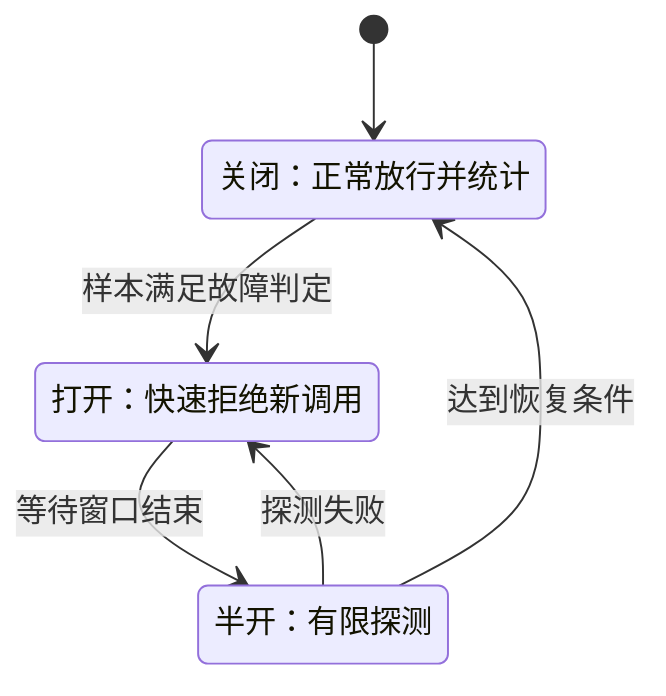

# 076 熔断、隔离与降级有什么区别？

> 难度：中级 · 分类：微服务

## 简短回答

熔断减少继续调用疑似故障依赖，隔离限制某类工作占用共享资源，降级在约定范围内提供较低能力或明确失败。它们解决不同层面的问题，必须同时约束正常路径和降级路径的成本，并验证恢复时不会再次冲击依赖。

## 详细解析

### 从推荐服务故障看三种控制

订单页面依赖推荐、库存与价格。推荐超时如果占满公共连接池，会拖累本来健康的核心查询。隔离可给推荐独立并发额度；熔断在连续异常时暂停部分调用；降级则返回不含推荐的页面，前提是推荐确实为可选能力。

| 手段 | 控制对象 | 不能自动解决 |
| --- | --- | --- |
| 熔断 | 故障依赖调用量 | 无法判断所有业务错误是否应计为失败 |
| 隔离 | 线程、连接、并发与队列预算 | 不会增加总物理容量 |
| 降级 | 返回内容和功能 | 不能把关键错误伪装成成功 |

### 熔断器需要状态和样本

常见模型包含关闭、打开和半开探测。低流量时仅靠百分比可能被少量失败误触发，应考虑最小样本；恢复时放行过多探测又可能再次压垮依赖。不同库的滑动窗口和错误判定不同，配置必须结合实际流量。

参数错误、权限拒绝与远端不可用不是同一类失败。若把所有业务拒绝都计入熔断统计，正常风控拒绝就可能让服务被错误熔断。应明确按错误类别、接口和依赖实例还是逻辑服务统计。

### 降级也会失败

从远端查询降级为本地缓存，必须说明允许多旧的数据；从主服务降级为备用服务，要核对备用容量是否足够。不能所有实例同时访问一个小备用库，把局部故障变为二次故障。

关键状态例如付款结果，无法可靠确定时应返回可查询的不确定状态，不应编造成功或返回旧余额。每次降级需要指标与原因，使业务可区分正常结果和能力受限结果。

### 熔断器的状态变化应当可解释

关闭状态正常放行并收集样本；达到规则后打开，快速拒绝新调用；经过等待进入半开，只允许少量探测。探测成功达到恢复条件才回到关闭，失败则再次打开。不同实现可能不用完全相同的三个状态，但评审时仍要说明探测量和重新放量的条件。

图中打开不会强制停止此前所有在途请求，这些请求仍需要自身的 deadline 和资源管理。熔断也不是精确故障判定器：低样本、热点参数或调用者取消都可能污染统计。可以按逻辑依赖或操作划分，但维度太细又会样本不足，需要根据真实流量选择。

### 用推荐故障推演三层保护

假设订单页每秒 1,000 次访问，推荐从 20 ms 变为 3 秒，理想在途需求会从约 20 增至 3,000。给推荐独立 50 个并发槽位，可以阻止它无限占用共享资源；调用超时限制占用时长；熔断减少继续发出注定失败的请求；降级则使页面按契约不展示推荐。

这四步共同作用，不能只选一个名字。若推荐与订单共用同一数据库池，应用层虽建了两组 goroutine，底层仍可能争抢同一资源。隔离需要沿调用链找到真正共享的 CPU、连接、队列或线程池，才能限制影响范围。

| 业务能力 | 合理的受限结果示例 | 不可接受的伪装 |
| --- | --- | --- |
| 推荐展示 | 明确省略推荐区域 | 把推荐错误统计成完整功能成功 |
| 商品描述 | 在允许窗口内使用旧内容 | 不说明关键字段可能已失效 |
| 库存确认 | 返回暂时无法确认或拒绝下单 | 编造库存充足 |
| 支付结果 | 保留可查询的未知状态 | 超时后直接宣布未扣款 |

### 恢复路径也需要资源预算

100 个客户端各自半开允许 10 个探测，依赖实际可能同时接收 1,000 个请求。单个熔断器的“少量”不等于集群整体少量，可以加入抖动并结合服务端准入，避免所有节点同时恢复造成再度过载。

降级到备用服务时同样要计算它能接多少请求；备用容量只有正常流量的十分之一，就必须配合限流和分级服务。对本地旧缓存降级，要核对陈旧上限和缓存空缺路径，不能在冷启动时再次全量回源。

验收应先让推荐稳定失败，确认核心订单仍在目标范围，再恢复推荐，观察探测、放量和重新打开是否振荡。只有错误率下降而业务完成率也下降，可能只是快速拒绝更多请求。本题提供的是状态与负载推演，没有安装某个熔断库或声称完成压力实验。

## 常见误区 / 面试追问

- **加熔断就不需要超时吗？** 仍需要，熔断采样和在途调用都依赖合理等待边界。
- **隔离越多越安全吗？** 过细会降低资源利用并增加配置复杂度，应围绕故障影响范围划分。
- **怎样验证恢复？** 注入依赖失败、观察拒绝与降级，再恢复依赖，确认探测流量有界且无持续振荡。

## 参考资料

- [Microsoft：Circuit Breaker 模式](https://learn.microsoft.com/en-us/azure/architecture/patterns/circuit-breaker)
- [Microsoft：Bulkhead 模式](https://learn.microsoft.com/en-us/azure/architecture/patterns/bulkhead)

[返回目录](../README.md) · [下一题](077-distributed-transactions.md)
