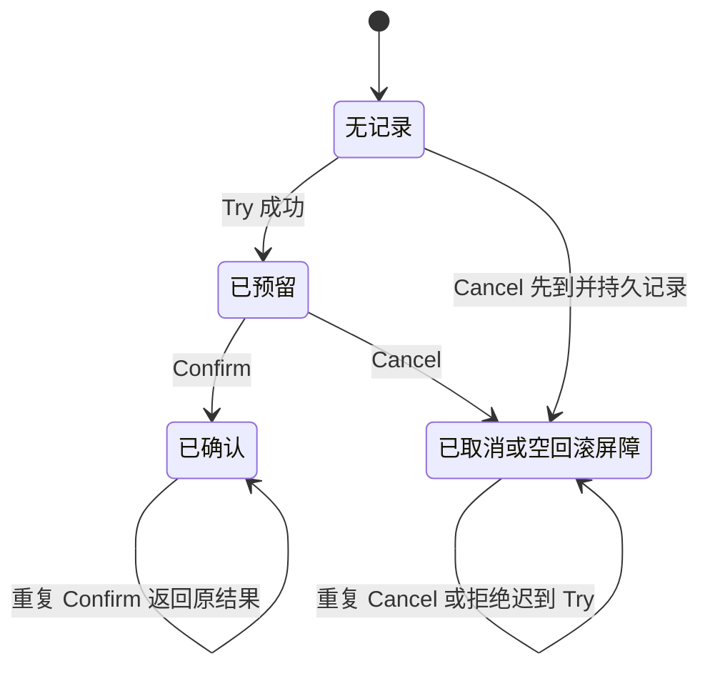

# 077 Saga 与 TCC 如何处理跨服务事务？

> 难度：高级 · 分类：微服务

## 简短回答

Saga 把业务拆为可独立提交的步骤，失败后执行语义补偿；TCC 先 Try 预留资源，再 Confirm 确认或 Cancel 释放。它们都需要持久状态、幂等、超时和恢复协议，不能提供任意外部动作的魔法回滚。

## 详细解析

### 用订单、库存和付款对比

Saga 可以先创建待支付订单、预留库存、尝试付款，失败时释放库存并取消订单。已经发送的邮件无法真正“未发送”，只能发送更正；已经发生的支付可能需要退款，退款也可能失败并需要后续恢复。

TCC 的库存 Try 先冻结可售量，Confirm 将冻结转为正式扣减，Cancel 释放冻结。资源服务要认识事务身份和阶段，并正确处理重复调用、空回滚与乱序到达，不能只给三个接口起好名字。

```text
Try 成功 → Confirm 成功：冻结转为扣减
Try 成功 → Cancel 成功：释放冻结
Cancel 先到 → 迟到 Try：必须按状态拒绝或处理，不能重新冻结
Confirm 重复 → 返回已确认结果，不能再次扣减
```

### 协调者崩溃后谁继续

流程状态必须持久化，恢复者能查询每个步骤当前状态，并根据协议继续确认或补偿。RPC 超时意味着结果不确定，不能立即假设 Try 没发生；参与方应提供可重试的状态查询或幂等阶段操作。

补偿需要满足业务含义。例如扣减库存后已经发货，简单加回库存会制造虚假可售量，必须把可补偿阶段边界设计在不可逆动作之前。需要人工介入的异常应有终态、告警和审计，不应无限重试却无人知道。

### 成本决定是否值得

TCC 对参与服务改造较大，并占用预留资源；Saga 在处理中允许中间状态，对外查询必须明确展示。若业务可以在同库事务内完成，或通过异步最终一致满足目标，优先选择更简单方案。分布式事务不应成为随意拆分强一致边界的理由。

### 把 TCC 的合法状态转移写出来

库存参与者可按全局事务 ID 和分支 ID 保存阶段状态。Try 在本地事务中检查可售量并创建冻结记录；Confirm 将这份冻结转为已使用；Cancel 则释放同一份冻结。三个操作都需要基于持久状态判断，不能只在内存里记住“已经执行过”。



图省略业务无效输入的拒绝边，但终态不能被另一个阶段随意改写。Confirm 与 Cancel 并发时，要通过原子状态条件保证只有合法转移成功；已经确认后再退款，应走新的业务流程，而不是直接把原事务改成取消。

“空回滚”是 Cancel 到达时 Try 尚未产生记录；若简单返回成功且不留痕，迟到 Try 可能随后冻结资源，而协调者已经认为取消完成。取消屏障用于记住这个决定，迟到 Try 必须被拒绝。这些记录的保留周期又必须覆盖迟到和重试窗口，否则删除后问题会重新出现。

### Saga 的补偿是新的业务事实

假设流程是创建待支付订单、预留库存、收款。收款明确失败时，释放库存与取消订单可以是补偿；收款结果未知时，应先查询或使用原支付身份恢复，不能一边退款一边允许原收款继续不受控地完成。已经发货后，简单恢复库存会把在途商品当成仓库现货，需要退货或其他业务流程。

| 原步骤 | 可设计的补偿 | 需要额外处理的情况 |
| --- | --- | --- |
| 创建待处理订单 | 标为已取消 | 客户端已看到中间状态 |
| 冻结库存 | 释放同一冻结记录 | 重复释放与过期接管 |
| 收款成功 | 发起可追踪退款 | 退款失败或到账延迟 |
| 发送通知 | 发送更正通知 | 无法使已读通知消失 |

协调者持久保存当前步骤和已知结果，重启后从事实继续。参与者应允许查询或幂等重试阶段操作，协调者不能仅凭内存中的超时计时器决定远端没有成功。所有步骤完成后，还要有业务对账发现长期停留在中间态的流程。

### 怎样选择更小的协议成本

能在一个权威数据库中用短事务完成的业务，优先保留这条简单边界。Saga 适合允许中间状态且有业务补偿的流程；TCC 要求参与方提供明确预留能力，会占用资源并引入更多阶段管理。两者都不是“失败就自动回到从未发生”的承诺。

测试矩阵至少涵盖重复 Try、Cancel 先到、Confirm 与 Cancel 竞争、协调者重启、补偿持续失败。验收按库存可售量、冻结量、已用量和业务终态对账，不能只看三个 RPC 都能返回。本文未实现协调器或运行分布式事务实验，状态图用于明确必须验证的协议。

## 常见误区 / 面试追问

- **补偿是数据库 Rollback 吗？** 不是，它是新的业务操作，会被外部观察到，也可能失败。
- **事务 ID 相同就自动幂等吗？** 还要用持久唯一性和阶段状态保证只产生一次合法转移。
- **怎样测试？** 枚举每步前后崩溃、重复、超时与乱序，验证最终资源守恒和状态可恢复。

## 参考资料

- [Microsoft：Saga 模式](https://learn.microsoft.com/en-us/azure/architecture/patterns/saga)
- [Apache Seata：TCC 模式](https://seata.apache.org/docs/dev/mode/tcc-mode/)

[返回目录](../README.md) · [上一题](076-resilience.md) · [下一题](078-configuration.md)
