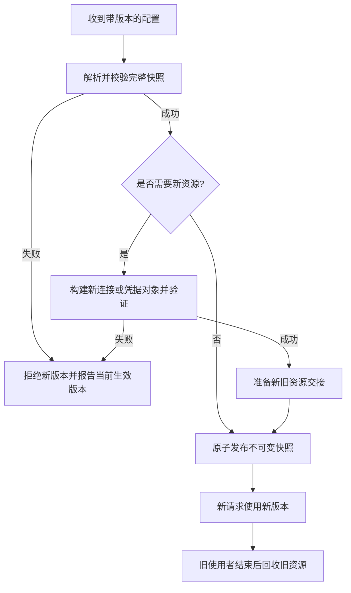

# 078 配置与密钥怎样安全变更和轮换？

> 难度：中级 · 分类：微服务

## 简短回答

配置应有类型校验、版本、审计和回滚路径，密钥应通过受控渠道注入且避免出现在源码与日志。热更新最好先构建并验证完整快照，再原子切换；需要重建连接的字段不能仅改变内存字符串就认为生效。

## 详细解析

### 区分三类变更

| 类型 | 例子 | 生效方式 |
| --- | --- | --- |
| 可原子替换策略 | 限流阈值、功能开关 | 校验后发布不可变快照 |
| 资源相关配置 | 数据库地址、TLS 凭据 | 构造新资源、验证、切换、回收旧资源 |
| 启动结构配置 | 监听端口、关键拓扑 | 明确是否需要重启或滚动发布 |

若逐字段更新共享配置，请求可能读到新超时配旧地址。快照方式能让一次请求使用同一版本，但发布后的对象必须保持不可变，引用的 map 和切片也不能继续被修改。

### 校验失败如何处理

启动时缺少必需配置应直接失败并给出清晰错误；运行时收到无效更新，可以拒绝该版本并保留上次已验证配置，同时告警和记录版本。这里保留旧值是明确的运行策略，不是静默掩盖配置错误；维护者必须知道新配置没有生效。

密钥轮换需要考虑新旧重叠窗口。先让验证方接受新密钥，再让签发方使用新密钥，确认旧凭据不再需要后撤销旧密钥。连接池中的旧连接可能继续持有旧认证状态，因此还要安排重连和资源释放。

配置值可以包含敏感信息，打印“完整加载配置”常会泄露口令。日志应记录版本和非敏感摘要，访问控制按最小权限设置，环境变量也不是自动保密的保险箱。

测试应模拟非法值、字段缺失、更新乱序、连接创建失败和回滚。只验证配置文件能解析，并不能证明运行中的服务已经安全应用它。

### 一次热更新应当像一次小型发布

配置中心发来版本 12，不应立即逐字段覆盖全局变量。先解析为独立对象，检查字段范围和交叉约束；例如连接池上限不能是负数，单次调用期限不应超过该调用的整体预算。验证通过后一次性发布快照，让新请求看到同一版本，旧请求按事先选择的策略完成。

原子替换指针只保证切换动作，不保证对象内部不可变。如果发布后继续修改它包含的 map，读请求仍可能竞态；如果发布新数据库指针后马上 Close 旧池，已经取得旧引用的请求可能失败。快照和值的生命周期、资源的使用与回收是两个需要分别设计的问题。

### 配置版本不能只存在于控制面

控制面显示“已发布 12”，某实例可能仍运行 11，因为解析失败、监听断开或更新乱序。实例应暴露实际生效版本和最后失败原因，运维才能判断发布是否完成。收到较旧版本时按协议拒绝或明确回滚，不能由消息到达顺序随机决定最终配置。

| 场景 | 所需行为 |
| --- | --- |
| 启动缺少必需字段 | 明确启动失败，避免带猜测配置接流 |
| 运行时新版本非法 | 拒绝该版本并告警，保留已验证状态 |
| 新资源连接测试失败 | 不切换，清理这次创建的资源 |
| 回滚到旧业务配置 | 作为可审计的新发布动作执行 |

这里保留旧配置是显式可用性策略，不适用于无限期保留已经被撤销的敏感凭据或安全策略。应定义哪些配置可以陈旧运行、最大多久、何时必须停止相关操作。

### 用签名密钥轮换推演新旧共存

假设签发令牌使用 K1，要切换到 K2。先让所有验证方取得并接受 K2，同时继续接受仍有效的 K1；确认传播后，签发方改用 K2；等待旧令牌寿命和允许时钟偏差等窗口后，再撤销 K1。若因泄露紧急撤销，可能必须立即拒绝旧令牌，这属于不同业务取舍，不能机械等待正常轮换窗口。

数据库密码轮换还涉及连接池：现存连接的认证状态与新建连接不同，修改配置文件不能证明所有连接都用新凭据。应验证新连接、安排有界替换，并在撤销旧凭据前确认依赖。Kubernetes Secret 的对象名称与 Base64 编码也不构成自动加密，访问权限、存储保护和注入方式仍需要实际配置。

本题没有操作真实配置中心或密钥系统。落地验收应注入乱序更新、无效值和资源构建失败，确认没有混合版本请求、资源泄漏或凭据出现在日志中。

## 常见误区 / 面试追问

- **所有配置都热更新更方便吗？** 复杂资源重建和一致性成本可能高于滚动重启，应按字段决定。
- **读到新密钥就能立即删旧密钥吗？** 需要核对客户端、令牌寿命和连接缓存的过渡窗口。
- **配置中心不可用时怎么办？** 区分启动与运行阶段，按已定义的可用性和陈旧策略执行，不做静默猜测。

## 参考资料

- [Kubernetes ConfigMap](https://kubernetes.io/docs/concepts/configuration/configmap/)
- [Kubernetes Secret](https://kubernetes.io/docs/concepts/configuration/secret/)
- [Go atomic.Value 快照示例](https://pkg.go.dev/sync/atomic#Value)

[返回目录](../README.md) · [上一题](077-distributed-transactions.md) · [下一题](079-observability.md)
