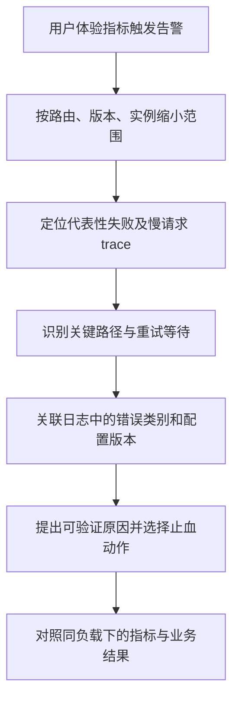

# 079 日志、指标、追踪如何串起一次故障？

> 难度：中级 · 分类：微服务

## 简短回答

指标告诉你何时、哪里、多少请求异常；追踪展示某次请求跨组件的时间关系；日志提供具体事件与业务上下文。通过统一服务身份、版本、请求关联与错误分类，三者可以相互定位，但采样与缺失意味着它们都不是完整事实数据库。

## 详细解析

### 从告警走到具体请求

支付接口错误率升高，先按接口、版本和实例切分指标，发现新版本集中异常；再查看该窗口失败 trace，定位到库存 RPC；最后通过 trace ID 查日志，发现请求使用了过期配置版本。每一步都缩小问题范围，而不是一开始全量搜索日志关键词。

```text
指标：错误率、P99、请求量
  → trace：哪个依赖、哪段等待、哪次重试
    → 日志：错误原因、配置版本、业务操作身份
```

### 关联信息也要有边界

trace context 需要跨 HTTP、gRPC 和消息头传播，异步任务还要选择父子关系或 link，以免把长时间任务误画成同步阻塞。不要把用户传入的任意追踪字段都当作可信审计身份。

指标标签必须控制基数。把 user_id、完整 URL、订单号作为标签，会产生大量时间序列；应使用路由模板、稳定错误类别和有限版本维度。具体订单号放在受控日志或 trace 属性中，并按隐私和保留策略处理。

直方图可聚合分布，不能把多个实例的 P99 简单平均当成全局 P99。采样 trace 则可能漏掉罕见错误，需要结合错误采样或其他聚合指标，不能用“找不到 trace”证明请求未发生。

遥测导出本身应有队列上限、超时与可观察的丢弃统计，避免监控后端故障反过来堵住业务。关停时给导出有限时间完成，必要时接受有记录的遥测丢失，而不是无限等待。

### 用一个模拟现场串起证据链

设 14:05 开始下单 P99 从 200 ms 升到 1.5 秒，错误率从 0.1% 升到 3%；这些是教学模拟数据。按版本切分发现只有 v2 异常，再看失败 trace，库存 RPC 的等待占大部分时间；关联日志显示 v2 使用配置 18，而 v1 仍是 17。此时可以提出“配置变更影响库存调用”的假设，但还要比较具体非敏感差异并验证，不能把时间相关直接当因果证明。



图不是要求所有故障都必须有一条完整 trace。采样、导出失败和跨进程传播缺失都会使链路不完整；这时用聚合指标、业务事实和其他日志补证据，不能为了凑完整故事而把不同请求拼成一次调用。

### 标签的成本可以在设计时估算

假设指标包含 20 个路由、5 种结果类别、50 个实例，潜在组合约 5,000；若再增加 100 万个用户 ID，理论组合空间会膨胀到 50 亿。实际不一定全部出现，但足以说明无限维度不适合指标标签。直方图还会按桶或其存储模型增加成本，需要结合采集实现预算。

使用 `/orders/{id}` 这样的路由模板，避免完整路径形成每个订单一条时间序列；将订单 ID 放入受控日志或 span 属性，用于具体问题追踪。属性本身也不是免费，应有长度、采样、敏感性与保留策略。

| 信号 | 最适合回答 | 不能独立证明 |
| --- | --- | --- |
| 指标 | 影响比例、趋势、容量与分布 | 单次业务的全部细节 |
| Trace | 一次采样请求的时间关系 | 未采样请求没有发生 |
| 日志 | 特定事件的上下文与原因 | 整个系统一定完整记录 |
| 业务审计或账本 | 关键状态是否实际提交 | 请求为何在某阶段变慢 |

跨实例 P99 不能简单平均：低流量实例和高流量实例贡献不同，各自百分位也不包含合并分布所需信息。应聚合适合合并的分布数据后再计算所需百分位，同时观察样本量，避免低流量窗口的百分位造成误导。

### 观测链路必须允许自身失败

导出器的有界队列满了，应按设计丢弃或限制遥测并计数，而不是无界增长拖垮业务。关停时给刷新有限期限；如果所有日志同步阻塞到远端存储，监控后端故障就可能成为新的业务依赖故障。

验收可人为触发一次受控失败，确认入口指标增加、trace 能指向对应依赖、日志携带相同关联信息和实际生效版本；再使遥测后端不可用，确认业务资源仍受控。本题没有部署完整观测后端，模拟故事和基数计算不代表已采集的生产数据。

## 常见误区 / 面试追问

- **日志越多越容易排查吗？** 重复堆栈与无结构文本会增加成本和噪声，应记录关键边界与关联字段。
- **有追踪就不需要业务审计吗？** 不行，追踪可能采样或过期，审计有独立完整性要求。
- **可观测性如何验收？** 人为触发一条失败链路，确认能从指标找到 trace，再定位具体日志和版本。

## 参考资料

- [OpenTelemetry 信号概念](https://opentelemetry.io/docs/concepts/signals/)
- [Prometheus 指标实践](https://prometheus.io/docs/practices/instrumentation/)

[返回目录](../README.md) · [上一题](078-configuration.md) · [下一题](080-rollouts.md)
