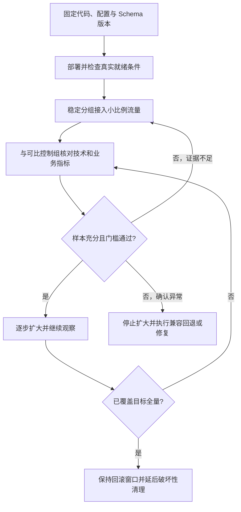

# 080 如何设计可回滚的灰度发布与流量切换？

> 难度：高级 · 分类：微服务

## 简短回答

灰度发布逐步把有代表性的流量交给新版本，依据明确指标决定扩大、暂停或回滚。回滚必须覆盖代码、配置、协议与数据兼容性；如果新版本已经写入旧版本无法理解的数据，切回旧镜像并不等于恢复。

## 详细解析

### 发布前先定义判断标准

选择错误率、延迟、资源消耗和业务成功率作为门槛，同时区分版本和流量分组。只有一分钟、几十个低风险请求的灰度，不能代表全量峰值与大租户行为。应覆盖关键路径、真实数据分布和足够的观察窗口。

```text
部署未接流 → readiness 验证 → 少量稳定分组
  → 比较控制组 → 逐步扩大 → 全量观察 → 清理旧版本
          失败则停止扩大，并执行已验证回滚步骤
```

随机逐请求分流可能让同一用户来回切换版本，影响会话、缓存和实验解释。按用户或租户稳定分组通常更容易分析，但也需要避免灰度组恰好全是低负载客户。

### 兼容性比开关重要

新旧版本共存期间，RPC 和事件协议需要兼容；数据库采用扩展再收缩策略，删除字段应在回滚窗口关闭之后。配置变更也要版本化，否则镜像回滚后仍读取导致故障的新配置。

影子流量可以观察新版本行为，但如果直接执行写操作，会产生重复订单或通知。需要隔离副作用、使用只读路径或专门验证环境，并说明结果与真实生产写入还有哪些差异。

切流不一定立即迁移现有长连接或流式请求。发布系统要协调负载均衡、摘流、关停宽限期和客户端重试；强制终止应有可恢复业务协议支持。

### 回滚演练证明可操作

在测试环境实际经历升级、写入、回滚、再次读取，确认旧版本能理解过渡期数据。记录触发条件、负责人和预计恢复时间。若只有文档写“有问题回滚”，却没有验证数据路径，仍不能算可回滚设计。

### 灰度门槛要同时看样本量和业务含义

假设新版本接 1% 流量，只收到 100 个请求且零错误，不能据此断言错误率低于万分之一。观察窗口需要覆盖足够样本、关键用户类型和周期性工作；更高风险变更可能需要先限定内部租户，再逐步覆盖大租户与高负载路径。



证据不足时维持当前阶段，不等于无限循环发版；应增加观察或有针对性的验证。错误率门槛也不能孤立使用：新版本把所有库存错误转为 HTTP 200，技术错误率会变低，业务成功率却不会改善。应同时核对成功订单、拒绝原因、金额等关键结果。

### 可比控制组怎样避免错误结论

灰度组若全是小租户，而控制组包含大客户，延迟更低可能只是请求更轻。可按稳定用户或租户分组，再比较相近业务分布；同时关注新旧版本共享的数据库和缓存，避免新版本制造负载后让控制组也变慢，从而低估影响。

| 变更对象 | 回滚前必须确认 |
| --- | --- |
| 镜像 | 旧版本仍可运行在当前依赖环境 |
| 配置 | 旧代码能解释当前值，错误版本已停止生效 |
| 数据库 | 旧字段与约束仍在，新增数据语义兼容 |
| 消息协议 | 队列里已有新消息不会使旧消费者失败 |
| 缓存 | 新格式不会污染旧进程读取路径 |

数据库删列、消息字段改单位等破坏性操作通常要放在回滚窗口之后。若新版本已经产生旧代码无法解释的数据，回退镜像可能扩大故障，应选择修复前进或有数据转换步骤的恢复方案。发布计划必须预先识别这个不可直接回退的边界。

### 影子流量与长连接是两个额外验证点

复制请求到影子服务时，要阻止支付、邮件、写库等真实副作用。只读影子验证能比较解析与查询结果，但不能证明真实提交路径正确；独立验证环境又可能缺少生产数据分布，需要如实说明覆盖范围。

切流比例变化也不意味着现有流式连接立刻迁移。旧实例可能仍在服务长请求，必须配合摘流、排空和业务恢复协议。灰度扩容期间总连接池数与缓存预热量会增加，发布系统本身可能成为共享数据库超载的触发点。

演练至少完成一次“新版本写入数据，再切回旧版本读取和继续处理”的循环，并记录恢复时间及未完成操作。本文未部署 Kubernetes 灰度环境，图中门槛和流程是设计方案；真正可回滚需要这类运行证据支持。

## 常见误区 / 面试追问

- **新版本错误率更低一定更好吗？** 可能把错误吞掉或快速拒绝了请求，还要看业务成功率和结果完整性。
- **金丝雀与 A/B 测试一样吗？** 前者主要控制发布风险，后者评估产品差异，指标与分组目标不同。
- **如何避免回滚产生重复操作？** 使用稳定幂等身份与兼容状态机，不能靠重启清空所有状态。

## 参考资料

- [Kubernetes Deployment](https://kubernetes.io/docs/concepts/workloads/controllers/deployment/)
- [Google SRE Workbook：金丝雀发布](https://sre.google/workbook/canarying-releases/)

[返回目录](../README.md) · [上一题](079-observability.md) · [下一模块](../09-kratos/081-kratos-overview.md)
