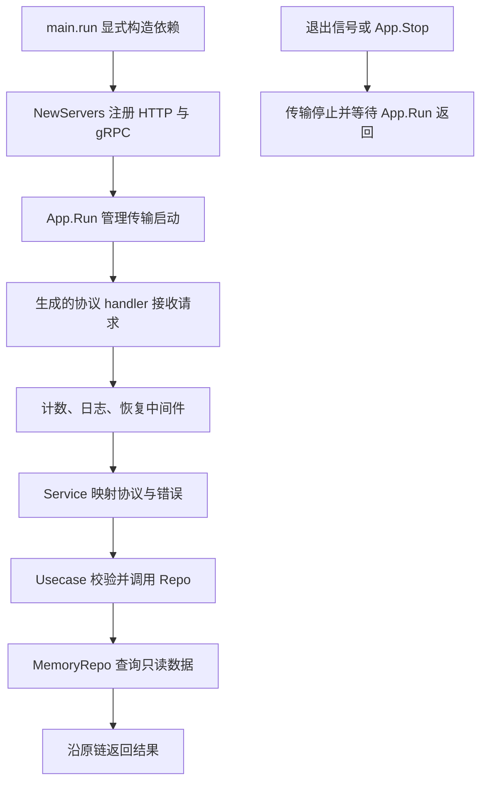

# 081 Kratos 解决哪些工程问题？何时值得引入？

> 难度：基础 · 分类：Kratos 工程 · 版本：v2.9.1

## 简短回答

Kratos 提供服务生命周期、HTTP/gRPC 传输、中间件、错误与配置等工程组件，帮助团队形成一致的服务开发方式。它不替代业务边界、事务与容量设计。已有简单标准库服务若不需要这些统一能力，没有必要仅为“微服务”名义增加框架。

## 详细解析

### 用本仓库的服务理解能力范围

[目录服务示例](../examples/catalog/README.md) 用同一个业务实现提供 HTTP 和 gRPC，使用统一日志、恢复与请求计数，由 App 管理启动与停止。它没有依赖真实数据库和注册中心，因此可以直接运行并测试，把学习重点放在请求和生命周期链路。

```go
package main

import (
    "fmt"
    "github.com/go-kratos/kratos/v2"
)

func main() {
    app := kratos.New(kratos.Name("interview.catalog"), kratos.Version("1.0.0"))
    fmt.Println(app.Name(), app.Version())
}
```
```output
interview.catalog 1.0.0
```

这段代码只构造应用元信息，不启动服务；真正双协议启动见示例入口。App 是组件生命周期管理器，不会因为调用 New 就自动加载业务、创建数据库或配置注册中心。

### 引入框架的判断标准

如果团队同时维护多种服务协议，希望统一错误码、中间件和装配习惯，Kratos 能减少每个服务重复建立基础设施的成本。代价是学习抽象、维护代码生成链和理解框架版本行为。调试时依然需要知道标准库、gRPC 和底层驱动发生了什么。

框架模板中的 service、biz、data 是常见职责组织方式，不是编译器强制层级。小例子可以按文件分工，大项目再按包和团队边界拆分，避免为了目录形状创建没有业务意义的转发层。

本模块明确使用 v2.9.1，并将 gRPC、Protobuf 与生成器版本记录在示例说明中。这里的选择服务于可重复学习与验证，不声称是最新版本或适合所有生产项目的版本组合。

### 把框架能力放回一次真实请求

在本仓库中，`main.run` 创建只读数据、用例与 service，`NewServers` 创建两种传输并注册同一个实现，最后由 App.Run 启动。客户端请求并不会先“经过整个框架”，而是从实际监听器进入对应 handler，再沿中间件和业务调用链返回。理解这个路径后，才能判断某项配置作用在哪一层。



图中每个名字都能在 [示例目录](../examples/catalog/README.md) 找到对应实现。App 不参与商品 ID 的判断，HTTP 生成代码也不决定缺失商品如何映射错误；框架提供连接这些职责的接口，应用仍要写出自己的规则。

### 用能力清单避免把“能接入”说成“已具备”

| 能力 | 本示例中的事实 | 仍需业务项目决定 |
| --- | --- | --- |
| 双协议服务 | 同一 GetItem 方法注册到两种传输 | 身份与网关策略 |
| 生命周期 | App 管理服务启动和停止 | 额外后台任务与外部资源的清理 |
| 中间件 | 已配置计数、日志、恢复 | 授权、配额和业务错误分类 |
| 注册发现 | 运行入口未传 Registrar | 注册中心部署、可达地址和路由 |
| 持久化 | 只有构造后只读的 MemoryRepo | 数据库事务、迁移和容量 |

一个项目引入 Kratos 包，不代表表中右栏自动完成。反过来，标准库服务也能实现这些职责；是否使用框架主要取决于团队是否愿意采用统一抽象和工具链，而不是能否写出 HTTP listener。

### 版本基线为什么影响阅读顺序

本模块依据 go.mod 中的 Kratos v2.9.1 解释行为，生成 HTTP 代码的头部却显示 protoc-gen-go-http v2.9.2。这不是矛盾：生成器与运行库是不同组件，需要分别锁定并验证兼容。看到一篇针对其他版本的博客时，应先核对当前函数签名与生成结果，不把“Kratos 会这样做”当成跨版本永久保证。

入门阅读建议是先运行查询成功和查询缺失，再看 service 的分支，最后查看传输注册与 App 生命周期。先读完所有目录模板很容易记住名称却无法解释请求。进阶练习则可以问：若仓储换成慢依赖，取消从哪里传入，谁关闭连接，哪个测试能够证明资源退出？答案必须沿实际对象关系展开。

本题的小程序只证明应用元信息的构造与读取；完整网络行为由示例集成测试验证。当前范围内服务可运行，不以数据库、注册中心或观测后端的占位代码冒充已接入能力。

## 常见误区 / 面试追问

- **使用 Kratos 就获得微服务治理了吗？** 组件需要正确配置与接入，注册发现、TLS 和观测后端不会凭空存在。
- **框架是不是越全越好？** 应按实际需求启用能力，避免无用依赖与难以解释的默认行为。
- **如何快速理解一个 Kratos 项目？** 从入口装配、生成 handler、service、biz、data 沿一次请求走完，再看退出路径。

## 参考资料

- [Kratos v2.9.1 官方源码](https://github.com/go-kratos/kratos/tree/v2.9.1)
- [Kratos App API](https://pkg.go.dev/github.com/go-kratos/kratos/v2@v2.9.1#App)

[返回目录](../README.md) · [下一题](082-layers.md)
