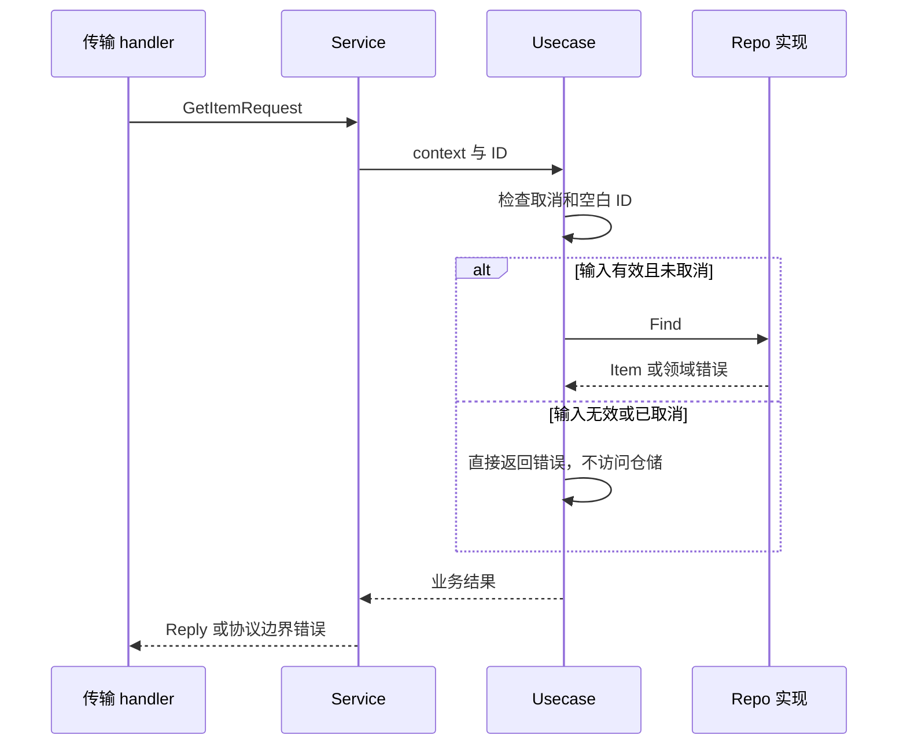

# 082 Kratos 的 service、biz、data 层如何分工？

> 难度：基础 · 分类：Kratos 工程 · 版本：v2.9.1

## 简短回答

service 适配协议输入输出，biz 表达用例与业务规则，data 实现存储和外部依赖。业务层声明所需的仓储接口，入口把具体实现注入。分层的价值是约束变更和副作用，不是要求每个字段穿过三次无意义转换。

## 详细解析

### 从 GetItem 的真实代码走一遍

示例的 [service.go](../examples/catalog/service.go) 接收生成的 GetItemRequest，调用 Usecase，并把业务缺失映射为稳定错误。[biz.go](../examples/catalog/biz.go) 检查取消和 ID 规则，依赖 Repo；[data.go](../examples/catalog/data.go) 用只读 map 实现查询。

```go
package main

import (
    "context"
    "fmt"
    "go-interview-100/examples/catalog"
)

func main() {
    repo := catalog.NewMemoryRepo([]catalog.Item{{ID: "book", Name: "Go"}})
    usecase := catalog.NewUsecase(repo)
    item, err := usecase.Get(context.Background(), "book")
    fmt.Println(item.ID, item.Name, err)
}
```
```output
book Go <nil>
```

业务可以脱离 HTTP/gRPC 直接运行，证明核心规则没有依赖传输请求对象。未来换成数据库仓储时，应实现同一个 Repo 契约，并保留错误与取消语义；这不意味着数据库事务性能也能被内存实现验证。

### 防止依赖方向倒置

biz 不应导入生成的 HTTP handler，也不应创建具体 SQL 客户端。否则业务测试必须启动外部系统，协议变化也会扩散到领域规则。data 可以使用业务类型，但不应把数据库行结构直接当成对外协议。

跨仓储事务需要在用例边界明确表达，不要让每个 Repo 方法各自提交，导致一个业务动作被拆成几个不一致的小事务。可以用符合现有项目的事务执行能力，但不要为仅一次查询的示例引入抽象事务框架。

小项目中某层暂时很薄是可以的，只要它承担清楚的边界职责。若一个层长期只有机械转发，又没有需要隔离的协议或规则，应重新评估其必要性。

### 相同 ID 在三个边界分别意味着什么

HTTP handler 把路径里的 `book` 放进 GetItemRequest，service 通过 `req.GetId()` 取值，Usecase.Get 检查 context 和空白 ID，然后才调用 Repo.Find。MemoryRepo 返回 Item 或 ErrMissing，service 再把 Item 转成 GetItemReply，把缺失事实转成 ITEM_NOT_FOUND。这是具体转换链，不是按目录名称猜出来的职责。



一个容易忽略的细节是 `TrimSpace` 在当前代码中只用于判断是否全为空白，并没有把非空 ID 规范化后再查询。`" book "` 会按原字符串查找，不会自动变成 `"book"`。是否允许前后空格应由契约决定，不能在解读代码时把没有实现的清洗逻辑补进去。

### 变更落在哪一层才不扩散

| 需求变化 | 优先修改位置 | 不应顺手耦合的内容 |
| --- | --- | --- |
| HTTP 返回字段名变化 | proto 与传输适配 | SQL 驱动细节 |
| ID 业务合法性变化 | 用例规则及测试 | 具体 HTTP 路由实现 |
| 目录改存数据库 | Repo 实现与装配 | 把 sql.Rows 暴露给 handler |
| 缺失错误的公开 reason 变化 | service 契约评审 | 修改所有存储错误文字 |

Repo 接口由业务层声明，是因为业务知道自己需要“按 ID 找商品”这个行为，而不需要一套面向任意表的通用 CRUD。MemoryRepo 的构造函数复制输入 Item 到私有 map，发布后只读；Item 当前只有 string 字段，返回值不会把内部可变 map 暴露出去。如果以后 Item 加入 slice 或指针，必须重新检查别名与并发语义。

### 薄层不等于没有价值，也不应无限增加

当前三层在同一个 catalog 包中按文件组织，所以编译器并没有禁止 service 直接访问 data 的具体类型。这是小型教学服务的组织选择；大型项目若需要强约束，可以按包导出边界实现。不能只看到三个文件名就宣称依赖倒置被语言强制执行。

service 的薄适配仍有价值，因为 HTTP 与 gRPC 都在此取得相同业务错误映射；用例很短，却使空 ID 与取消可以脱离网络单独验证。若未来加一层只原样转发、没有新的规则或依赖边界，应先问它解决什么问题，而不是为了模仿模板继续套层。

测试中的 repoFunc 会在无效或预取消请求到达仓储时直接失败，因此测试不仅检查返回 error，还检查副作用边界。它证明当前用例不会访问仓储，不证明未来 SQL 实现的隔离和锁语义；后者需要适配器集成测试。

## 常见误区 / 面试追问

- **所有错误都应该由 data 转成 HTTP 状态吗？** 不应把协议语义塞进存储实现，业务事实与传输映射可以分开。
- **Repo 是否应暴露通用 CRUD？** 优先表达用例所需操作，避免上层绕过领域约束任意修改表。
- **分层就能避免循环依赖吗？** 还需要正确接口归属与入口装配，参见 [009](../01-language-design/009-packages.md)。

## 参考资料

- [Kratos 官方布局示例](https://github.com/go-kratos/kratos-layout)
- [Kratos 官方示例仓库](https://github.com/go-kratos/examples)

[返回目录](../README.md) · [上一题](081-kratos-overview.md) · [下一题](083-transports.md)
