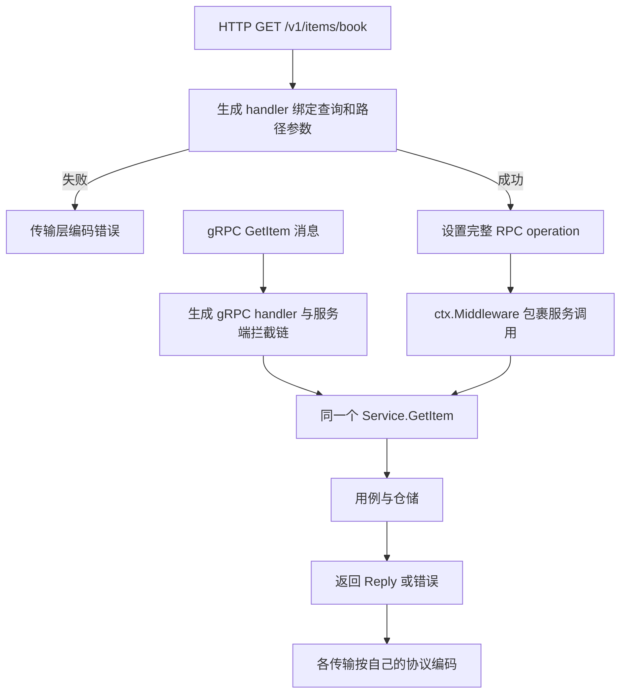

# 083 Kratos 如何通过 Protobuf 暴露 HTTP 与 gRPC？

> 难度：中级 · 分类：Kratos 工程 · 版本：v2.9.1

## 简短回答

在 Protobuf 中定义消息与 RPC，再用 HTTP 注解描述映射。不同生成器产生消息代码、gRPC 桩和 Kratos HTTP 适配代码，两种服务端都注册同一个业务适配实现。共享契约减少重复，但两种协议仍有各自的绑定、错误和传输行为。

## 详细解析

### 以已生成文件为证据

[catalog.proto](../examples/catalog/api/catalog.proto) 定义 GetItem，并将其映射为 GET `/v1/items/{id}`。对应生成产物为：

| 文件 | 职责 |
| --- | --- |
| [catalog.pb.go](../examples/catalog/api/catalog.pb.go) | 消息类型、反射与序列化支持 |
| [catalog_grpc.pb.go](../examples/catalog/api/catalog_grpc.pb.go) | gRPC 服务接口、注册与客户端 |
| [catalog_http.pb.go](../examples/catalog/api/catalog_http.pb.go) | HTTP 路由、参数绑定、中间件入口与结果编码 |

HTTP handler 的实际流程是绑定查询参数和路径变量、设置 operation、构造 ctx.Middleware 调用链，再调用 service.GetItem，最后通过 ctx.Result 编码响应。gRPC 桩从 Protobuf 消息调用同一个方法，协议差异停留在边界。

### 生成不能代替业务校验

字段能解码为 string，不等于符合商品 ID 的业务规则。生成代码不会自动知道空 ID、租户授权或库存约束；这些规则仍由明确的校验与业务层完成。HTTP 注解也不会自动给所有路由加认证。

直接注册普通 http.Handler 或手写路由时，不能假设自动走到生成 handler 使用的同一 middleware 调用点。示例的 `/metrics` 使用独立 HandleFunc，刻意不计入业务计数；这项边界由实际注册方式决定。

生成器版本需要固定且记录。本仓库已提交生成代码，普通运行无需 protoc；重新生成使用 [脚本](../scripts/generate_proto.py)，校验所需工具版本并定位锁定模块的官方注解目录。修改生成文件正文会在重新生成时丢失，规则应改在 proto、适配器或配置里。

双协议契约测试验证相同查询结果以及 HTTP 404 与 gRPC NotFound 的对应关系，同时保留协议自己的表示，不强行要求响应字节完全相同。

### 参数绑定失败会不会进入业务中间件

阅读生成的 `_Catalog_GetItem0_HTTP_Handler`，可以看到 BindQuery 和 BindVars 在 `ctx.Middleware` 之前执行。因此绑定失败会提前返回，不会经过示例在该调用点安装的业务计数器。路由根本不匹配也不会进入 GetItem。观测全 HTTP 流量与观测已进入 RPC 方法的业务调用，是两个不同统计范围。

完整 operation 是 `/interview.catalog.v1.Catalog/GetItem`，不同于 HTTP 路径 `/v1/items/{id}`。选择器或指标以 operation 为维度时，应使用生成常量，避免把路由字符串写成匹配条件后误以为已保护该接口。

### 两种入口共享哪些事实，保留哪些差异

成功查询都返回同一个商品业务内容，缺失都表达 ITEM_NOT_FOUND；HTTP 用状态码与 JSON 表达，gRPC 用 status 和消息表达。请求没有 ID 时，gRPC 可以发送空 GetItemRequest，HTTP `/v1/items/` 则可能没有匹配到这条路径，它们不是同一种输入路径。不要为了追求“对称测试”把路由 404 当成业务参数 400。

| 验证对象 | 从真实测试或代码能确认什么 |
| --- | --- |
| HTTP 成功与 missing | 真实 TCP 请求进入生成路由，成功解码或返回 404 |
| gRPC 成功与 missing | 生成客户端调用同一实现，返回结果或 NotFound |
| gRPC 空请求 | Usecase 拒绝空 ID，映射 InvalidArgument |
| 手写 /metrics | 注册在原生 HandleFunc 路径，未调用生成的 ctx.Middleware |

HTTP 成功使用 ctx.Result(200, reply)，错误则返回给传输错误编码器；不能在 service 中直接操作 ResponseWriter，再假设同一方法还能自然供 gRPC 使用。共享层应返回类型化结果，让传输承担编码。

### 修改契约后的最短核查路径

先改 catalog.proto，再用锁定工具生成，检查生成文件差异是否符合预期，最后运行双协议测试。新增字段后还要验证 JSON 名称、存在性和旧端解释；生成成功只能证明工具理解 Schema，不能证明业务兼容。

生成文件中的版本断言能帮助发现某些运行库不兼容，但并不是所有语义变化的证明。普通使用者可直接运行已提交代码，不必先安装 protoc；修改协议的维护者则需要严格复现生成链。本文没有声称任意手写路由、流式方法或未来生成器都拥有同样执行顺序，结论来自当前仓库的具体产物。

## 常见误区 / 面试追问

- **Protobuf 定义了服务就会自动监听吗？** 还需构造传输服务、注册实现并启动生命周期。
- **一个 HTTP 路径就是 operation 吗？** 生成代码使用完整 RPC 方法名作为 operation，selector 应按实际值匹配。
- **只测试 service 是否足够？** 还需验证参数绑定、生成代码注册和协议错误映射。

## 参考资料

- [Kratos HTTP 传输源码](https://github.com/go-kratos/kratos/tree/v2.9.1/transport/http)
- [Google API HTTP 注解](https://github.com/googleapis/googleapis/blob/master/google/api/http.proto)

[返回目录](../README.md) · [上一题](082-layers.md) · [下一题](084-dependency-injection.md)
