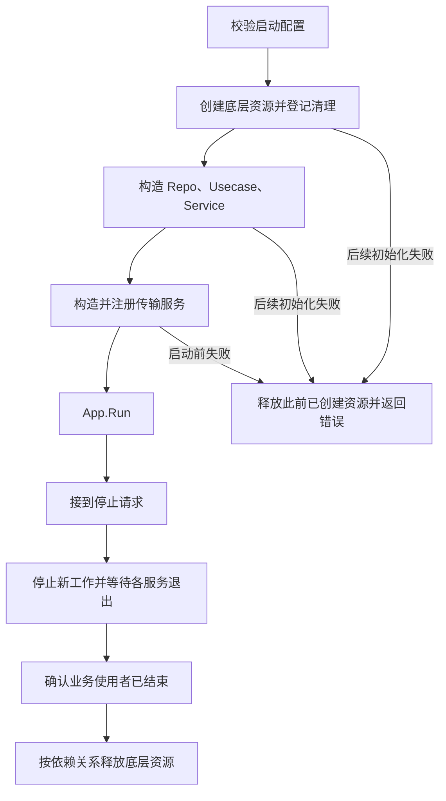

# 084 Kratos 应用如何装配依赖并释放资源？

> 难度：中级 · 分类：Kratos 工程 · 版本：v2.9.1

## 简短回答

装配把配置、仓储、用例、service 和传输服务连接起来，资源的创建者也应明确清理责任。小项目手写构造调用通常足够，生成式依赖注入只改变装配方式，不自动处理业务边界、资源释放和启动失败回滚。

## 详细解析

### 本仓库采用显式构造

[main.go](../examples/catalog/cmd/server/main.go) 依次创建 MemoryRepo、Usecase、Service 和两个传输服务，再交给 Kratos App。每个依赖都能在入口看到，没有 init 中隐藏的网络连接，也没有依赖全局单例来取得仓储。

```text
配置 → Repo → Usecase → Service → HTTP/gRPC Server → App
退出：App 停止入口并等待 → 用例不再使用依赖 → 释放资源
```

内存仓储没有外部资源，所以没有为了形式而添加空 Close 方法。若换成数据库，构造后需验证连接条件，并在应用停止使用后关闭；若后续客户端构造失败，要释放此前已经成功创建的资源。

### 生命周期需要逆向推演

创建数据库 → 创建消息客户端失败，这时数据库不能被遗留；创建全部成功 → 服务运行 → 收到退出信号，则应先停止入口和后台生产任务，再等待使用者结束，最后关闭数据库与消息客户端。清理顺序通常与依赖使用方向相反，但应根据实际关系验证。

通过 cleanup 函数可以把清理责任交还入口，使用 defer 覆盖后续返回路径。清理错误应被记录或按约定汇总，不应覆盖掉更有诊断价值的启动错误，也不能在未完成清理前直接 os.Exit。

部分 Kratos 项目使用 Wire 生成装配代码。其工具维护状态、版本和现有项目要求需要单独核对；框架并不要求使用它。本课程直接手写短小装配链，便于看到所有构造和释放关系，避免为教学服务增加额外工具依赖。

装配检查应包含缺少必需配置、端口占用、依赖连接失败、部分初始化成功和重复启动等场景。仅仅接口类型全部匹配，不表示应用已经具备可服务条件。

### 构造图和关闭图必须一起评审

在当前入口中，MemoryRepo 没有需要释放的外部句柄，Usecase 与 Service 只是持有依赖；真正需要停止的是 HTTP/gRPC server。因此现有代码没有空的 cleanup 框架。若以后加入数据库和消息客户端，就要在每个可能失败的构造点安排已经创建资源的清理，而不是只在全部成功之后登记一次退出函数。



这张图包含未来接入外部资源时应遵守的装配职责，不表示当前 MemoryRepo 创建了数据库。一个构造函数若打开连接，应返回清理能力或清晰的拥有者对象；纯数据对象则不需要为了统一形式添加无意义 Close。

### 依据 v2.9.1 区分停止请求与停止完成

App.Stop 会执行 beforeStop 钩子，尝试注销已注册实例，然后取消应用 context；App.Run 中的等待任务收到取消后调用各 server.Stop。Run 最终等待这些任务返回。因此测试显式等待 Run 的结果，才覆盖了传输停止的完成边界。

还要注意源码中的错误路径：如果注册注销返回错误，当前版本的 Stop 会在调用 cancel 前返回；不能把“调用过 Stop”当成所有情况下都发出了停止信号。接入注册中心的应用需要根据实际返回值和平台退出预算制定处理策略，并测试注册中心不可达的关停过程。当前直连示例没有 Registrar，不覆盖这一分支。

StopTimeout 用于 server.Stop 的停止 context，不会给任意自定义代码提供强制终止能力。一个忽略 context 的后台 goroutine，也不会仅因注册到某个清理列表就自动退出。启动钩子中发生失败时同样要核对已启动对象是否仍需应用负责清理，不能只根据框架名称推断全部回滚语义。

| 失败点 | 应检查的资源 |
| --- | --- |
| 配置校验失败 | 尚未创建不必要网络资源 |
| 第二个客户端创建失败 | 第一个客户端已经被关闭 |
| 端口被占用 | 其他已绑定监听器及底层资源已释放 |
| 正常退出 | 服务停止完成后才关闭被使用的依赖 |

### 依赖注入不改变业务的所有权

无论手写装配还是生成代码，数据库连接池由谁创建、谁关闭、能否被多个服务共享都要明确。把对象放进全局容器并不会延长某个请求 context 的合法使用期限，也不会让测试自动隔离。

本例短构造链可以直接追踪，增加 DI 工具反而需要维护生成器和清理约定。若大型项目已有成熟装配方式，应沿用并阅读最终生成代码，而不是同时维护另一套手写与生成实现。评审目标是所有资源有明确归属和失败路径，而不是使用了某个特定工具。

## 常见误区 / 面试追问

- **依赖注入容器能解决循环依赖吗？** 它可能报告问题，真正修复仍需调整职责和依赖方向。
- **所有对象都要接口化吗？** 构造清晰的具体类型即可，接口用于稳定行为边界与副作用隔离。
- **App.Stop 返回就能关闭数据库吗？** 应等待 App.Run 及相关工作者完成，不能把发出停止信号等同于全部退出。

## 参考资料

- [Kratos v2.9.1 App 实现](https://github.com/go-kratos/kratos/blob/v2.9.1/app.go)
- [Kratos 官方布局](https://github.com/go-kratos/kratos-layout)

[返回目录](../README.md) · [上一题](083-transports.md) · [下一题](085-kratos-errors.md)
