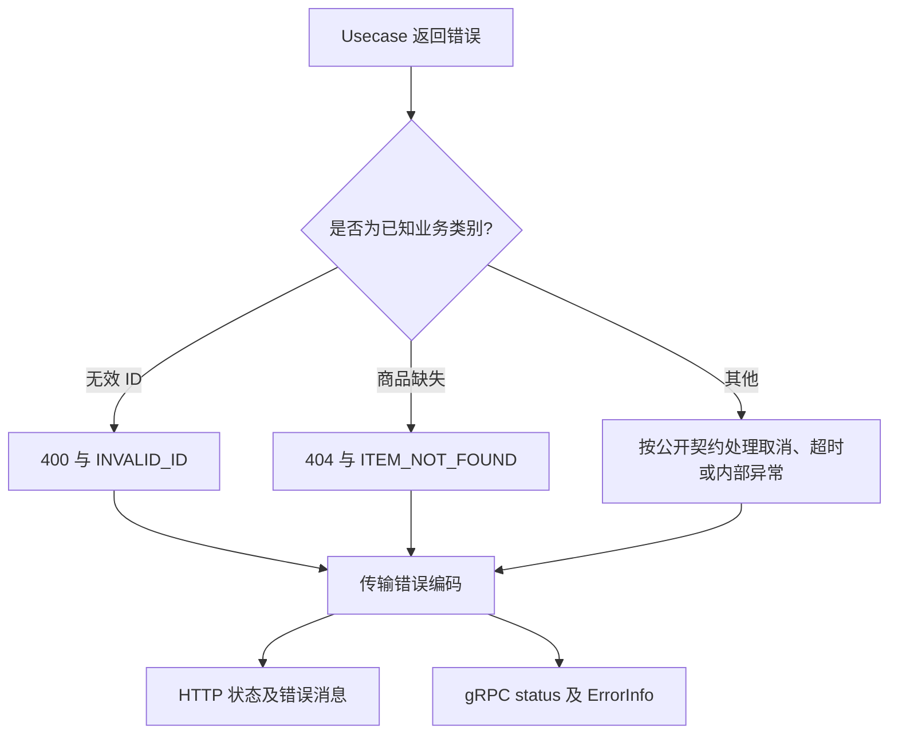

# 085 Kratos 的错误模型如何映射业务错误？

> 难度：中级 · 分类：Kratos 工程 · 版本：v2.9.1

## 简短回答

Kratos 错误包含 code、reason、message 和 metadata，并提供 HTTP 与 gRPC 状态转换。code 表达协议类别，reason 表达稳定业务原因，message 面向阅读。业务判断不应依赖可变的错误文字，内部 cause 也不应无筛选地暴露给客户端。

## 详细解析

### 同一业务错误跨两种协议

```go
package main

import (
    "fmt"
    kerrors "github.com/go-kratos/kratos/v2/errors"
    "google.golang.org/grpc/status"
)

func main() {
    err := kerrors.NotFound("ITEM_NOT_FOUND", "item not found")
    fmt.Println(kerrors.Code(err), kerrors.Reason(err))
    fmt.Println(status.Code(err))
}
```
```output
404 ITEM_NOT_FOUND
NotFound
```

本仓库的 service 把领域 ErrMissing 转成这个错误，HTTP 与 gRPC 测试验证各自返回协议类别。领域层保留“商品缺失”的事实，不需要知道 HTTP 数值或 gRPC 枚举。

### 错误字段有不同稳定性

客户端可根据 reason 选择业务分支，message 可以在不破坏逻辑判断的前提下改善描述。metadata 用于约定的附加信息，例如可公开的字段错误；不要把 SQL、内部主机名或凭据塞进去。需要根因时可用 WithCause 保留错误链，日志边界再进行受控记录。

v2.9.1 的 FromError 支持包装错误与 gRPC 状态转换；对于普通 error，会构造未知类别并使用其 Error 文本。因此不能假设框架会自动为所有数据库错误脱敏。对外错误映射是服务边界职责，未知错误应转成稳定公开信息，同时内部保留诊断证据。

超时与取消也要按实际协议语义处理。服务端自行产生的 context 错误、客户端本地 deadline 和远端业务错误可能经历不同路径，应通过真实协议测试确认，而不是只调用一个转换函数就推断所有情况。

### 从仓储错误到客户端可见结果

当前 Service.GetItem 通过 `errors.Is` 判断 ErrInvalidID 和 ErrMissing，再转换为 BadRequest 与 NotFound；其他错误直接返回。这对当前仅产生缺失与 context 错误的只读仓储范围有明确含义，但如果以后接入 SQL，不能原样认为未知数据库错误已经被隐藏。



图中的“其他”是错误边界需要审查的职责，当前示例对应直接返回分支；它不代表示例已经实现了所有生产错误分类。区分已实现行为和扩展要求，可以避免把一个教学接口误当作通用错误网关。

### 公开 message 与内部 cause 可以分开

下面程序展示一个明确映射：客户端看到稳定公开信息，服务端仍能通过错误链识别原始错误。内部错误文本只用于说明差异，不应该作为实际客户端响应或无筛选日志输出。

```go
package main

import (
    "errors"
    "fmt"
    kerrors "github.com/go-kratos/kratos/v2/errors"
    "google.golang.org/grpc/status"
)

func main() {
    cause := errors.New("private database diagnostic")
    public := kerrors.InternalServer("INTERNAL", "service temporarily unavailable").WithCause(cause)
    fmt.Println(status.Code(public), status.Convert(public).Message())
    fmt.Println(errors.Is(public, cause))
    fmt.Println(kerrors.FromError(public).Reason)
}
```
```output
Internal service temporarily unavailable
true
INTERNAL
```

v2.9.1 的 GRPCStatus 使用公开 message 和 ErrorInfo 构造协议状态，不把 cause 当作公开字段；但 Error() 的字符串包含 cause。因此直接记录整个 error 仍可能泄露内部信息，WithCause 只是保留链路，不是自动脱敏器。日志边界需要决定保留哪些诊断字段及其访问范围。

### 错误码也是版本化协议

| 字段 | 适合承担的角色 | 应避免的用法 |
| --- | --- | --- |
| code | 协议类别和通用客户端处理 | 为每个订单号造不同 code |
| reason | 稳定业务分支 | 随文案翻译一起变化 |
| message | 可读解释 | 客户端依赖字符串精确相等 |
| metadata | 已约定的公开补充信息 | 暴露 SQL、凭据或内部拓扑 |

业务冲突是否值得重试，应由 reason、操作语义和剩余预算共同判断；同样的 500 也可能来自不可重试的程序错误。取消与 deadline 在调用者本地、服务端业务和传输层经过的转换路径可能不同，需要真实协议实验，而不是从本题的 NotFound 示例类推全部错误。

更深入的测试应注入未知仓储错误、包装后的领域错误和运行中取消，分别检查客户端可见字段与内部错误链。当前已有网络测试证明成功、缺失和无效参数的映射；上面的新增程序仅验证公开错误与 cause 分离的转换行为。

## 常见误区 / 面试追问

- **所有业务失败都返回 500 吗？** 应区分参数、权限、缺失、冲突与内部异常，便于客户端和监控正确处理。
- **reason 可以随文案一起改吗？** 若已成为客户端契约，应保持兼容或显式版本化。
- **每层都记录错误是否更安全？** 常导致重复日志，底层加上下文，上层在处理边界记录即可。

## 参考资料

- [Kratos v2.9.1 errors 实现](https://github.com/go-kratos/kratos/blob/v2.9.1/errors/errors.go)
- [Kratos HTTP/gRPC 状态映射](https://github.com/go-kratos/kratos/tree/v2.9.1/transport/http/status)

[返回目录](../README.md) · [上一题](084-dependency-injection.md) · [下一题](086-kratos-middleware.md)
