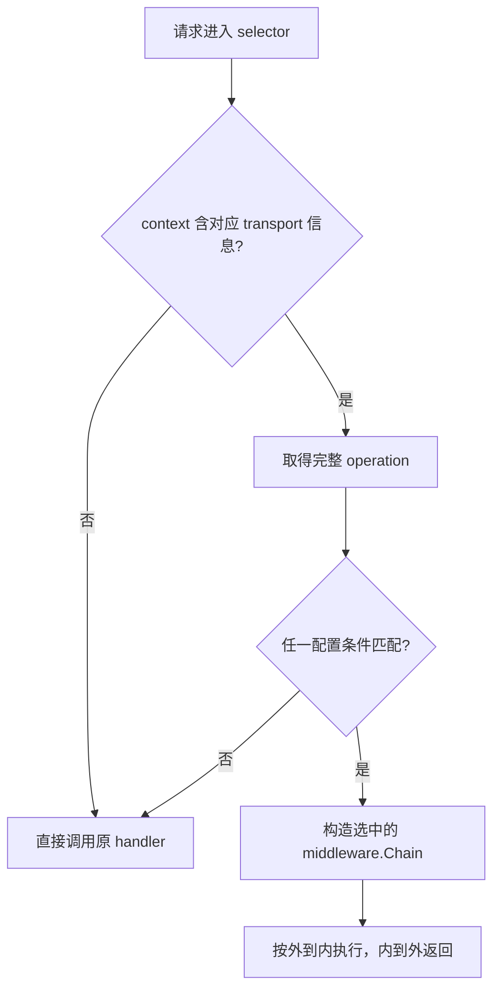

# 086 Kratos 中间件与 selector 应该怎样组织？

> 难度：中级 · 分类：Kratos 工程 · 版本：v2.9.1

## 简短回答

Kratos middleware 把 `Handler(context.Context, any) (any, error)` 包装成新的 Handler，可以统一处理 HTTP/gRPC 方法调用。selector 根据 operation 等信息选择是否应用中间件。必须核对匹配值、包裹顺序与未匹配路径，避免鉴权因匹配错误被绕开。

## 详细解析

### Chain 的实际执行顺序

v2.9.1 的 Chain 从末尾向前包装，因此传入列表中的第一个中间件处于最外层。下面用完整程序验证进入与返回顺序。

```go
package main

import (
    "context"
    "fmt"
    "github.com/go-kratos/kratos/v2/middleware"
)

func mark(name string) middleware.Middleware {
    return func(next middleware.Handler) middleware.Handler {
        return func(ctx context.Context, req any) (any, error) {
            fmt.Println(name, "in")
            defer fmt.Println(name, "out")
            return next(ctx, req)
        }
    }
}

func main() {
    h := middleware.Chain(mark("A"), mark("B"))(func(context.Context, any) (any, error) {
        fmt.Println("call")
        return nil, nil
    })
    if _, err := h(context.Background(), nil); err != nil { panic(err) }
}
```
```output
A in
B in
call
B out
A out
```

示例服务将计数放在日志与 recovery 外侧，因此业务 panic 被恢复成错误后，计数中间件可以观察到失败。若 recovery 在最外侧，内层没有完成的普通返回代码不一定执行，指标记录方式需要重新审视。

### selector 匹配的是哪条名字

生成的 GetItem operation 是 `/interview.catalog.v1.Catalog/GetItem`，不是 HTTP URL `/v1/items/book`。配置 Path、Prefix 或 Match 时应针对实际 operation，并为受保护与放行路径分别测试。没有 transport 信息时的匹配结果也要核对，单元测试直接用 Background 可能与真实请求不同。

认证更适合默认覆盖业务入口，再明确列出健康检查等例外；仅给少数方法名单加保护，新增方法时容易遗漏。手写 HTTP HandleFunc 不会自动经过生成 handler 的 ctx.Middleware，这也是为什么不能只检查一份 middleware 配置就宣布所有入口受保护。

中间件里不要保存每请求可变状态到共享字段，应放在局部变量或 context 中。读写请求对象也要遵守类型与所有权契约，不能假设 HTTP 与 gRPC 之外的调用永远提供同一种类型。

### selector 的多个匹配条件不是自动取交集

v2.9.1 的 matches 先取得 transport 信息，然后依次检查 Prefix、Regex、Path 和自定义 Match，任一条件成功就返回 true。若想表达“属于这个服务且不是健康检查”，不能先配置一个宽 Prefix，再指望后面的 Match=false 把某个方法排除，因为前面的成功已经返回。



没有 server transport 信息时，Server selector 会直接不匹配；即使自定义 Match 本来想返回 true，也不会走到它。因此用 Background 直接调用一段 selector 单元测试，可能完全绕过预期中间件。需要构造符合实际边界的 transport 上下文，或通过真实请求验证。

### 顺序改变会影响恢复后的指标

示例链为 `observe(logging(recovery(service)))`。业务在同一 goroutine panic 时，recovery 把它转为 error 返回，logging 和 observe 能沿正常返回路径看到错误。若把 recovery 放到 observe 外面，observe 中 `next` 后面的失败计数代码可能在 panic 展栈时跳过，虽然外层最终仍返回错误。

这不意味着内侧 recovery 覆盖一切：observe 自己的 panic 位于其外侧，另开 goroutine 的 panic 也不在同一恢复栈中。中间件应保持少副作用、边界清楚，不能把“安装 recovery”解释成所有故障都不会使进程退出。

| 要检查的请求 | 预期验证点 |
| --- | --- |
| 受保护的完整 operation | 认证中间件确实执行 |
| 明确允许的健康操作 | 只绕过允许绕过的能力 |
| 新增业务方法 | 默认策略是否覆盖 |
| 手写 HTTP 路由 | 是否需要单独包裹网络层保护 |
| 绑定阶段失败 | 不误认为进入了业务计数链 |

对鉴权来说，未匹配路径通常直接执行 handler，而不是报配置错误。因此错误的 operation 字符串会安静地变成权限漏洞，测试需要检查鉴权是否被调用，而不能只看接口返回成功。Regex 的非法表达式在当前实现中返回不匹配，也应在配置审查阶段发现。

### 共享中间件对象中的状态怎样保存

一次调用的开始时间、请求 ID 和结果应放在闭包内的局部变量，不要写到 Middleware 实例的普通共享字段。跨请求计数使用原子或其他同步机制，标签维度保持有界。本例的 Metrics 只有两个 atomic.Int64，足以表达教学计数；它没有包含延迟直方图或完整追踪，不应从字段名称补出不存在的能力。

本题 Chain 程序实际验证正常顺序；selector 的条件关系来自固定版本源码。真正的鉴权覆盖仍需针对项目的注册表和受保护方法执行测试，本示例没有虚构一个未接入的认证系统。

## 常见误区 / 面试追问

- **selector 没匹配会报错吗？** 通常会直接继续处理，错误匹配可能静默跳过能力，所以需要覆盖测试。
- **recovery 能捕获新 goroutine 的 panic 吗？** 不能，仍受同一 goroutine 的恢复规则限制。
- **指标为何与访问日志数量不一致？** 检查绑定失败、手写路由和中间件覆盖范围，而不是先怀疑计数器。

## 参考资料

- [Kratos Chain 实现](https://github.com/go-kratos/kratos/blob/v2.9.1/middleware/middleware.go)
- [Kratos selector 实现](https://github.com/go-kratos/kratos/blob/v2.9.1/middleware/selector/selector.go)

[返回目录](../README.md) · [下一题](087-kratos-config.md)
