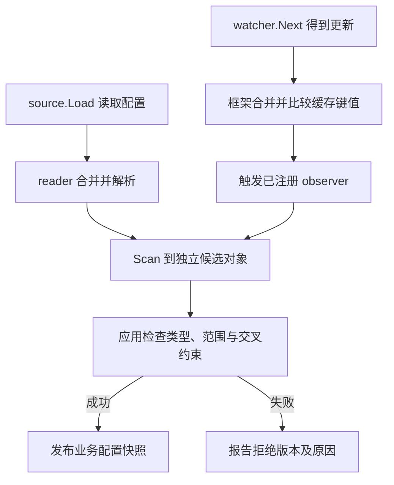

# 087 Kratos 配置加载与热更新的边界是什么？

> 难度：中级 · 分类：Kratos 工程 · 版本：v2.9.1

## 简短回答

Kratos config 将来源加载、解码合并、取值和变更观察组织成统一接口。Load 与 Scan 成功只说明配置被读取并转换，不代表业务资源已经重建。Watch 通知也不是多字段业务配置原子切换协议，需要应用自行校验并发布快照。

## 详细解析

### 按真实 API 理解阶段

v2.9.1 的 Config 接口提供 Load、Scan、Value、Watch 和 Close。文件 source 从路径读取内容并按格式提供配置数据；Load 建立观察过程，Scan 将当前数据转换到目标结构。应用应先 Load，再 Scan，再执行字段范围与依赖关系校验。

```yaml
server:
  http:
    addr: 127.0.0.1:8000
    timeout: 1s
catalog:
  max_page_size: 100
```

这段 YAML 仅描述配置数据。timeout 怎样转换为 Go 字段，取决于目标结构和解码约定；框架不会自动把任意字符串都变成业务期待的 time.Duration。实际项目需使用正确类型并验证解析结果。

### Watch 不会改掉已有连接

数据库地址更新后，一个在启动时创建的 sql.DB 不会因为配置对象变化就自动指向新库。正确流程应构造并验证新连接资源，安全切换使用者，再等旧请求完成后关闭旧资源。监听地址、TLS 和注册信息也有不同生效边界。

源码中的观察机制按 key 比较缓存值并触发 observer，并不承诺应用多字段同时被读成一个完整业务版本。回调中逐项修改共享结构体可能产生竞态或混合配置；应构造新快照，完成全部业务验证后再原子发布。

更新失败时，应用可明确拒绝新版本并继续使用上次验证通过的快照，同时记录失败和告警。这是可追踪的配置策略，不能只吞掉错误让运维误以为更新已生效。启动时必需配置无效则应直接报错。

退出时调用 Close 停止相关 watcher，避免后台资源失去所有者。本仓库的目录服务使用显式启动参数，没有声称已经集成配置中心；本题讲述 config 能力和接入边界。

### 从 source 更新走到应用真正使用的新值

当前版本的 Load 会逐个读取 source，把键值合并到 reader，建立 watcher，并执行解析。Scan 把当时 reader 中的配置转换到目标对象。之后 source 发生变化，框架更新自己的 reader 和缓存值，不会自动找到应用中曾经 Scan 过的任意结构体并重写它。



图里 observer 到 Scan 是应用可以建立的处理步骤，不是 Config 自动替业务执行的逻辑。若多个键共同描述一个连接配置，应该从同一候选版本构建整组对象，再一次发布，不能分别收到 host 和 password 更新后立即修改共享连接选项。

### Watch 的边界可从源码直接确认

Watch 注册时会先调用 Value，键不存在或值为空会返回 ErrNotFound。当前观察循环对已缓存键进行比较，只有读取到的新值存在、类型相同且内容不同，才 Store 并调用对应 observer。因此不能假设删除键、改变值类型和普通值变化都会以相同方式通知业务。

| 变化 | 应额外验证的行为 |
| --- | --- |
| 已有数值从 100 改为 200 | observer 是否触发、业务范围是否允许 |
| 原整数改成字符串 | 框架比较条件与应用拒绝策略 |
| 删除必需键 | 是否收到期望事件，生效快照如何处理 |
| 连续发布两个相关版本 | 应用是否避免乱序或混合快照 |

这些是 v2.9.1 的具体实现边界，不应推断所有 source 适配器和未来版本完全相同。回调在 watcher 处理路径中执行，若回调长时间进行网络重建，会拖慢相应更新处理；可把重建交给受控的串行任务，但任务本身要有限队列和版本淘汰规则。

### 配置数据不是自动装配指令

YAML 中写 `timeout: 1s`，是否能够 Scan 到目标字段由解码与类型约定决定。更稳妥的课程练习是先用字符串字段接收，再用明确解析函数校验，或使用项目已有的 Protobuf Duration 结构；不能只看 YAML 外观就声称实际 time.Duration 已是正确纳秒值。

把数据库地址从 A 改成 B，需要创建新池、验证连接、切换引用、等待旧使用者结束并关闭旧池。这些动作不在 Config 接口中。对于监听端口或复杂拓扑，采用滚动重启可能比自行实现热替换更容易验证，也符合按需使用框架的原则。

退出时 Close 会停止已建立的 watcher，但应用在 observer 中创建的额外任务仍有自己的所有者。若 Load 中途失败，也要考虑此前已创建 watcher 的清理。当前目录服务只用命令行地址参数，本文没有增加未验证的配置中心接入；上述链路基于锁定源码解释能力与限制。

## 常见误区 / 面试追问

- **Scan 一次后结构体会自动随更新变化吗？** 不应这样假设，需要明确观察与重新构建应用状态的流程。
- **热更新是否比重启更安全？** 动态资源替换可能更复杂，对启动结构配置滚动重启往往更清晰。
- **怎样验证生效？** 检查应用使用的配置版本与实际行为，不只看配置中心显示已发布。

## 参考资料

- [Kratos config v2.9.1](https://github.com/go-kratos/kratos/blob/v2.9.1/config/config.go)
- [Kratos 文件配置 source](https://github.com/go-kratos/kratos/tree/v2.9.1/config/file)

[返回目录](../README.md) · [上一题](086-kratos-middleware.md) · [下一题](088-kratos-discovery.md)
