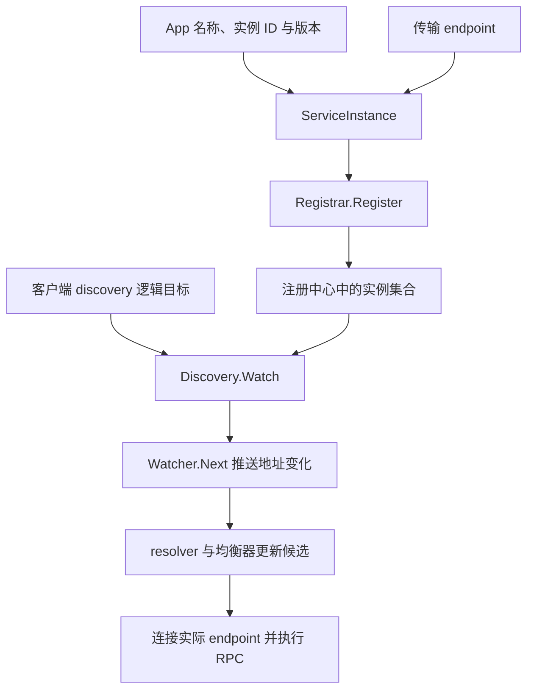

# 088 Kratos 如何接入注册发现与客户端治理？

> 难度：中级 · 分类：Kratos 工程 · 版本：v2.9.1

## 简短回答

Kratos 通过 Registrar 发布和注销实例，通过 Discovery 获取并观察服务实例；客户端结合逻辑 endpoint、resolver 与均衡器调用后端。接入注册中心只是建立地址发现链路，超时、身份、重试和容量仍需分别配置与验证。

## 详细解析

### 注册的信息从哪里来

v2.9.1 的 ServiceInstance 包含 ID、Name、Version、Metadata 和 Endpoints。App 可从传输服务获得 endpoint，并使用注入的 Registrar 注册；客户端通过 Discovery 查询或 Watch 实例变化。不同注册中心适配器的租约和故障行为不完全相同。

```text
HTTP/gRPC Server → endpoint
应用名称、实例 ID、版本 → ServiceInstance → Registrar
                                                   ↓
客户端逻辑服务名 → Discovery/Watcher → 地址更新 → 调用
```

gRPC 客户端接入常涉及 WithEndpoint 和 WithDiscovery，逻辑地址形如 `discovery:///interview.catalog`。其中服务名要与注册名称一致，不能把 HTTP 路由当成服务名；实际连接仍要满足地址可达和 TLS 身份要求。

### 注册成功不等于服务完整就绪

框架生命周期负责启动和注册协调，但不能替代应用的数据库连通、缓存预热和业务 readiness 校验。应在对外接流前完成必需准备；注册到错误网卡、容器内部地址或不可达端口，也会出现“列表里有实例但无法调用”。

关闭时先注销和停止新增流量，再等待在途请求。注销失败、客户端列表缓存和长连接都会影响实际摘流速度，需要通过故障演练观察，不能只看 App.Stop 被调用。

客户端治理要避免层层叠加重试。框架 middleware、gRPC 配置和服务网格都可能施加策略，应建立一份实际调用预算。注册中心暂时不可达时，是否保留旧地址取决于适配器和客户端行为，需按实际版本验证。

本仓库双协议测试使用本地直连，未启动 etcd、Consul 或其他注册中心。因此它验证传输与业务链路，不提供注册中心故障切换的运行证据。

### 从逻辑服务名走到一个真实 socket

假设将目录服务部署到多个节点，所有实例使用 Name=`interview.catalog`，但实例 ID 各不相同；每个实例发布可被调用方访问的 gRPC endpoint。客户端用逻辑目标发现实例，resolver 将结果转换为地址集合，均衡策略再选择目标。注册名称、协议、网络地址和 TLS 身份分别承担不同职责，不能互相替代。



当前 registry 接口把 Register/Deregister 与 GetService/Watch 分开定义，某个适配器是否同时实现两者需要看实际实现。Watcher.Next 可以等待变化，Watcher.Stop 负责结束观察；客户端关闭和上下文取消时应核对后台观察是否退出，不能每次请求都新建一个 watcher 后遗忘。

### 本地地址不能直接复制到集群注册信息

示例默认 127.0.0.1 便于本机学习，但远程客户端连接它会访问自己的回环地址。监听 `0.0.0.0` 也只代表本地绑定所有接口，不一定是应发布的可路由地址。容器网段、NAT、代理、端口映射和证书名称都可能影响最终可达性，应从真实客户端位置测试。

| 配置不一致 | 可能表现 | 优先核对 |
| --- | --- | --- |
| 注册名与逻辑目标不同 | 发现不到实例 | Name 与 endpoint 中的服务名 |
| endpoint 协议不匹配 | 解析或连接失败 | grpc/http、明文或 TLS |
| 注册内部不可达地址 | 有实例却全部拨号失败 | 客户端到目标的网络路径 |
| ID 被多个进程复用 | 实例覆盖或摘流异常 | 适配器对唯一身份的要求 |

Version 和 Metadata 只是携带的信息，只有 resolver、过滤器或流量策略主动使用它们，才会影响选址。把版本填为 v2 不会自动得到金丝雀发布，也不会阻止旧客户端调用不兼容的新协议。

### 治理参数要按实际构造入口核对

Kratos 的 gRPC 客户端构造器与直接调用 grpc.NewClient 并不是同一套配置入口。锁定版本 client.go 中的 WithEndpoint、WithDiscovery 和客户端拦截器负责自己的装配，不能把框架默认值套到本示例测试中直接创建的 gRPC 客户端。测试为调用显式派生了两秒 context，这才是该路径的等待边界。

注册中心故障时是保留旧地址、多久重试、如何更新空列表，应阅读所选适配器与 resolver，而不能从 registry 接口签名直接确认。接口没有写明的故障保证，无法从文件直接确认，需要实际适配器代码和运行实验。

关停还要覆盖注销失败与传播延迟。v2.9.1 App.Stop 在注销报错时可能提前返回，应用必须处理返回结果；已有本地直连测试不涉及这条分支。建议把注册、扩容、摘流、控制面短暂断开分别作为集成场景，而不是仅测“第一次能找到服务”。

## 常见误区 / 面试追问

- **一个服务的所有实例能共用同一 ID 吗？** 可能导致注册覆盖或身份冲突，实例身份应按适配器要求唯一。
- **元数据里的版本会自动实现灰度吗？** 还需要发现、选择和流量规则显式使用它。
- **发现列表更新就完成切流了吗？** 已有连接和在途请求还可能继续，需要结合连接与关停策略。

## 参考资料

- [Kratos registry 接口](https://github.com/go-kratos/kratos/blob/v2.9.1/registry/registry.go)
- [Kratos gRPC 客户端](https://github.com/go-kratos/kratos/blob/v2.9.1/transport/grpc/client.go)

[返回目录](../README.md) · [上一题](087-kratos-config.md) · [下一题](089-kratos-tests.md)
