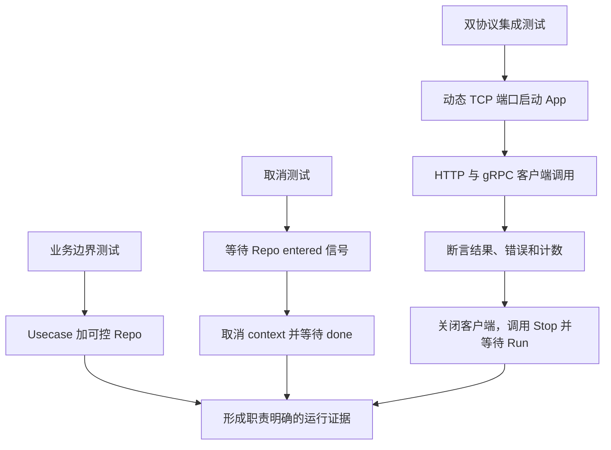

# 089 如何测试 Kratos 服务而不依赖真实数据库？

> 难度：高级 · 分类：Kratos 工程 · 版本：v2.9.1

## 简短回答

在 biz 的仓储接口后注入可控实现，验证业务规则与错误传播；在传输边界启动真实本地 HTTP/gRPC，验证生成代码、绑定和错误映射。这样的测试可以不依赖数据库，但不能证明 SQL、隔离级别或迁移行为，后者仍需数据库集成测试。

## 详细解析

### 本仓库已有三类运行验证

[catalog_test.go](../examples/catalog/catalog_test.go) 使用 repoFunc 提供最小替身。无效 ID 和预取消请求不应访问仓储，因此一旦替身被调用就让测试失败。这验证了副作用边界，而不是机械检查每行实现。

运行中取消测试先等待仓储明确进入阻塞点，再发出取消，最后等待任务返回。它不靠 sleep 猜测任务是否开始；超时只用于防止测试永久挂起，并不作为业务正确性的同步机制。

双协议测试使用动态本地端口启动 Kratos App，通过标准 HTTP 客户端与生成的 gRPC 客户端访问，验证成功结果、404/NotFound、InvalidArgument 和请求计数。测试清理时调用 Stop，并等待 Run 返回，证明后台生命周期实际结束。

```sh
go test ./examples/catalog/... -count=1
go test -race ./examples/catalog/... -count=1
go vet ./examples/catalog/...
```

这些命令在本仓库根目录执行。具体工具版本与验收结果记录于 [验收记录](../docs/VALIDATION.md)，不把示例输出误当成生产环境报告。

### 替身应该保留哪些语义

仓储替身需要返回明确的缺失、失败或取消结果，才能测试业务决策；它不应自动让所有调用成功。对于包含事务的用例，测试应验证成功与失败路径的业务不变量，但不能声称模拟对象准确复现数据库锁行为。

接口过大时替身会被迫实现大量无关方法，这是边界设计需要调整的信号。不要为了测试方便把所有外部能力塞进全局可变函数，容易产生并行测试相互污染。

测试中使用固定随机种子或受控输入，关闭客户端与服务资源，不依赖硬编码端口或网络公网。协议生成器升级后重跑契约测试，确保编译通过之外的行为仍符合预期。

### 三种测试分别切在哪个边界

Usecase 测试直接调用业务方法，不关心 HTTP 编码；取消测试把 Repo 换成可控制阻塞的实现，验证 context 传递与退出；网络测试保留真实生成代码、两种传输和 App，只替换外部数据来源。这样每次失败都能指向一个相对明确的责任边界。



图中的替身不是对全部生产环境的模拟。只读 MemoryRepo 能验证目录查询和稳定错误，不能模拟数据库的连接池、事务回滚、锁等待或副本延迟。因此不用数据库的测试提升反馈速度，真实数据库适配器测试则承担另一类证据，两者并不冲突。

### 先等待进入，再触发取消

TestRunningTaskCancellation 中，Repo 进入后关闭 entered，测试收到信号才调用 cancel，最后等待 done。若直接启动 goroutine 后立即 cancel，任务可能在进入 Repo 前就被拒绝，测试只覆盖“预取消”，却被误认为验证了运行中工作可以退出。

两秒 time.After 是测试挂起的保护边界，不是用于创造正确交错的 sleep。任务是否进入由 entered 决定，是否退出由 done 决定。这种方法也适用于后续测试慢依赖、关停排空和事务提交窗口。

### 五次业务调用为何对应三次失败

| 调用 | 预期结果 | 是否计为失败 |
| --- | --- | --- |
| HTTP book | 200 与商品字段 | 否 |
| HTTP missing | 404 | 是 |
| gRPC book | 成功与商品名称 | 否 |
| gRPC missing | NotFound | 是 |
| gRPC 空请求 | InvalidArgument | 是 |

当前集成测试最终断言 Calls=5、Failures=3，它验证的是共享业务中间件路径上的计数。它并没有请求 `/metrics` 再验证文本内容，也没有故意制造 panic；这些不能从计数断言中直接推导。课程明确写出未覆盖项，便于读者选择下一项有价值的测试。

动态端口由操作系统分配，Endpoint 获取实际地址，避免固定 8000 在并行环境被占用。客户端有明确超时，清理关闭客户端连接并调用 App.Stop，还等待 Run 的完成 channel；否则测试函数返回时仍可能留下后台 goroutine。

### 哪些改动需要扩大验证

修改 proto 或生成器，要重跑双协议契约；修改 Repo 的取消处理，要验证运行中取消；改中间件顺序，应注入 panic 或拒绝分支检查指标；接入 SQL，则增加真实驱动与数据库实验。测试应随着风险边界变化，而不是为了提高文件数量重复断言构造函数保存了参数。

race detector 只检查本次实际执行到的并发访问，不能证明所有未来路径。结合只读数据发布、原子计数以及清晰生命周期的代码审查，结论才完整。本题引用的测试文件是当前仓库真实实现，执行结果以验收记录和实际命令输出为准。

## 常见误区 / 面试追问

- **mock 测试都通过就能上线吗？** 还需要真实依赖与部署路径验证，尤其是 SQL、权限和迁移。
- **为什么要真实 TCP，而不是只调 service？** 可以覆盖路由注册、序列化、协议状态和连接生命周期。
- **race 通过能证明所有并发安全吗？** 只能覆盖实际执行到的路径，应结合共享状态设计审查。

## 参考资料

- [Go testing](https://pkg.go.dev/testing)
- [Go race detector](https://go.dev/doc/articles/race_detector)
- [Kratos 官方示例](https://github.com/go-kratos/examples)

[返回目录](../README.md) · [上一题](088-kratos-discovery.md) · [下一题](090-kratos-service.md)
