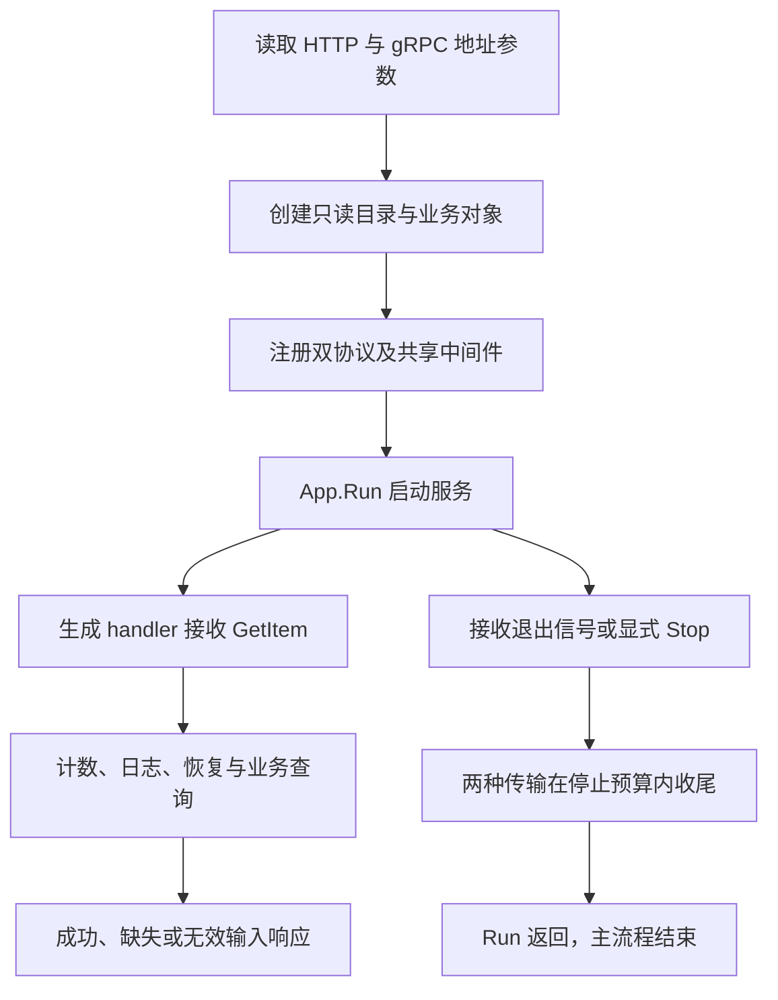

# 090 实战题：如何设计一个可观测、可关闭的 Kratos 服务？

> 难度：高级 · 分类：Kratos 工程 · 版本：v2.9.1

## 简短回答

先定义业务与协议契约，再显式装配依赖、配置有界超时、接入日志与指标，最后用应用生命周期协调退出。本题的完整实现是双协议只读目录服务；它可运行、可测试，不用未实现的仓储或占位 handler 代替实际行为。

## 详细解析

### 功能范围与真实入口

[示例说明](../examples/catalog/README.md) 给出启动命令与端口。[入口](../examples/catalog/cmd/server/main.go) 创建内存商品目录，查询 book 返回名称，查询不存在商品返回稳定缺失错误。HTTP 和 gRPC 由同一 Protobuf 契约生成并注册到同一个 service。

```text
go run ./examples/catalog/cmd/server

HTTP GET /v1/items/book → 商品响应
HTTP GET /v1/items/missing → 404 / ITEM_NOT_FOUND
gRPC Catalog.GetItem → 同一业务用例
HTTP GET /metrics → 请求与失败累计计数
```

目录构造后只读，因此多个请求可以共享查询；没有写入功能，也没有假装内存数据具有跨重启持久性。应用默认仅监听本机，明文连接便于学习；生产身份与 TLS 属于部署时必须明确接入的边界。

### 观测与退出如何串起来

[server.go](../examples/catalog/server.go) 将计数、结构化调用日志和 recovery 配置到两种协议上，设置传输期限及 HTTP 读写边界。指标只使用有限名称，不把商品 ID 变成标签，避免基数随业务数据增长。

App 接管两种 server 的启动和停止，StopTimeout 给退出设上限。CLI 正常收到退出信号后由 Run 收尾并返回；测试则显式调用 Stop 并等待 Run，避免只发信号就把任务留在后台。

当前服务没有后台写入和数据库连接，因此无需添加空清理函数。未来增加消费者时，应把停止拉取、在途确认与依赖关闭纳入同一生命周期，不能另开无人等待的 goroutine。

### 如何评价是否完成

先验证业务规则，再通过真实本地连接检查两种协议，再用 race 与 vet 检查实际执行和静态风险。生成代码已提交并可按固定工具版本重建，学习者无需手动补全 RPC 桩。

本例验证的是一个明确范围的完整服务，不声称已经验证注册中心、真实数据库、集群 TLS、压测或分布式故障恢复。那些能力应以实际接入和环境证据单独验收。

### 从启动到关停画出一条完整路径

入口只有一个内置商品 book。MemoryRepo 在创建后不再写入，两个传输共享 Service 与 Usecase；因此可以在不接外部系统的前提下，完整演示协议适配、错误、观测和生命周期。范围小不等于流程缺失，读者可以直接运行、修改请求并检查结果。



图不包含注册中心、SQL 或消息消费者，因为这些对象没有在入口创建。新增能力时应该把实际资源和恢复路径加入图，而不是先画一张完整微服务平台图，再把尚未实现的框当成项目已有功能。

### 各个时间参数保护不同阶段

server.go 设置 Kratos 传输 Timeout 为 1 秒，同时给 HTTP 配置 2 秒请求头读取、5 秒读写和 30 秒空闲期限；入口设置 App.StopTimeout 为 5 秒。这些是示例配置，不能理解成所有业务工作都最多运行一秒，也不能把 HTTP 写期限当成 goroutine 强杀机制。

| 参数或边界 | 在本例中的用途 | 扩展时要重新评估 |
| --- | --- | --- |
| 业务 context 期限 | 向用例及依赖传播取消 | 数据库与远程调用是否响应 |
| HTTP 读写期限 | 限制连接阶段等待 | 上传、流式与代理路径 |
| App 停止预算 | 给传输关闭有限时间 | 长连接与自定义后台任务 |
| 本地监听地址 | 限制示例默认可达范围 | 部署后的 TLS 与访问控制 |

指标只记录进入业务方法的总调用与 error 返回，不能表示所有 HTTP 访问，也不包含耗时分布。业务缺失同样计为 Failures，因此这个计数不能直接拿来当“内部故障率”SLO；真实服务需要按约定区分业务拒绝、参数错误和系统失败。

### 怎样把它作为面试实战而不是照抄模板

第一步让候选人运行 book 与 missing，解释为什么两种协议调用同一方法。第二步提供空 ID，要求指出在哪一层拒绝、为何不访问仓储。第三步将仓储替换为等待 context 的可控实现，要求证明运行中取消。最后要求说明停止信号、server.Stop 和 App.Run 返回之间的关系。

| 评价层次 | 可观察的完成标准 |
| --- | --- |
| 能运行 | 命令启动，真实客户端拿到商品 |
| 能解释 | 从 proto 到 Repo 逐个指出真实调用点 |
| 能处理失败 | 明确错误映射、取消与资源所有者 |
| 能评估范围 | 不把本地只读示例说成完整生产平台 |

扩展订单写入时，先写幂等键、库存事务与状态机契约，再选择持久存储。仅给 map 增加写锁只能解决单进程并发访问，不能提供跨进程一致性、持久化或业务恢复。

本题对应服务没有占位 handler，已有测试覆盖确定的本地网络和业务路径；未验证部分包括集群认证、注册发现、数据库、压测和故障切换。清楚报告这些边界，才能让后续学习按证据逐步扩大，而不是把框架能力列表当成验收结果。

## 常见误区 / 面试追问

- **加了日志和计数就算完整可观测性吗？** 它们覆盖本例边界，跨服务还需要追踪传播、指标后端和业务告警。
- **如何扩展到订单写入？** 先定义幂等、事务与状态机，再实现真实仓储，不应直接给 map 加一个写方法就当成生产订单系统。
- **框架价值体现在哪里？** 两种传输共享契约与治理，应用生命周期统一；业务正确性仍由清晰用例负责。

## 参考资料

- [Kratos App 生命周期源码](https://github.com/go-kratos/kratos/blob/v2.9.1/app.go)
- [Kratos HTTP Server](https://github.com/go-kratos/kratos/blob/v2.9.1/transport/http/server.go)
- [Kratos gRPC Server](https://github.com/go-kratos/kratos/blob/v2.9.1/transport/grpc/server.go)

[返回目录](../README.md) · [上一题](089-kratos-tests.md) · [下一模块](../10-production-design/091-containers.md)
