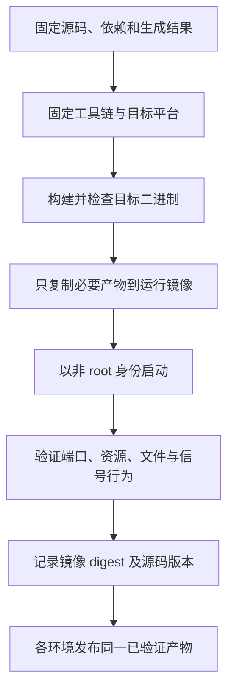

# 091 Go 服务如何构建为可重复部署的容器？

> 难度：基础 · 分类：生产与系统设计

## 简短回答

固定源码、模块依赖、工具链和镜像输入，在构建阶段产出目标平台二进制，运行镜像只保留必要文件。多阶段构建减少运行环境体积，但是否能使用极简镜像取决于 cgo、证书、时区与动态库需求；小镜像不自动等于可运行。

## 详细解析

### 一份完整的构建配方

以下 Dockerfile 在仓库根目录作为构建上下文，面向不依赖 cgo 的目录服务。示例标签固定版本，若要固定镜像内容还应记录经过核验的 digest。本文没有把容器构建写成已经执行的验证结果。

```dockerfile
FROM golang:1.26.5 AS build
WORKDIR /src
COPY go.mod go.sum ./
RUN go mod download
COPY . .
RUN CGO_ENABLED=0 go build -trimpath -o /catalog ./examples/catalog/cmd/server

FROM scratch
COPY --from=build /catalog /catalog
USER 65532:65532
EXPOSE 8000 9000
ENTRYPOINT ["/catalog"]
CMD ["-http", "0.0.0.0:8000", "-grpc", "0.0.0.0:9000"]
```

当前服务只使用本地只读内存数据，不发起 HTTPS，因此此配方未复制证书包。未来增加外部 TLS 客户端、读取时区或动态库时，需要显式补齐运行依赖，不能继续盲用 scratch。容器端口发布还应按部署环境控制访问范围。

### 可重复不只是固定 go.mod

生成代码、构建参数、目标架构、基础镜像和构建时注入的版本信息都会影响产物。不要在构建阶段使用不受控 latest 或自动升级依赖。模块缓存只是加速器，清空缓存后也应能从声明的输入构建。

运行用户不应依赖 root，工作目录和可写路径需要明确。只读文件系统能暴露未声明的写入需求，但临时文件、证书和日志输出应按真实行为验证。应用日志输出到标准流，交给运行平台收集。

部署时还需设 CPU、内存与终止宽限期，并验证信号能到达应用。exec 形式 ENTRYPOINT 避免额外 shell 吞掉信号，但应用自身仍要正确收尾。镜像内能启动不代表 readiness 与依赖已经准备好。

### 从构建输入追溯到正在运行的进程

可重复部署首先要求能回答“这次运行的是哪一个产物”。源码提交、Go 版本、模块内容、生成器结果、构建参数和基础镜像共同决定产物。镜像标签有助于阅读，digest 才能锁定所指内容；多架构镜像还要区分清单与具体平台内容。



`-trimpath` 减少本机路径进入产物，但它不会自动固定所有输入。若构建时把当前时间写入版本变量，即使源码不变，二进制也可能不同。应该区分“行为可重复、输入可追溯”和“逐字节完全相同”这两种目标，后者需要更严格的构建环境控制。

### 编译通过、镜像构建成功、容器能服务是三份证据

本轮在 Windows 上实际以 `GOOS=linux`、`GOARCH=amd64`、`CGO_ENABLED=0` 交叉构建了目录服务，命令成功生成目标产物。这证明所选源码可以为 Linux amd64 编译，不证明 Docker 基础镜像已拉取、容器已启动或 Linux 上的信号行为已经测试。本文仍不把 Dockerfile 的构建和运行写成已完成。

| 验证阶段 | 能发现的问题 | 仍看不到的问题 |
| --- | --- | --- |
| 目标平台编译 | 依赖和平台编译不兼容 | 运行文件、权限和网络 |
| 镜像构建 | COPY 路径、构建上下文和镜像输入 | 实际请求与退出行为 |
| 容器启动及请求 | 监听地址、权限、运行依赖 | 长期负载与集群故障 |
| 终止和滚动发布 | 信号传递、排空与宽限期 | 未覆盖的外部系统恢复 |

scratch 中没有 shell，也没有系统证书和时区数据库。排障不能假设 `docker exec ... sh` 一定可用；可以通过日志、指标、临时诊断环境或更合适的运行镜像进行。若服务需要 HTTPS 信任根，缺少证书包可能表现为 TLS 验证失败，而非启动报错。

### 构建上下文和权限也是输入的一部分

实际采用配方时应设置 `.dockerignore`，排除 .git、本地构建产物、课程渲染缓存和不需要的文件，避免把巨量 .work 内容送入构建上下文。不能把本地密钥复制进构建层后再在后续层删除，因为旧层仍可能保留内容；私有依赖凭据应使用构建工具提供的受控机制。

容器内监听 127.0.0.1 与宿主机端口映射不是同一件事，所以配方给应用显式传入 0.0.0.0。EXPOSE 只是镜像元信息，不自动开放主机防火墙或发布端口。非 root 用户还需要拥有确实要写入的目录权限，不能通过改回 root 掩盖未声明的文件需求。

最终部署验收应包含真实请求、只读根文件系统下的运行、资源限制和终止信号。对于本例没有外部存储的事实，应该保留简单镜像；增加 cgo 或动态库后必须重新检查链接和运行环境，而不是继续沿用之前的静态构建结论。

## 常见误区 / 面试追问

- **Go 二进制一定完全静态吗？** 不一定，取决于 cgo、链接方式和依赖，必须检查目标构建。
- **镜像越小越安全吗？** 体积小降低部分暴露面，但不代替漏洞、权限与配置治理。
- **本机 Windows 编译成功能证明 Linux 容器成功吗？** 不能，需要目标平台构建与运行验证。

## 参考资料

- [Docker 多阶段构建](https://docs.docker.com/build/building/multi-stage/)
- [Go 构建命令](https://pkg.go.dev/cmd/go#hdr-Compile_packages_and_dependencies)

[返回目录](../README.md) · [下一题](092-testing.md)
