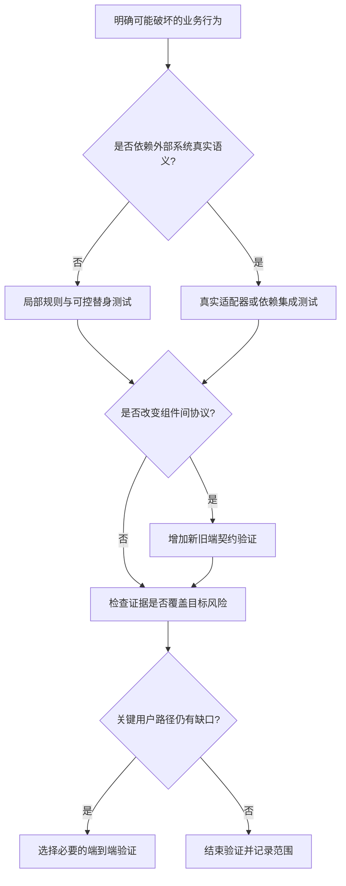

# 092 单元、集成、契约与端到端测试如何分工？

> 难度：基础 · 分类：生产与系统设计

## 简短回答

单元测试快速验证局部规则，集成测试验证真实依赖边界，契约测试验证组件间协议，端到端测试验证完整用户路径。按风险选择最便宜但足够真实的证据，避免用大量 mock 证明数据库语义，也避免所有逻辑都靠昂贵全链路测试。

## 详细解析

### 以创建订单分配验证责任

| 层次 | 该验证什么 | 不应声称什么 |
| --- | --- | --- |
| 单元 | 数量边界、状态转移、失败不触发副作用 | 数据库锁一定正确 |
| 集成 | 唯一约束、事务回滚、真实 SQL | 前端完整流程已通过 |
| 契约 | 请求字段、错误码、兼容性 | 所有生产依赖都健康 |
| 端到端 | 登录、下单、查询最终状态 | 所有低概率并发窗口都覆盖 |

本仓库 [目录服务测试](../examples/catalog/catalog_test.go) 将业务边界与本地双协议测试分开：前者检查非法与取消请求不访问仓储，后者检查真实 TCP 上的协议行为。因为仓储是内存实现，它没有替数据库集成测试作保证。

### 测试断言应围绕行为

金额必须守恒、同一幂等键只产生一个订单、取消后任务退出，这些是有价值的不变量。断言内部函数恰好调用了三次、对象构造顺序完全不变，若不是外部契约的一部分，会让无害重构也导致测试失败。

外部依赖测试需要隔离数据和可重复清理，不能把开发共享库当随机试验场。并发测试用通道和控制点建立可重复时序，固定 sleep 容易在快机器通过、慢机器失败。超时应作为挂起保护，而不是同步机制。

失败路径要由实际风险决定。付款类操作关注重复、提交不确定和恢复；只读格式化函数则无需搭建完整集群。代码覆盖率可以暴露未执行区域，但执行过不代表断言有效，百分比不是质量结论。

当测试失败，应保留输入、版本和最小复现，区分产品缺陷与环境问题。把不稳定测试直接重跑到绿，会掩盖真实竞态并削弱流水线可信度。

### 从风险到最小充分证据

假设修复“订单提交成功但响应丢失后会重复扣库存”。只给 handler 加一个返回码测试不够，因为核心风险在持久化与重试窗口；直接搭建完整浏览器流程又未必能稳定触发该窗口。更合适的是用真实数据库控制第一次提交后中断响应，再以同一业务键重试，核对订单数和库存变化。

图强调风险驱动，不要求每次改动都从上到下跑完所有测试。修改文章链接可能只需要链接检查；修改库存竞争协议则必须有真实数据库语义的证据。投入要与未确定性匹配，不能用测试层次名称代替判断。

### 测试替身应当放在副作用边界

Usecase 依赖 Repo，替身可以返回缺失、取消或指定错误，让业务分支可控；不应该连需要验证的 Usecase 本身一起 mock 掉。另一方面，用一个行为过于复杂的内存假数据库模拟 SQL 隔离，很可能只是测试自己想象的数据库。

| 失败需求 | 最有价值的断言 | 弱断言示例 |
| --- | --- | --- |
| 非法输入不写库 | 写入边界未被触达 | 返回对象不为空 |
| 幂等重试不重复效果 | 同业务键仅一笔事实及一次扣减 | handler 返回 200 |
| 取消释放任务 | 任务完成信号已到达 | 已调用 cancel |
| 事务失败原子回滚 | 相关记录均未部分提交 | mock.Commit 返回了错误 |

有些调用次数是有效契约，例如非法输入不得访问存储；有些只是实现细节，例如内部 helper 必须恰好执行三次。区别在于它是否保护外部行为和成本边界，而不是一概禁止检查调用。

### 稳定性来自控制条件，不是不断重跑

并发实验用进入、释放、完成信号控制交错；网络服务用动态端口并显式等待就绪；外部依赖用隔离数据和清理策略。随机输入应记录种子或最小失败样本，方便重现。测试的超时用于阻止永久等待，不能充当“睡这么久应该完成了”的正确性依据。

测试失败后先保留失败证据，再判断是产品缺陷、环境不可达还是测试自身竞态。如果修改测试只是扩大 sleep 或无条件重跑到绿，没有解释最初为何失败，就还没有解决问题。

当前仓库能提供 Go 示例输出、业务边界、本地双协议和 race 的运行证据；数据库、消息系统和集群实验在相关课程中明确作为设计推演。把这张证据地图维护清楚，比把所有测试都称为端到端更能帮助使用者判断风险。

## 常见误区 / 面试追问

- **测试越多越好吗？** 要看是否覆盖独立风险和有用边界，重复断言增加维护负担。
- **所有依赖都 mock 是否更稳定？** 可能更快，却会漏掉驱动、协议和数据库真实行为。
- **如何决定补测试？** 当现有证据无法证明关键行为或修复不再复发时，补最小充分验证。

## 参考资料

- [Go testing](https://pkg.go.dev/testing)
- [net/http/httptest](https://pkg.go.dev/net/http/httptest)

[返回目录](../README.md) · [上一题](091-containers.md) · [下一题](093-fuzz-race.md)
