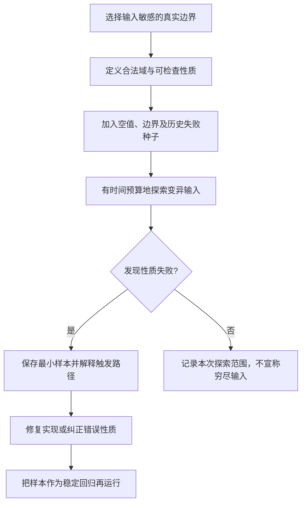

# 093 Go fuzzing 与 race detector 能发现哪些问题？

> 难度：中级 · 分类：生产与系统设计

## 简短回答

fuzzing 在种子输入基础上探索更多输入，适合解析、编码和边界处理；race detector 在实际执行路径中检测未同步的冲突访问。二者增强证据，但都不能证明程序对所有输入、调度和外部系统状态绝对正确。

## 详细解析

### 先为 fuzz 定义性质

解析器可以要求任意输入不发生未约定 panic；编码解码可验证在明确合法域内往返保持值；规范化函数可以验证重复规范化结果不变。但“输出不为空”往往不是足够准确的性质，错误性质会使测试奖励错误实现。

准备有代表性的种子，包括空输入、边界长度、无效编码与历史故障输入。发现失败后保留工具缩减的最小输入，纳入回归语料。不要在 fuzz 函数中调用真实支付、发送通知或访问共享生产数据，应隔离副作用。

### race 检测的是运行过的冲突

```sh
go test -race ./examples/catalog/... -count=1
```

本仓库用该命令检查示例的共享内存、指标和生命周期路径。需要受支持平台及相应 C 工具链。检测插桩会增加时间和内存，因此不能把带 race 的延迟当作正常生产性能。

一个共享 map 的错误路径如果从未被测试执行，race 检查不会凭空发现；逻辑上的原子性错误也可能没有数据竞争，例如每次读写都加锁，但“先读后写”之间允许其他任务插入。仍需用不变量测试验证业务结果。

### 组合使用而不扩大结论

| 工具 | 擅长发现 | 典型盲区 |
| --- | --- | --- |
| fuzzing | 输入触发的边界错误 | 没有被性质表达的业务错误 |
| race detector | 执行路径上的数据竞争 | 未执行路径、业务竞态、外部事务 |
| vet | 部分可疑静态模式 | 完整运行行为与动态协议 |

本仓库没有宣称执行了长期 fuzz campaign；课程示例的具体运行证据见验收记录。真实项目可以先对高风险解析器安排有时间预算的 fuzz，再把发现的问题转成稳定回归，而不是无目标地让所有函数随机跑一遍。

### 给 fuzz 一个能够反驳错误实现的性质

以路径或标识符解析器为例，“不 panic”只检验稳健性，错误实现若对所有输入都返回空值也能通过。更强的性质可以是：对合法域中的值，编码后再解码保留相同语义；对不合法输入，返回明确错误而不产生副作用。性质必须说明合法域，否则 Unicode 规范化、大小写或数值范围可能让看似自然的相等判断并不成立。



不同输入之间应相互独立，不依赖上一次执行留下的全局状态。对需要有限内存的解析器，还应设置合理输入与工作量边界，避免测试函数本身无界扩张。fuzz 不是向真实业务系统随机发写请求，副作用应停在可控制的测试边界。

### race 与业务竞态为什么不同

考虑余额 100，两个请求分别在锁内读取余额，在锁外判断足够，再各自在锁内写回余额 20。每次内存访问都可能有锁，race detector 不报错，两个请求却都认为成功花了 80。需要把“读取、判断、扣减”作为一个受保护的业务操作，或者使用权威存储的条件更新。

| 情形 | race 可能报告吗 | 还需要什么证据 |
| --- | --- | --- |
| 两个 goroutine 未同步 append 同一切片 | 路径被执行时可能检出 | 所有权与结果正确性检查 |
| 每次访问加锁但检查与修改分离 | 未必有数据竞争 | 业务不变量与受控交错 |
| 两台服务重复创建订单 | 不属于单进程内存检测范围 | 数据库唯一性和重试实验 |
| 漏掉的错误分支从未执行 | 无法靠本次运行覆盖 | 增加触发输入或场景 |

本仓库 [030 Review](../03-concurrency/030-concurrency-review.md) 提供明确标为错误的竞态程序，`scripts/check_bad_examples.py` 单独运行并要求看到 DATA RACE；正常程序则必须通过 race 检查。反例不应混进普通成功示例，也不能以“程序输出看起来对”掩盖检测报告。

### 从工具结果到修复结论

race 报告中的两条访问栈指出冲突访问位置，修复要建立正确的所有权或同步关系，而不是用 sleep 降低出现概率。一次运行没有报告不构成安全证明；测试调度、输入与检测能力都有边界，因此仍需检查 happens-before。

fuzz 找到失败样本后，先在普通测试中稳定重放，确认是实现违反契约还是测试性质定义错误。修复后保留样本，再进行有预算探索。不要只将 panic recover 掉并返回任意结果，那可能隐藏解析错误或破坏业务状态。

本轮实际执行了正常示例的 race 与已知竞态反例验证，没有运行长期 fuzz campaign，也没有用随机测试代替真实数据库事务实验。区分这些证据的作用范围，是工具题最重要的面试判断点。

## 常见误区 / 面试追问

- **race 无报错就证明线程安全吗？** 只能说明本次执行没有检测到相应冲突，仍需审查同步关系。
- **fuzz 会自动知道正确答案吗？** 不会，需要可检查性质或可靠参考实现。
- **发现 panic 应全部 recover 吗？** 先修复违反契约的输入处理，吞掉 panic 可能掩盖状态损坏。

## 参考资料

- [Go 官方 fuzz 教程](https://go.dev/doc/tutorial/fuzz)
- [Go race detector](https://go.dev/doc/articles/race_detector)

[返回目录](../README.md) · [上一题](092-testing.md) · [下一题](094-ci.md)
