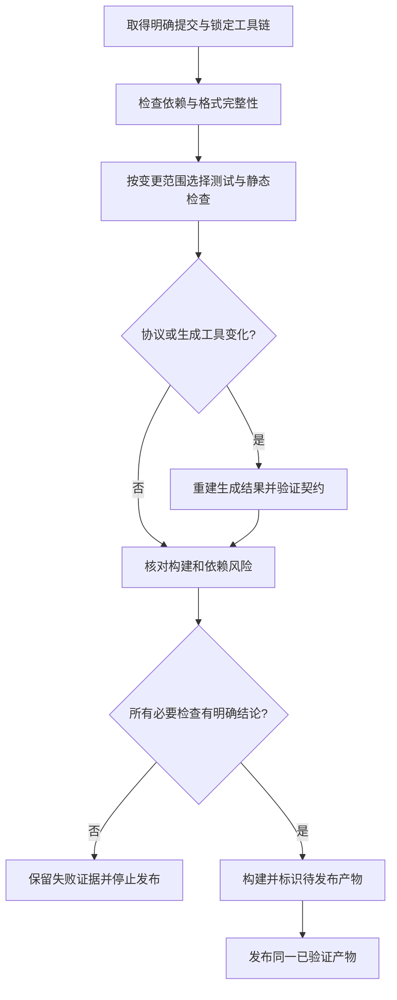

# 094 CI 如何建立依赖、漏洞与构建质量门禁？

> 难度：中级 · 分类：生产与系统设计

## 简短回答

CI 应把可复现构建、相关测试、静态检查、依赖完整性和漏洞分析变成明确步骤，并保留失败证据。检查范围按风险决定；任何工具的通过都只说明它覆盖的条件，不应被概括为“系统已经安全”。

## 详细解析

### 从仓库已有命令建立流水线

本项目可执行的核心检查如下，均从仓库根目录运行。课程检查负责文档结构与 Go 示例，Go 工具负责实际包和服务测试，不把文章数量检查冒充程序测试。

```sh
go mod verify
go vet ./...
go test ./... -count=1
go test -race ./examples/catalog/... -count=1
python scripts/course.py check --execute
```

生成代码验证需要固定 protoc 和三个生成器版本，重新生成后检查 Git diff 为空。普通测试不要求每次重新安装生成器，避免引入不必要网络变量；真正修改协议或工具版本时才执行这项关联检查。

### 漏洞扫描如何解释

govulncheck 结合已知漏洞信息与调用关系提供证据，相比仅按版本列表报警更接近实际代码路径。但动态调用、部署条件和新披露漏洞仍可能超出分析范围；没有报告不代表未来或所有场景安全。工具版本与漏洞数据库时间也应记录。

本课程说明门禁设计，未把本仓库未运行的漏洞扫描写成已通过。若在实际项目启用，应固定工具版本，区分可达漏洞、仅依赖存在和误报，并有明确修复或有期限例外流程。

### 依赖与发布产物

提交 go.mod/go.sum，构建时禁止自动升级依赖；私有依赖访问使用最小权限凭据，避免在日志中打印完整环境。缓存命中不能绕过必要测试，失败也不能通过无限重跑被隐藏。

构建产物应关联源码提交、工具链、依赖与配置版本，发布同一经过验证的产物，而不是在每个环境重新从浮动依赖构建。CI 不应在普通 PR 检查中持有不必要的生产写权限。

### 把一次合并判断拆成可以解释的门禁

假设 PR 同时修改 proto 和 service。编译通过只能证明当前代码能连接起来；还要重建生成结果、验证两种传输的请求与错误，并确认旧契约没有被无意破坏。若只修改说明文案，则结构、链接和相关示例检查通常更合适，没必要为一句话重建整个集群。



门禁失败应能够对应责任：测试失败是行为证据，依赖下载失败是环境或访问问题，扫描报告则需要按漏洞类型和可达路径评估。把所有非零退出统称为“网络波动”并重跑，或者把下载失败当成漏洞不存在，都会破坏判断。

### 缓存提高速度，但不能成为事实来源

模块缓存键应包含工具链、平台和相关依赖输入；生成产物缓存还依赖 proto 与生成器版本。缓存命中之后仍要运行该变更需要的测试，否则可能在旧产物上验证新源码。`go mod verify` 核对模块缓存内容，不负责分析业务逻辑或已知漏洞。

| 检查 | 通过时能说明什么 | 不能扩大成什么 |
| --- | --- | --- |
| go mod verify | 下载模块内容与记录一致 | 依赖没有漏洞 |
| go vet | 未发现其识别的可疑模式 | 所有运行路径正确 |
| go test | 本次断言和路径通过 | 任意输入和并发均正确 |
| govulncheck | 对给定数据库和分析范围的结果 | 永久安全或完全无风险 |
| 生成后 diff 为空 | 当前工具重建出提交内容 | 协议语义必然兼容 |

漏洞门禁要记录扫描工具版本、数据库时间、模块和调用路径。不可达依赖漏洞与实际调用路径上的漏洞不应被混成同一个等级，但“当前静态分析未找到路径”也不等于永远不可达。例外需要说明依据、范围和失效时间，不能简单把扫描退出码忽略。

### 检查环境也有权限边界

来自普通 PR 的代码不应自动获得生产发布凭据。构建和测试需要的权限与部署需要的权限可以分离，避免测试脚本或依赖安装过程意外访问生产资源。日志展示命令与版本即可，不应把完整环境变量或凭据打印出来帮助排障。

发布阶段使用已经验收并关联提交的镜像或二进制，而不是再运行一次可能解析不同标签或网络输入的构建。这样线上故障可以追溯到具体源码和检查结果；回滚也能定位到同一份历史产物。

当前仓库提供可本地执行的校验命令与脚本，没有提交 GitHub Actions workflow，也未执行 govulncheck。因此本题是 CI 门禁设计，不冒称远程流水线已经启用或漏洞扫描已经通过。真正接入时应先让这些命令在受控 runner 上运行，再记录报告与权限配置。

## 常见误区 / 面试追问

- **go mod verify 能查代码漏洞吗？** 它核对下载内容完整性，不判断代码安全。
- **所有项目都要跑全套昂贵检查吗？** 按变更风险选择，但不能跳过证明核心行为所必需的检查。
- **格式检查通过说明代码质量好吗？** 只说明格式符合规则，还需正确性、边界和可维护性判断。

## 参考资料

- [Go 漏洞管理](https://go.dev/doc/security/vuln/)
- [Go module verify](https://go.dev/ref/mod#go-mod-verify)
- [Go vet](https://pkg.go.dev/cmd/vet)

[返回目录](../README.md) · [上一题](093-fuzz-race.md) · [下一题](095-slo.md)
