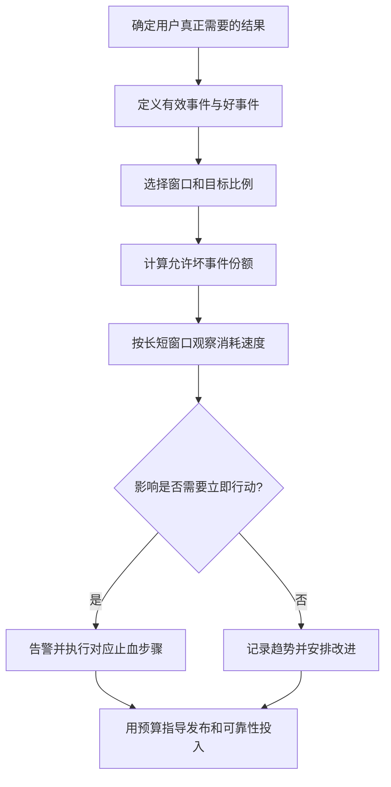

# 095 SLO、错误预算与告警阈值如何设计？

> 难度：中级 · 分类：生产与系统设计

## 简短回答

SLI 是对用户体验的度量，SLO 是该度量在窗口内的目标，错误预算是允许未达标的份额。先定义哪些请求算有效、什么结果算好，再设计告警；CPU 高低可以帮助诊断，却不应替代用户成功率与延迟目标。

## 详细解析

### 一个按请求计算的例子

过去 30 天有一千万次有效下单请求，成功率目标 99.9%，则允许坏请求约一万次。这个预算按请求数计算，不能直接换成每月停机分钟，因为流量在不同时间并不相同。

```text
有效请求：协议正确、在服务承诺范围内的请求
好请求：在规定期限内得到符合业务契约的结果
错误预算：有效请求总数 × (1 − 目标比例)
```

必须明确用户主动取消、参数错误、限流和依赖失败是否计入。不能为了让指标好看，把系统导致的超时或拒绝全部移出分母。业务成功也不能只看 HTTP 200，异步下单需要追踪最终完成状态。

### 用预算消耗速度告警

如果实际坏请求比例为 1%，目标允许 0.1%，消耗速度约为预算基准的十倍。在负载结构近似稳定的前提下，持续十倍消耗会更快用完整段窗口预算。短窗口发现急剧故障，长窗口确认持续影响，两者结合能减少瞬时噪声。

低流量服务用百分比会不稳定，应结合绝对事件数量、关键探测或更长窗口。延迟 SLO 则可以定义“多少比例请求在 300 ms 内完成”，使用可聚合的直方图桶或相应事件统计，而不是平均多个实例 P99。

错误预算应该影响发布与可靠性投入：预算消耗过快时暂停高风险变更、优先修复根因，而不是只作为仪表盘装饰。告警要对应可行动步骤，通知接收者应知道哪个用户路径受影响、先查什么和如何止血。

### 先定义分母，才有可讨论的目标

假设一个下单 API 每次请求都返回 202，但后台有 2% 任务在十分钟后仍未落单。若只把 202 计作成功，入口 SLI 会显示很好，用户目标却没有完成。可以把“成功持久受理”和“受理后在期限内进入明确终态”分成不同指标，分别承诺，避免把异步链路隐藏在入口状态码后面。



用户输入明显非法可以不属于服务成功承诺，但系统因容量不足而拒绝本来有效的请求，通常不能为了美化指标全部排除。定义必须先于事故，并能由原始事件复算；否则每次事故修改分母，就失去了长期比较意义。

### 消耗速度怎样换成可行动判断

设目标 99.9%，允许坏比例为 0.001。当前窗口坏比例 0.01，burn rate 为 `0.01 / 0.001 = 10`。如果流量近似稳定、这个状态持续，一份 30 天预算会在约 3 天消耗完；不是说当前只观察一分钟就能断言未来一定持续三天。

进一步假设需要在一小时内消耗 30 天预算的 2% 时告警，目标速度为 `0.02 × 30 × 24 / 1 = 14.4`。对应坏比例约为 `14.4 × 0.001 = 1.44%`。这是教学推导，实际门槛应依据响应能力、业务代价和流量结构设计，而不是把 14.4 当成所有服务的固定常数。

| 窗口组合 | 主要用途 | 需要注意 |
| --- | --- | --- |
| 短窗口异常、长窗口也异常 | 识别正在持续消耗的故障 | 设置足够事件量，避免低流量误判 |
| 短窗口恢复、长窗口仍异常 | 判断故障可能已结束但历史影响仍在 | 不必继续反复通知同一已恢复事件 |
| 慢速长期消耗 | 发现小比例但持续的用户损失 | 通常需要计划修复而非每次叫醒人 |

按请求计算的预算会随流量变化，因此“几分钟故障”与“多少错误预算”不是固定换算。峰值一分钟可能比夜间一小时影响更多用户；低流量服务则可能只因一个失败就出现很高百分比，需要结合绝对数量和关键探测。

### 告警应附上可以执行的下一步

有效告警包含受影响用户路径、当前消耗速度、时间窗口、关键分组和诊断入口。CPU 或连接数可作为原因指标帮助定位，但不应替代用户结果。支付接口技术成功率高，也可能因为错误地返回成功而掩盖业务损失，因此需要结果对账。

预算接近耗尽时，可以暂停扩大高风险灰度，优先处理已知可靠性问题；这不是停止服务的自动指令。组织需预先约定如何使用预算，避免事故中临时争论。本题的数量与阈值均为计算示例，没有接入真实监控或创建告警规则。

## 常见误区 / 面试追问

- **目标越接近 100% 越好吗？** 更高目标有成本，应根据用户需求和系统能力确定，不能只追求漂亮数字。
- **所有错误都应立即叫醒人吗？** 对用户有持续或重大影响且需要立即行动的情况才适合紧急通知。
- **预算用完是否意味着停止服务？** 它通常指导发布和改进决策，具体组织策略要事先定义。

## 参考资料

- [Google SRE Workbook：实现 SLO](https://sre.google/workbook/implementing-slos/)
- [Google SRE Workbook：基于 SLO 告警](https://sre.google/workbook/alerting-on-slos/)

[返回目录](../README.md) · [上一题](094-ci.md) · [下一题](096-flash-sale.md)
