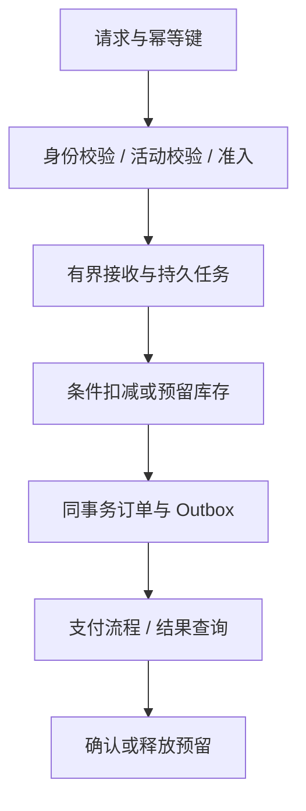

# 096 系统设计：如何实现不会超卖的秒杀下单链路？

> 难度：高级 · 分类：生产与系统设计

## 简短回答

先定义库存权威与业务不变量，再用准入控制承受流量，用数据库原子条件更新或可靠预留协议保护库存，用幂等键防重复落单。异步排队只改变处理时机，不自动解决超卖、消息丢失和支付超时后的状态冲突。

## 详细解析

### 明确假设与不变量

假设单活动一万件商品，峰值每秒十万次点击，用户可接受排队查询结果。要求库存不为负，同一业务请求最多生成一笔订单，已支付订单不能被超时任务释放库存。点击数是入口压力，不等于数据库必须每秒处理十万笔订单。

### 将强保证放在权威状态上

最直接的单库方案，是事务内用 `available >= quantity` 条件扣减，检查影响行数，再写具有唯一请求键的订单与 Outbox。高竞争下单行会成为热点，但它的正确性边界清楚。容量不够时再考虑库存分桶等设计，并证明各桶总量守恒，不能只增加缓存扣减就宣布问题解决。

Redis 可以挡掉明显无资格或已售罄请求，减少权威库压力。若把它作为最终库存权威，就必须承受其持久化、复制与切换语义的影响，并提供对账和恢复协议；不能同时让数据库和缓存各自决定真实库存。

### 队列与支付的失败路径

响应“已受理”前需要可靠记录任务或订单意图，进程内 channel 不能保证重启不丢。消息消费者按稳定请求键幂等执行；重复投递不会重复扣库存。数据库提交与通知通过 Outbox 协调，参见 [068](../07-cache-messaging/068-outbox.md)。

支付成功与超时取消可能并发到达。用订单版本或条件状态转移协调：只有待支付状态才能进入取消释放，支付确认也必须检查合法状态。释放动作要有唯一身份，避免重复补库存；外部支付成功但本地取消已提交时，需要明确退款或人工修复流程。

### 容量与验收

入口限流、用户维度配额、任务队列上限、消费者并发和数据库连接应逐层预算。售罄后尽快拒绝无效请求，查询结果也要防止轮询洪峰。测试覆盖同时抢最后一件、重复请求、提交后响应丢失、消费者重启和支付取消竞态。

验收看最终库存守恒、订单唯一性、已支付状态正确与恢复时间，而不是只看压测 QPS。上面是系统设计方案，没有声称本仓库已部署秒杀集群。

### 先算准入，而不是把十万点击全部排进队列

继续使用一万件库存、每秒十万点击的假设。如果权威下单链路在目标延迟内只能处理每秒 2,000 次有效尝试，入口就必须过滤或拒绝大部分无效工作。持久队列上限若为 20,000，在没有新流量且每条工作成本相同的理想条件下，也要约 10 秒消化；持续入队时还需使用净消化速率重新计算。

这组容量数字是设计假设，不是压测结果。应先通过单库竞争实验找到实际可持续完成率，再配置入口配额与消费者并发。队列满后明确拒绝或返回可解释状态，不应已经返回“受理成功”却只把任务放在进程内 channel。

轮询结果也可能成为新热点。十万用户每秒查询一次会重新形成十万 QPS；可以返回建议查询间隔、带随机抖动的轮询或合适通知机制，并对查询路径单独预算。成功提交入口减少了压力，不等于整个用户旅程都已受控。

### 用库存账本检验状态守恒

设初始可售量为 10,000，将库存分为可售 A、已预留 R、已确认售出 S，在没有补货和退货的简化模型中应保持 `A + R + S = 10,000`。预留使 A 减、R 增；支付确认使 R 减、S 增；合法取消使 R 减、A 增。每次转移都要有唯一操作身份，避免重复取消使总量凭空变大。

| 并发或故障 | 权威处理 | 对账条件 |
| --- | --- | --- |
| 同键请求重复到达 | 复用同一订单事实 | 不重复扣减或预留 |
| 最后一件被同时竞争 | 条件更新只有合法成功者 | 成功订单与扣减数量一致 |
| 支付确认与取消竞争 | 订单状态条件决定合法转移 | 不同时售出并归还同一份库存 |
| 消息投递重复 | 事件处理与去重原子提交 | 状态转移只生效一次 |
| 外部付款成功但本地取消 | 进入明确退款或修复流程 | 资金与订单状态可追踪 |

“不会超卖”不仅是库存数字不为负。两个订单共享了一次扣减，库存仍可能为零，却承诺了两件商品；因此还要验证每个成功订单与库存效果的对应关系。支付和发货事实也必须纳入业务对账，而不是仅依靠缓存中的库存数。

### 容量进一步增长时，复杂度从哪里来

把库存拆成多个桶可以降低单行竞争，但必须证明初始配额之和等于总库存，跨桶调拨不会重复分配，某桶售罄时路由如何处理。如果每次失败都广播尝试所有桶，会增加无效数据库工作。应先明确一致性与转移协议，再衡量性能收益。

同样，Redis 预检查可以快速拒绝已售罄活动，但误判不能永久挡住合法库存恢复，缓存故障也不能让十万点击全部直冲数据库。权威库准入是最后一道资源保护，不能只依赖上游缓存正常。

验收可以用较小库存稳定制造最后一件竞争，再增加重复键、提交后断网、消费者崩溃和支付取消交错。每轮都按订单、库存、支付和事件对账，而不只记录吞吐。本文没有运行这些集群实验；所有容量与状态模型都是带前提的设计推演。

## 常见误区 / 面试追问

- **用分布式锁包住整个下单就够了吗？** 长链路持锁会影响吞吐且仍有租约过期问题，优先让数据库维护核心不变量。
- **异步化后就不会超时了吗？** 提交、排队和查询各有期限，长队列可能让任务在开始前就失效。
- **如何处理系统恢复后的重复消息？** 保留稳定操作身份和持久幂等约束，恢复不能重置业务唯一性。

## 参考资料

- [PostgreSQL 条件更新](https://www.postgresql.org/docs/16/sql-update.html)
- [AWS Transactional Outbox](https://docs.aws.amazon.com/prescriptive-guidance/latest/cloud-design-patterns/transactional-outbox.html)

[返回目录](../README.md) · [下一题](097-job-platform.md)
