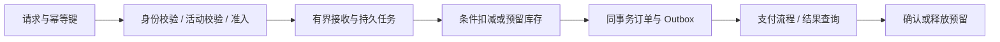

# 096 系统设计：如何实现不会超卖的秒杀下单链路？

> 难度：高级 · 分类：生产与系统设计

## 简短回答

先定义库存权威与业务不变量，再用准入控制承受流量，用数据库原子条件更新或可靠预留协议保护库存，用幂等键防重复落单。异步排队只改变处理时机，不自动解决超卖、消息丢失和支付超时后的状态冲突。

## 详细解析

### 明确假设与不变量

假设单活动一万件商品，峰值每秒十万次点击，用户可接受排队查询结果。要求库存不为负，同一业务请求最多生成一笔订单，已支付订单不能被超时任务释放库存。点击数是入口压力，不等于数据库必须每秒处理十万笔订单。

### 将强保证放在权威状态上

最直接的单库方案，是事务内用 `available >= quantity` 条件扣减，检查影响行数，再写具有唯一请求键的订单与 Outbox。高竞争下单行会成为热点，但它的正确性边界清楚。容量不够时再考虑库存分桶等设计，并证明各桶总量守恒，不能只增加缓存扣减就宣布问题解决。

Redis 可以挡掉明显无资格或已售罄请求，减少权威库压力。若把它作为最终库存权威，就必须承受其持久化、复制与切换语义的影响，并提供对账和恢复协议；不能同时让数据库和缓存各自决定真实库存。

### 队列与支付的失败路径

响应“已受理”前需要可靠记录任务或订单意图，进程内 channel 不能保证重启不丢。消息消费者按稳定请求键幂等执行；重复投递不会重复扣库存。数据库提交与通知通过 Outbox 协调，参见 [068](../07-cache-messaging/068-outbox.md)。

支付成功与超时取消可能并发到达。用订单版本或条件状态转移协调：只有待支付状态才能进入取消释放，支付确认也必须检查合法状态。释放动作要有唯一身份，避免重复补库存；外部支付成功但本地取消已提交时，需要明确退款或人工修复流程。

### 容量与验收

入口限流、用户维度配额、任务队列上限、消费者并发和数据库连接应逐层预算。售罄后尽快拒绝无效请求，查询结果也要防止轮询洪峰。测试覆盖同时抢最后一件、重复请求、提交后响应丢失、消费者重启和支付取消竞态。

验收看最终库存守恒、订单唯一性、已支付状态正确与恢复时间，而不是只看压测 QPS。上面是系统设计方案，没有声称本仓库已部署秒杀集群。

## 常见误区 / 面试追问

- **用分布式锁包住整个下单就够了吗？** 长链路持锁会影响吞吐且仍有租约过期问题，优先让数据库维护核心不变量。
- **异步化后就不会超时了吗？** 提交、排队和查询各有期限，长队列可能让任务在开始前就失效。
- **如何处理系统恢复后的重复消息？** 保留稳定操作身份和持久幂等约束，恢复不能重置业务唯一性。

## 参考资料

- [PostgreSQL 条件更新](https://www.postgresql.org/docs/16/sql-update.html)
- [AWS Transactional Outbox](https://docs.aws.amazon.com/prescriptive-guidance/latest/cloud-design-patterns/transactional-outbox.html)

[返回目录](../README.md) · [下一题](097-job-platform.md)
