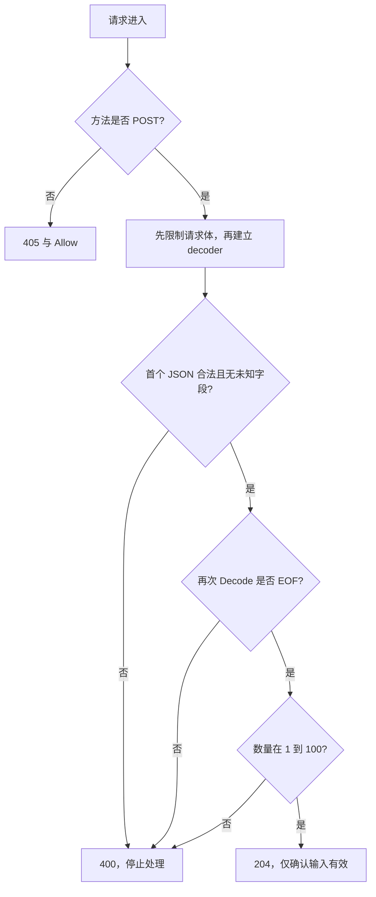

# 098 代码 Review：一个能运行的 HTTP 服务还缺什么？

> 难度：中级 · 分类：生产与系统设计

## 简短回答

Review 应沿输入、业务副作用、响应与资源退出检查，而不只看能否编译。常见缺口包括无界请求体、宽松或不完整解码、零值误用、未传 context、重复副作用、错误泄露和缺少优雅关闭。每项问题都要说明具体触发条件与影响。

## 详细解析

### 先运行一个明确有缺陷的起点

以下程序刻意保留 Review 问题，仅用 httptest 在本地验证，不执行任何订单写入。它忽略解码错误、不检查方法和数量，也没有确认请求体只包含一个 JSON 值。不能把它用作正式接口实现。

```go
package main

import (
    "encoding/json"
    "fmt"
    "net/http"
    "net/http/httptest"
    "strings"
)

func naive(w http.ResponseWriter, r *http.Request) {
    var input struct { Quantity int `json:"quantity"` }
    _ = json.NewDecoder(r.Body).Decode(&input)
    fmt.Fprintf(w, "accepted %d", input.Quantity)
}

func main() {
    for _, tc := range []struct{ method, body string }{
        {"POST", `{"quantity":2}`},
        {"POST", `{}`},
        {"POST", `{"quantity":2}{}`},
        {"GET", `{"quantity":2}`},
        {"POST", `broken`},
    } {
        rec := httptest.NewRecorder()
        naive(rec, httptest.NewRequest(tc.method, "/validate", strings.NewReader(tc.body)))
        fmt.Println(rec.Code, rec.Body.String())
    }
}
```
```output
200 accepted 2
200 accepted 0
200 accepted 2
200 accepted 2
200 accepted 0
```

五个响应都是成功状态，但只有第一个输入符合预期。最后一个无效 JSON 被忽略错误后，以零值数量继续执行；第三个只解析首个对象，尾部对象没有被消费；GET 则说明路径能进入 handler 不等于方法契约已经建立。

### 先缩小一个可验证边界

假设入口读取 JSON 数量后直接返回接收结果。若只 Decode 一次，可能接受后面还有第二个 JSON 的请求；若不限制 body，会被大请求消耗资源；若不验证数量，缺失字段与负数也可能进入业务。

下面完整程序验证输入边界，接口只确认合法输入，不执行订单持久化，因此不会把缺少幂等与事务的代码冒充下单实现。

```go
package main

import (
    "encoding/json"
    "fmt"
    "io"
    "net/http"
    "net/http/httptest"
    "strings"
)

func validate(w http.ResponseWriter, r *http.Request) {
    if r.Method != http.MethodPost {
        w.Header().Set("Allow", "POST")
        http.Error(w, "method not allowed", http.StatusMethodNotAllowed)
        return
    }
    r.Body = http.MaxBytesReader(w, r.Body, 1024)
    defer r.Body.Close()
    dec := json.NewDecoder(r.Body)
    dec.DisallowUnknownFields()
    var input struct { Quantity int `json:"quantity"` }
    if err := dec.Decode(&input); err != nil {
        http.Error(w, "invalid JSON", http.StatusBadRequest)
        return
    }
    var extra any
    if err := dec.Decode(&extra); err != io.EOF {
        http.Error(w, "single JSON value required", http.StatusBadRequest)
        return
    }
    if input.Quantity < 1 || input.Quantity > 100 {
        http.Error(w, "quantity out of range", http.StatusBadRequest)
        return
    }
    w.WriteHeader(http.StatusNoContent)
}

func main() {
    for _, tc := range []struct{ name, method, body string }{
        {"valid", "POST", `{"quantity":2}`},
        {"missing", "POST", `{}`},
        {"negative", "POST", `{"quantity":-1}`},
        {"range", "POST", `{"quantity":101}`},
        {"trailing", "POST", `{"quantity":2}{}`},
        {"unknown", "POST", `{"quantity":2,"extra":1}`},
        {"body_limit", "POST", `{"quantity":2` + strings.Repeat(" ", 1024) + `}`},
        {"method", "GET", `{"quantity":2}`},
    } {
        req := httptest.NewRequest(tc.method, "/validate", strings.NewReader(tc.body))
        rec := httptest.NewRecorder()
        validate(rec, req)
        fmt.Println(tc.name, rec.Code)
    }
}
```
```output
valid 204
missing 400
negative 400
range 400
trailing 400
unknown 400
body_limit 400
method 405
```

### 这份修复证明了什么

示例核对单一 JSON 值、数量范围和方法，且限制读取体积。它还没有定义 Content-Type 策略或拒绝重复 JSON 键；若协议需要这些严格性，应补充对应解析规则与测试。公开错误使用稳定文本，没有把内部解析详情直接暴露出去。

接入业务后继续审查权限是否针对目标资源、幂等键是否持久、数据库操作是否共享正确事务、取消是否贯穿依赖，以及成功响应是否只在提交后产生。性能方面关注连接复用、结果关闭和共享状态，而不是一上来微调格式化。

服务外壳还要明确读写期限、日志指标和关停流程，可参考 [目录服务](../examples/catalog/README.md)。输入校验通过只证明入口边界，不能代替完整业务与部署验证。

### 每一项修复都应对应一条被阻止的路径



| 起点问题 | 触发输入或情形 | 修复位置与验证 |
| --- | --- | --- |
| 任意方法被接收 | GET 携带合法 body | 入口方法检查，返回 405 |
| 错误被忽略 | 非法 JSON | 检查 Decode 返回值后立即返回 |
| 缺省被当有效零值 | `{}`、负数和超范围 | 数量业务范围检查 |
| 只检查第一个对象 | 合法对象后再追加对象 | 第二次 Decode 必须得到 EOF |
| 无大小限制 | 超过 1 KiB 的输入 | 读取前建立 MaxBytesReader |
| 错别字字段被吞掉 | extra 等未知键 | 针对 struct 的严格字段检查 |

本程序把超限统一归入 400 的输入错误，这是此处展示的简化错误契约；若产品要求区分 413，应通过 `http.MaxBytesError` 做类型判断并补充响应断言，而不是靠错误文本包含某个英文单词。读取限制也不等于读取期限，真实服务器仍需要针对慢请求配置时间边界。

Review 时还要指出修复没有覆盖的情况：重复 quantity 键不会被 DisallowUnknownFields 自动拒绝，Content-Type 没有校验，EOF 等待依赖真实网络期限。这些是明确范围内的后续协议选择，不应该隐瞒后再宣布“严格 JSON 已经全覆盖”。

更重要的是，204 只表示这份输入通过本校验接口，程序没有落单。若接入订单写入，应在进入事务前完成验证，事务提交后再产生成功结果，并将幂等、授权与提交不确定性分别验证。不能把一份更健壮的输入处理函数直接改名 CreateOrder 就当成完整实现。

两个程序都可直接运行并核对输出：前者证明缺陷确实可触发，后者证明所列输入被正确分流。这样的 Review 形成“输入—错误行为—修复—验证”的闭环，比罗列十条抽象最佳实践更便于判断优先级。

## 常见误区 / 面试追问

- **返回 400 就不需要限制 body 吗？** 解析到失败前可能已消耗大量资源，限制要在读取前建立。
- **错误都包装成成功响应方便前端吗？** 会破坏通用客户端和监控对协议结果的理解。
- **Review 意见如何避免泛泛而谈？** 用具体输入、执行路径和可验证的后果说明问题，并给出最小充分修改。

## 参考资料

- [http.MaxBytesReader](https://pkg.go.dev/net/http#MaxBytesReader)
- [json.Decoder](https://pkg.go.dev/encoding/json#Decoder)

[返回目录](../README.md) · [上一题](097-job-platform.md) · [下一题](099-incident.md)
