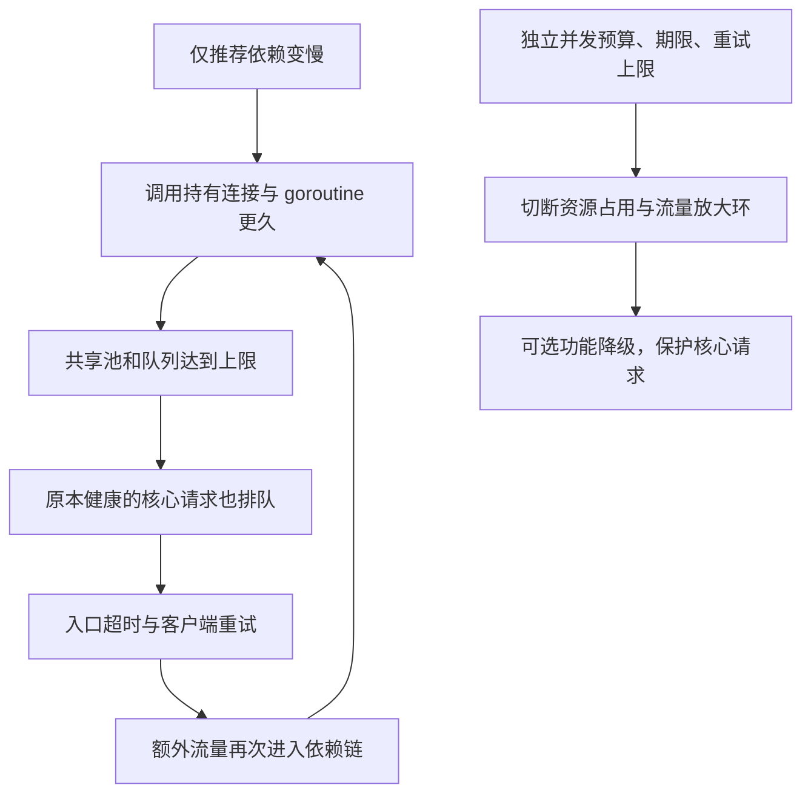

# 099 故障演练：依赖超时如何演变为全站雪崩？

> 难度：高级 · 分类：生产与系统设计

## 简短回答

依赖变慢会增加在途请求，进而占用连接、队列与内存；无界重试继续增加流量，健康依赖也可能被共享资源拖垮。演练要验证故障影响是否受限、系统能否主动拒绝无效工作，以及依赖恢复后是否能平稳消退积压。

## 详细解析

### 先给出可推演的故障链

假设推荐服务由 20 ms 变为 2 s，聚合接口还配置三次立即重试。请求占用时间增加，公共 HTTP 连接与 goroutine 堆积，入口开始超时；客户端再次重试，数据库与其他依赖也受到追加请求影响。初始故障只有推荐，最终却可能让核心下单不可用。

```text
依赖慢 → 持有资源更久 → 排队增长 → 入口超时
   ↑                                      │
   └──────── 立即重试增加压力 ────────────────┘
```

### 设计一次受控演练

先确定允许影响的环境、流量范围与停止阈值。建立正常基线后，只对指定依赖注入延迟或错误；观察入口成功率、P99、在途数、队列、连接池等待、重试次数和内存。任何超出预定范围的影响都应触发停止注入与恢复步骤。

预期保护包括：下游期限小于上游剩余预算；推荐有独立并发配额；重试有预算和退避；故障达到条件后受控熔断；页面可明确降级为无推荐，同时核心订单流程仍有自己的资源保障。

### 恢复比停止注入更难

依赖恢复后，旧请求、重试任务和冷缓存可能同时冲击它。需要逐步恢复准入、限制探测流量，并丢弃已经失去业务意义的工作。不能看到依赖健康检查变绿就立即全量解除所有限制。

恢复完成应以积压回落、超时比例恢复、后台任务退出和核心业务结果完整为标准。若只看平均 CPU 降低，可能其实是大量请求被永久卡住或全部快速失败。

### 把演练变成长期改进

记录时间线、最先失控的资源、保护规则是否生效、报警到行动的时延。修复项要指向具体代码或配置，并用同样注入重验。本文给出演练设计，本仓库未向外部或生产系统注入故障。

### 用数字看清故障怎样放大

假设聚合入口每秒 500 个请求，每次都访问推荐，推荐从 20 ms 变为 2 秒。在没有保护且尚能持续接收的理想模型中，推荐调用的在途需求从约 10 增至 1,000。若总共允许三次顺序尝试，最坏单请求占用可接近 6 秒，稳态尝试到达率可接近每秒 1,500；实际会受超时、准入和饱和影响，不应把这个上界当成实测曲线。



图中的关键不是推荐本身有错误，而是它占用了其他业务依赖的公共资源。若推荐使用独立连接与并发配额，核心订单可以继续；若只是单独写了一个函数，却仍共用同一个无界任务队列，隔离并没有发生。

### 写清基线、注入和停止条件

下面是一份实验设计，所有阈值都是示例，需按环境调整。先在隔离验证环境测正常请求量与核心成功率；只对推荐调用注入 2 秒延迟，保持其他依赖不变；记录每秒实际尝试数、池等待、内存及任务数。如果核心成功率跌出预定边界或资源接近环境上限，就停止注入并保留现场。

| 阶段 | 预期观察 | 偏离时说明什么 |
| --- | --- | --- |
| 无保护基线推演 | 慢依赖占用明显增加 | 先核对流量是否真正经过目标依赖 |
| 启用超时与并发限制 | 在途数量受上限约束 | 取消未退出或保护点太晚 |
| 启用熔断与降级 | 推荐尝试减少，核心业务保持 | 降级路径也耗尽共享资源 |
| 停止延迟注入 | 探测逐渐恢复，旧工作减少 | 积压、重试或缓存冷启动仍在放大 |

“无保护基线”可以先做容量推演，不必为了实验把不受控风险放到共享环境。实际注入范围应局限于已授权的测试系统，本文没有向外部服务或生产环境注入延迟。

### 恢复阶段为什么不能立即全开

推荐恢复到 20 ms 后，入口积累的等待者、延迟重试和熔断探测可能同时到达。恢复速率要服从下游当前容量，已经过期的请求不再执行；有效异步任务则按持久状态继续，不能一刀切丢弃。观察净消化速率和最老任务年龄，而不是只看健康检查变绿。

若依赖已经恢复但 goroutine 数不下降，要检查阻塞发送、无取消等待和未关闭的响应体；若请求数下降但业务成功率没有恢复，要检查是不是所有流量都在快速拒绝。不同现象对应不同残留故障，不应统称为“缓存还没热”。

复盘记录至少包含注入时刻、首次用户影响、首次告警、止血动作、依赖恢复和业务恢复时刻。改进项应对应发现的失控边界，例如推荐共享池隔离或重试预算，而不是泛泛写“加强监控”。完成后用相同输入重新演练，比较核心成功率、资源上界和恢复时间。本文给出完整演练设计，未伪造任何实测事故时间线。

## 常见误区 / 面试追问

- **超时调大能止血吗？** 可能降低立即失败，却增加资源占用，必须结合瓶颈判断。
- **熔断恢复就算演练通过吗？** 还要看数据状态、积压和其他依赖是否恢复，没有留下持续副作用。
- **每次都全站故障才有价值吗？** 小范围、有明确假设的演练更容易解释并控制风险。

## 参考资料

- [Google SRE：处理级联故障](https://sre.google/sre-book/handling-overload/)
- [AWS：超时、重试与抖动](https://aws.amazon.com/builders-library/timeouts-retries-and-backoff-with-jitter/)

[返回目录](../README.md) · [上一题](098-backend-review.md) · [下一题](100-interview-chain.md)
