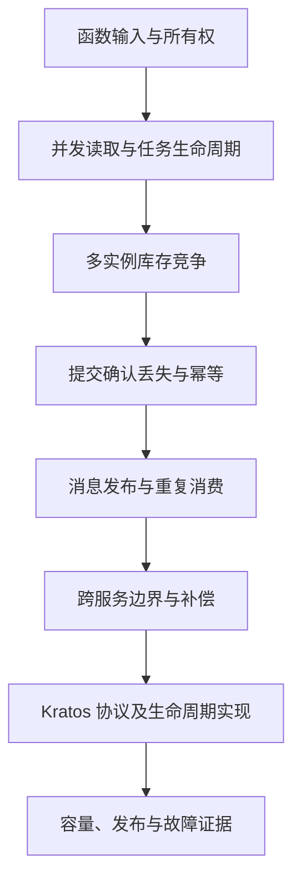

# 100 综合追问：从一个 Go 函数走到生产级系统设计

> 难度：高级 · 分类：生产与系统设计

## 简短回答

一次完整后端回答应从输入和不变量出发，说明语言语义、并发所有权、依赖失败、数据一致性与运行验证，再给出容量和演进取舍。关键不是罗列组件，而是解释每项选择如何保护具体业务，以及失败后如何确认和恢复。

## 详细解析

### 固定一个背景，让追问持续修改同一个系统

假设先实现一个单库订单服务，库存是权威数据库中的数量，接口要求同一业务请求不重复下单。开始时只有一台进程，随后依次加入并发、多实例、网络失败、消息和服务拆分。每增加一个条件，都检查上一轮保证是否仍成立，避免每道题都另起一个互不关联的答案。

图中的顺序是问题条件的递进，不是说每个项目最终都应该拆服务。若单库事务已经满足业务，能够说明保留它的理由，同样是成熟答案。

### 沿“创建订单”递进十层

1. **函数收切片为什么会改到调用者？** 切片值被复制，但底层元素可能共享。先定义输入是否借用、是否允许修改，长期保留时明确复制边界。复习 [003](../01-language-design/003-value-semantics.md)、[012](../02-types-memory/012-slice-retention.md)。

2. **价格与库存能不能并发查？** 只有独立读取才能并发，且要有上限、取消和结果等待。共享结果按独立索引或同步保护，不能并发 append 同一切片。复习 [028](../03-concurrency/028-worker-pool.md)、[030](../03-concurrency/030-concurrency-review.md)。

3. **客户端离开后任务怎么办？** 请求 context 向依赖传播，任务主动退出，发起者等待收尾；取消不能撤销已提交副作用。复习 [026](../03-concurrency/026-context.md)。

4. **两个请求同时抢最后一件呢？** 用权威存储的条件更新或事务协调检查与扣减，并检查结果，进程锁不能保护多实例。复习 [056](../06-database/056-stock-locking.md)。

5. **数据库提交后响应丢了呢？** 使用稳定业务幂等键和状态查询，不能把超时当作确定未执行。复习 [047](../05-backend-api/047-idempotency.md)、[052](../06-database/052-transactions.md)。

6. **落单后通知为什么偶尔丢？** 本地事务与 broker 发布之间存在窗口，用 Outbox 持久化发布意图，消费者仍处理重复。复习 [067](../07-cache-messaging/067-consumers.md)、[068](../07-cache-messaging/068-outbox.md)。

7. **库存拆成服务后怎么保持业务？** 本地事务边界改变，需要预留确认、补偿与恢复协议，先评估拆分收益是否值得。复习 [071](../08-microservices/071-boundaries.md)、[077](../08-microservices/077-distributed-transactions.md)。

8. **Kratos 放在哪里？** 它组织协议、中间件与生命周期，service 适配请求，biz 保留规则，data 实现存储；框架不会自动赋予幂等和分布式事务。复习 [082](../09-kratos/082-layers.md)、[090](../09-kratos/090-kratos-service.md)。

9. **流量翻倍，先调什么？** 先测单位请求成本、依赖配额、在途工作和排队，找到瓶颈后调整准入或容量。直接翻倍 goroutine 可能扩大故障。复习 [039](../04-runtime-performance/039-capacity.md)、[060](../06-database/060-pool-exhaustion.md)。

10. **怎样证明发布后仍可靠？** 用相关单元与真实依赖测试验证不变量，契约测试覆盖协议，灰度观察 SLO，并演练超时、重复和退出。复习 [080](../08-microservices/080-rollouts.md)、[092](092-testing.md)、[099](099-incident.md)。

### 每层怎样判断答到了机制，下一问为何成立

以下是学习用评分卡，不是某家公司的招聘标准。每层 0 分表示只有术语或明显错误，1 分表示主结论正确但缺少故障边界，2 分表示能够解释机制并给出对应验证。满分 20 分，目的在于定位知识缺口，不能代替实际工程能力评价。

| 层次 | 拿到 2 分应说清的内容 | 下一问怎样承接 |
| --- | --- | --- |
| 1 输入所有权 | 切片描述符按值传递、底层共享；明确复制时机 | 共享数据被并发访问会怎样 |
| 2 并发读取 | 工作有上限，结果不竞态，失败后取消并等待 | 客户端不再需要结果时谁收尾 |
| 3 取消生命周期 | 传播到依赖且实际退出，不能撤销已提交副作用 | 多个请求同时修改库存怎么办 |
| 4 库存竞争 | 权威条件更新、同事务订单、检查影响结果 | 提交成功但客户端不知道怎么办 |
| 5 幂等恢复 | 稳定业务身份、唯一性、结果查询与未知状态 | 订单成功后通知为何仍会丢 |
| 6 消息可靠性 | 本地事务保存发布意图，重复消费不重复效果 | 拆服务后原事务还覆盖哪些对象 |
| 7 服务边界 | 说明拆分收益、预留或补偿的状态与恢复 | 这些协议怎样落到 Go 工程中 |
| 8 框架落地 | 区分生成 handler、service、biz、data 与 App | 框架正确是否意味着容量足够 |
| 9 容量判断 | 到达率、持有时间、瓶颈配额和重试放大 | 调整上线后如何证明没有破坏行为 |
| 10 运行验证 | 不变量测试、真实依赖、灰度与故障恢复证据 | 回看假设是否被实际数据支持 |

评分时不要要求某个唯一组件名。第六层使用可靠日志或明确的事务消息机制，也可以说明同一发布义务；但只回答“用 Kafka 保证不丢”而不解释提交窗口，应继续追问。第七层主动拒绝不必要拆分并给出证据，不能因为没提 Saga 就扣成不会设计。

### 一次有信息量的回答应当怎样展开

面对“客户端付款超时是否重试”，可以先说超时只表示没有及时得到结果，然后给操作保留同一幂等键，查询权威状态；确认成功则返回原订单，未知则保留查询路径，不换键重复支付。再指出本地数据库唯一性只能保护本地事实，外部支付仍需要对方的幂等或结果查询契约。最后给出“提交后、响应前断网”的验证点。

这段回答包含结论、机制、边界和验证。若只说“加锁重试三次”，应追问锁的范围、租约过期、支付是否已经成功以及三次从何而来；每个追问都来自前一答案留下的具体缺口，而不是随机考一个新术语。

容量层也要给单位。假设每秒 2,000 次数据库操作，平均占连接 20 ms，平均需要约 40 个在用连接；占用变为 200 ms 时变成约 400。接下来应该检查查询、锁与慢消费，而不是直接把池上限调到 400。这是教学估算，需要尾延迟和数据库容量实验补证据。

### 用一张回答卡自检

每次回答写下业务假设、权威状态、正常路径、失败窗口、资源上限、验证证据六项。如果一个方案只能解释正常成功，无法说明提交后断网、任务重试或进程退出，它还没有形成完整工程解释。

复习时可用三轮完成：第一轮限时口述十层，只标记卡住的位置；第二轮回到对应课程运行能执行的示例，手推数据库和消息时序；第三轮让同伴只改变一个假设，例如从单实例变多实例、从只读变写入，检查保证是否仍成立。不要把“读过全部题目”当成掌握的证据。

遇到版本实现细节无法确定时，应明确说明需要查哪份规范、源码或实验。对于当前仓库能运行的 Kratos 查询，可以给出实际文件和测试；对于秒杀、分片和跨服务事务，只能报告设计推演与所需验证，不能补写不存在的生产经验。完整回答既能深入，也知道证据在哪里结束。

## 常见误区 / 面试追问

- **回答必须越复杂越好吗？** 不应。单库事务能解决的问题，不必先引入分布式协调；复杂度要由需求证据支持。
- **记住框架 API 就能回答设计吗？** API 只是实现入口，要能解释错误、生命周期和数据保证。
- **遇到不知道的版本细节怎么办？** 明确区分语言保证与实现细节，说明需查哪份源码、用什么实验验证，不编造常数或运行结果。

## 参考资料

- [Go 官方文档](https://go.dev/doc/)
- [Kratos v2.9.1 官方源码](https://github.com/go-kratos/kratos/tree/v2.9.1)
- [Google SRE Workbook](https://sre.google/workbook/table-of-contents/)

[返回目录](../README.md) · [上一题](099-incident.md) · [查看学习计划](../PLAN.md)
